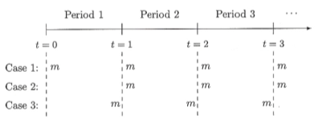
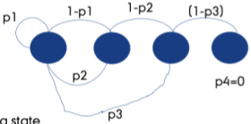
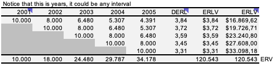
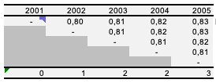
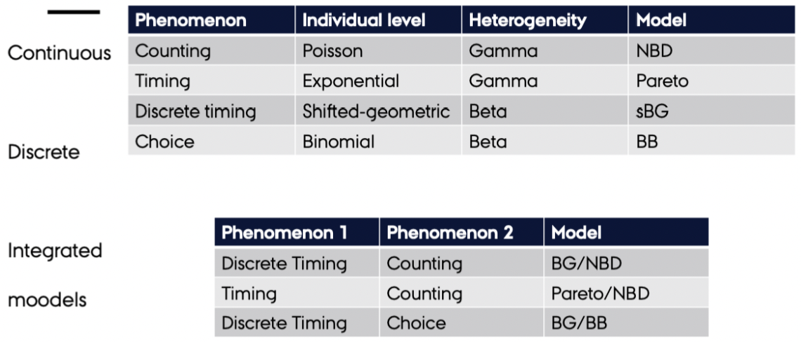
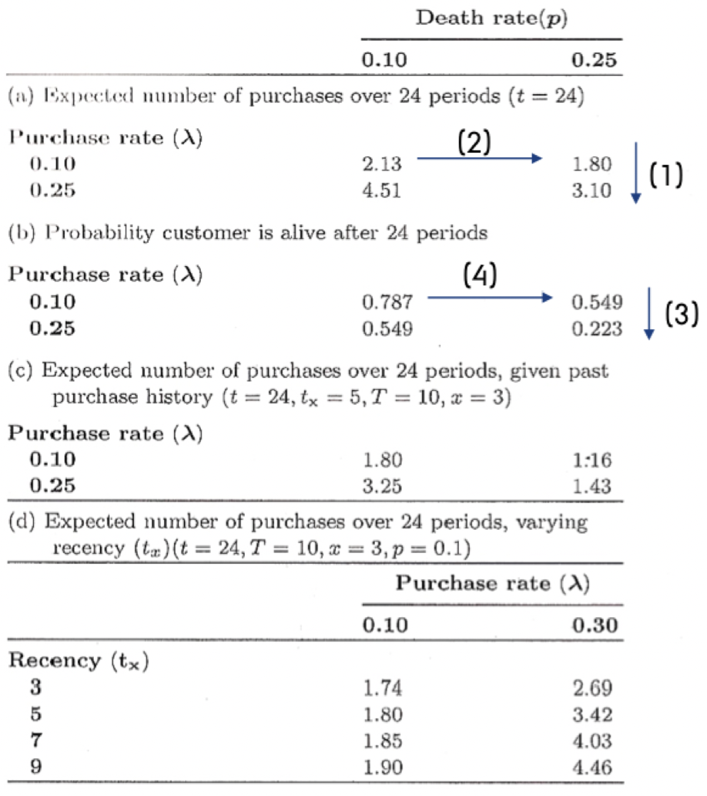

# Customer Lifetime Value

Contractual vs. non contractual:

+ Contractual setting: We see that a customer pays a constant amount each month. Notice that one may also buy extra stuff.
+ Non contractual setting: We see that a customer can buy at any given time, e.g., a supermarket.
+ Discrete purchase: That is when a person makes purchase for a given time period, that is for instance subscriptions
+ Continuous purchase: That is a person is able to make a purchase at any given time.

In the following we see an example of placing orders either in the beginning or at the end of the period. The difference between case 1 and 2, is that in case 2 it is not a new customer, as we do not have a purchase in time period 0.



See section *CLV continuous time accounting for when you get the money* in the CLV templates.


## Non-contractual The matrix formulation

This is for a __non contractual setting.__

This comes in relation to having different states, where the last state is an absorbing state, which indicates a lost customer. It can be shown with a Markov Chain.



We see that there are different probabilities of starting in the different states. Then for that given state you can either move one down or move up to state one. Where state 1 = most recent purchase.

Notice that this illustration has four states, state one equal the most recent purchasers while state 5 is the absorbing state. In this state there is 0 probability of moving up to state 1, hence the customer is lost.

In the following example we have a scenario of the cost being 4 and a purchase giving a margin og 40

__For an infinite period__

```{r}
#Facts
margin <- 40
costs <- 4
discount_factor <- 1.2
states <- 5

#Transition probabilities
p1 <- 0.3
p2 <- 0.2
p3 <- 0.15
p4 <- 0.05
p5 <- 0

#Transition probability matrix
P <- matrix(nrow = states,byrow = TRUE
            ,c(p1,1-p1,0,0,0,
               p2,0,1-p2,0,0,
               p3,0,0,1-p3,0,
               p4,0,0,0,1-p4,
               p5,0,0,0,1-p5
               )# NOTE, ADD STATES BELOW, AND EXTEND THE MATRIX
            )
              

# Profit vector (G for profit :) ) 
G <- matrix(nrow = states
            ,c(margin - costs, #Purchase only occurs in state 1
               -costs,
               -costs,
               -costs,
               0)) #We spend no money on the last recency state, because we dont mail them
            # NOTE THE AMOUNT OF LINES MUST = STATES

#Identify matrix
I <- diag(states)

#Customer lifetime value
CLV <- solve(I-1/(discount_factor)*P) %*% G
CLV
```

We see that for customers starting in state 1, we have a profit of 52, if the customer is starting in state 2, then the profit is 5.6, if starting in state three then 1.25 and fourth they are not positive.

Notice that the approach above show the infinite lifetime of the customers. We may be interested in finding out what the lifetime of a customer is, given a certain period. That we look into in the following


__Infinite modified CLV__

_It is modified as the infinite solution, does not tell what they earn after a certain period, the following does, i guess that is why it is called modified_

We can also calculate the infinite _modified_ solution, where we apply the transition probabilities and assess how the lifetime value of a customer starting in a specific state is. Notice, we are already having the customer.

```{r}
#Note, it is prerequisite to run the code above first
# Infinite modified solution *

# Transition probabilities
p1=0.3
p2=0.2
p3=0.15
p4=0 #Notice, that we discovered above that recency state 4 where negative, so we will not invest in these. Then we also assume, that they will not buy anything. One may also have kept p = 0.05
p5=0

# Transition probability matrix
Pmod=matrix(nrow=states,byrow=T,
            c(p1,1-p1,0,0,0,
              p2,0,1-p2,0,0,
              p3,0,0,1-p3,0,
              p4,0,0,0,1-p4,
              p5,0,0,0,1-p5
              )
            )

Gmod=matrix(c(margin-costs,  #G for profit :)
              -costs,
              -costs,
              0, #Notice, that we remove the cost, that is also why we know that p4 = 0
              0)
            ,nrow=states)
Gmod

# Customer lifetime value
CLV = solve(I-1/(discount_factor)*Pmod) %*% Gmod
CLV
  # Now we see that we do not loose money on cohort 4
```

__Finite period__

Notice that the following is just for a finite period, where the calculations above are infinite. We see that the result is not really different, just as we saw in the example in excel.

```{r}
# 4 periods **
p2 <- P %*% P #P = the first period
p3 <- p2 %*% P #By matrix multiplication can we find the proportions in consecutive periods
p4 <- p3 %*% P
P
p4
```

What do we see from this. We see that in period 1 recency 1, we have 30% stayers and 70% that moves to recency 2, notice that the stayers, will be those that actually buy something.

Then by matrix multiplication we can see that 13.97% of those originally in state 1 is still in state 1. On the other hand can we see that 45% of the customers are lost. That is because in this scenario, there is always a greater chance of loosing the customer rather than them staying. Thus if we had more than 50% of staying, then naturally we would have more people staying in state one (repetitive buys) compared to completely lost customers (those in the absorbing state.)

In the following we can replicate the lifetime value through matrix multiplication as well.

```{r}
res1 <- 
  G + 1/discount_factor * P %*% 
  G + 1/discount_factor^2 * p2 %*% 
  G + 1/discount_factor^3 * p3 %*% 
  G + 1/discount_factor^4 * p4 %*% 
  G

res1
```

## Contractual - Valuing customer base + residual lifetime value

We see that the customer base can be estimated with the sBG approach. In this scenario we have different cohorts, for instance all those that that signed up in a given period. Hence we are working in a contratual setting.

We see that we are able to measure how many customers that are actually left in the different cohorts.



Then we can also show the retention rates for the given cohorts.



We see that the retention rate is actually increasing. Two explanations could be:

1. Getting more loyal customers
2. Filtering out in the heterogeneous customer base - *this also implies that we assume heterogeneity*

Then you may ask, how do we get the retention rates and hence the survival rates? This is estimated with the sBG (Shifted-Beta-Geometric model), with a beta distribution you are able to reflect many different shapes, hence we can also replicate the retention rates. Examples of different outcomes can be seen in the following picture.

*Why is it called 'shifted'? That is because a customer cannot leave in time period 0, as they have paid for that period.*


Application of this is made in the excel sheet.

The following also simulate two different scenarios.

```{r}
alpha1 <- 0.676
beta1 <- 3.86
alpha2 <- 0.7009
beta2 <- 1.1712

theta <- (1:99)/100
p.beta_high = dbeta(theta,alpha1,beta1)
p.beta.reg = dbeta(theta,alpha2,beta2)
matplot(theta,cbind(p.beta_high,p.beta.reg),xlab = "Churn probability"
        ,ylab = "Density",type = "l",col = c("blue","red")
        ,main = "Composition of customers with respect to churn")
legend(0.7,7,legend = c("High_end","Regular"),pch = c(16,1)
       ,col = c("blue","red"),cex = 0.7)
```

We can also calculate the amount of people that are expected to churn in period one, for this we just need the alpha and the beta values (or at least the estimated values).

That is done with $P = \frac{\alpha}{\alpha + \beta}$

```{r,results='hold'}
options(digits = 3)
alpha1/(alpha1 + beta1) #0.149
alpha2/(alpha2 + beta2) #0.374
```

Hence we see that 37% of the regular customers will churn, while only 15% of the high end customers will churn (leave). That is as expected as we see the greatest density of the of regular churners is higher than the high end, where we see that most lie in the lower region.


## Non-Contractual Setting - Probabilitic Models

```{r}
library(BTYD) #Buy till you die.
```

Now we are going to move into non-contractual models estimate the lifetime value of such a customer base, we are going to apply probabilistic models to estimate the churn rate but also the rate of purchase (transaction rate).

We are working with a non-contratual setting. Also these models are specifically applicable when the company is not able to point out the exact time, that the customer will drop out, so the opposite of when we have a contratual setting, where we know exactly if the customer does not renew his contract.

*I have put notes to to BG/NBD, hence one may go directly to that section to see some details. It is put as a note to describe the other approaches.*


**Summary of the models:**

We see the following summary:



*Individual level = drop out of a given customer*

*Heterogeneity = difference in customers, hence difference in when customers tend to drop out, e.g., some drops out quickly while others will stay long.*

*Counting = about estimating no. of transactions*

*Timing = Estimating when a customer will leave in the future*

*__What defines the model?__ We see that the individual level and heterogeneity are described by different distributions. These combinations make up the model, e.g., Poisson and Gamma distrbution combination to estimate respectively Individual level and Heterogeneity, is called the NBD (negative binomial distribution). And the combination of Exponential and Gamma distribution is called the Pareto distribution. Hence to estimate the Pareto distribution, you naturally need the parameters estimating both the Exponential and Gamma distribution.*

**Notice that we are not going to look at the BB distribution!!**

We are going to apply integrated models. **What is integrated models?**:

These models apply the the different combinations seen in the first table. Hence we want a distribution both for estimating no. of transactions but also a model to describe when a customer will leave and that is why we both use NBD with BG and Pareto.

We see that from the table above:

+ If we are in a continuous setting and want to count no. of transactions, then we go with **NBD**. This is reflected by the poisson distribution and the heterogenirty of the customers can be estimated by a gamma distribution.

+ If we have a discrete time period (hence not continous purchase = contractual), we can estimate the transaction rate with a shifted geometirc model and the heterogenity (dropout rate) can be estimated with a Beta distribution. This is applied with the **sBG** model.

+ If we have a timing model, this is basically where we do not know when a customer makes a purchase and they can dropout at any given time. We assume that any customer is having lifetime, and this can be estimated with an exponential distribution. We also assume heterogeneity in the customers, i.e., different tendencies to drop out, this is estimated with a beta distribution. We use the **Pareto** model for this approach.


### Pareto/NBD vs. BG/NBD

The difference between these is the timing, meaning when a customer will leave. In the Pareto estimate of timing, a customer can leave at any point in time, where the BG model only allows to leave after a purchase.

That makes the Pareto model more flexible than the BG model.

Lets take an example of the BG/NBD:



We see in section (a), that the higher the death rate the fewer purchases do we expect a customer to make, and the higher the purchase rate, the more transactions do we estimate him to have.

Although, the probability of customer being alive is is actually decreasing when we increase purchase rate while holding death rate constant. That is due to how the model is build, as the BG model only allows for a customer dying after a purchase.

Therefore when the purchase rate is higher, then he will also make more purchases, but for each purchase there is also a probability of dying.

Therefore we also see in the last table, we see that we observe a customer in 10 periods, 1 being the first and 10 the last.

We see that the more recent the customer has placed a purchase, the greater is the expected number of purchases in a 24 period. Hence implying that the longer time since the last purchase, the greater is the probability it is just because the customer is lost.


### Pareto/NBD

*NBD = Negative Binomial Distribution*

Here we have a model, that aim to predict (or estimate) the transaction rate and the dropout rate. Also the model allows for heterogeneity in the customers, meaning that all are not the same and so will the dropout not be. We are working with 4 parameters, two for estimating the transaction rate and two for estimating the dropout rate.

Notice that the model is similar to the e.g., the BG/NBD, that is because this is the foundation hereof.

We see that the Pareto/NBD is from 1959 and the BG/NBD is from 2005, hence it builds on the Pareto/NBD.

The reason for making the BG/NDB is to make it less cumbersome to estimate, although with the computing power now, we see that the Pareto/NBD model can easily be estimated. Therefore the Pareto/NBD is often preferred over the BG/NBD.

\

#### Data preparation

We only need three pieces of information for every person:

1. How many transactions the customer in the training period - **Frequency**
    a. Denoted as $x$
2. The time of their last transaction - **Recency**
    a. Denoted as $t.x$
3. The total time for which they were observed
    a. Denoted as $T.cal$. For time of the calibration period.

Thus we must construct a data frame with a row for each customer and the information above.

We use `dc.ReadLines`, this is basically the same as `read.csv`. Notice that elog is a file with a lot of transactions. Thus we have customer identifier, date and amount.

```{r}
cdnowElog <- system.file("data/cdnowElog.csv", package = "BTYD")
elog <- dc.ReadLines(cdnowElog, cust.idx = 2
                     ,date.idx = 3, sales.idx = 5)
elog[1:3,]
```

Notice the name 'elog', that is for event log. Hence it logs all of the events.

We want to transform the date to a date type instead.

```{r}
elog$date <- as.Date(elog$date, "%Y%m%d");
elog[1:3,]
```

The following is able to merge transactions in the same customer. Before running the code we have 6919 observations (events).

```{r}
elog <- dc.MergeTransactionsOnSameDate(elog);
```

After merging we have 6696 events. Thus it appears that some customers made several purchases on the same day.

Now we can **split the data** to get a train (calibration) and test period.

```{r}
end.of.cal.period <- as.Date("1997-09-30") #Insert the last date in the train period.
elog.cal <- elog[which(elog$date <= end.of.cal.period), ]
```

___Notice, the BG/NBD model deals with repeat transactions, hence the first transaction is ignored.___

```{r}
split.data <- dc.SplitUpElogForRepeatTrans(elog.cal);
clean.elog <- split.data$repeat.trans.elog;
```

Now we are going to create a customer-by-time matrix. That is simply a matrix with each customer on each row and then days as columns. The following is just a snip.

```{r}
#Customer-by-time: Repeatitive transactions
freq.cbt <- dc.CreateFreqCBT(clean.elog);
freq.cbt[1:3,1:5]
```

Since we initially deleted all first transactions, the frequence customer-by-time matrix does not have any of the customer who made zero repeat transactions. These customers are still important hence they will be included in the matrix with the following.

```{r}
#Customer-by-time: All first transactions transactions
tot.cbt <- dc.CreateFreqCBT(elog)

#Merging both customer-by-time matrices.
cal.cbt <- dc.MergeCustomers(tot.cbt, freq.cbt)
```


```{r}
birth.periods <- split.data$cust.data$birth.per
last.dates <- split.data$cust.data$last.date
cal.cbs.dates <- data.frame(birth.periods, last.dates
                            ,end.of.cal.period)

cal.cbs <- dc.BuildCBSFromCBTAndDates(cal.cbt
                                      ,cal.cbs.dates
                                      ,per="week") # we want to see weekly data
```

_Notes:_ 

_1. cbs = customer-by-sufficient-statistics_
_2. We use `per = "week"` to get data shown per week, as ultimately it show the same as pr. day and returns a more simple data frame._

In general the procedure above can be executed in the following command: `dc.ElogToCbsCbt()`. But they have chosen to show the process, so one is able to make iterations to the data if that is needed in other applications. 


You’ll be glad to hear that, for the process described above, the package contains a single function to do everything for you: `dc.ElogToCbsCbt`.


#### Parameter Estimation

First we must estimate the parameters. Notice that the function takes a starting point with the following values for the parameters (1,1,1,1).

```{r}
params <- pnbd.EstimateParameters(cal.cbs);
params
```


```{r}
LL <- pnbd.cbs.LL(params, cal.cbs);
LL
```

The log likelihood estimates the fit to the data, thus we have a log-likelihood of -9494.98. We are not able to deduct much from the number itself. But we are able to compare it with other models. Basically, we want to select the model with a log-likelihood that is as close to 0 as possible.

In the following we run consecutive estimations with its own output as its starting point.

```{r}
p.matrix <- c(params, LL);
for (i in 1:2){
  params <- pnbd.EstimateParameters(cal.cbs, params);
  LL <- pnbd.cbs.LL(params, cal.cbs);
  p.matrix.row <- c(params, LL);
  p.matrix <- rbind(p.matrix, p.matrix.row);
}
colnames(p.matrix) <- c("r", "alpha", "s", "beta", "LL");
rownames(p.matrix) <- 1:3;
p.matrix
```

We see that the log-likelihood, hence the fit, is the same, but some of the parameters are changing slightly. We have the following parameters:

__Describing the the gamma mixing distribution of the NBD transaction process__

+ r
+ Alpha

See figure \@ref(fig:pnbd1)

__Describing the gamme mixing distrbibution of the Pareto (or gamma exponentiated) dropout process__

+ s
+ beta

See figure \@ref(fig:pnbd2)

```{r pnbd1,results='hide',fig.cap="Transaction rate heterogeneity of estimated parameters"}
pnbd.PlotTransactionRateHeterogeneity(params)
```

Few have a very high transaction rate, where the majority lies in the south eastern region.

```{r pnbd2,results='hide',fig.cap="Dropout rate heterogeneity of estimated parameters"}
pnbd.PlotDropoutRateHeterogeneity(params)
```

Few have a very high dropout rate, where the majority lies in the south eastern region.

#### Individual Level Estimations

Now we can also make some estimations on the individual level. We can do:

1. Estimating purchases in the calibration period and hold out period.
1. Calculating probability that the customer is still alive at the end of the calibration period.

__First__ we can estimate the number of transactions we expect a newly acquired customer to make in a given time period.

```{r}
pnbd.Expectation(params
                 ,t=52 #We have weekly data
                 )
```

We expect a newly acquired customer to make 1.47 repeat purchases in a time period of one year.

Calling information from an individual customer.

```{r}
cal.cbs["1516",]
```

Now we can store the information, to be used for estimating purchases in the holdout period.

```{r}
x <- cal.cbs["1516", "x"]
t.x <- cal.cbs["1516", "t.x"]
T.cal <- cal.cbs["1516", "T.cal"]
pnbd.ConditionalExpectedTransactions(params
                                     ,T.star = 52
                                     ,x
                                     ,t.x
                                     ,T.cal)
```

We expect 25 purchases in the hold out period.

__Second__ we can calculate the probability that the customer is still alive in the end of the hold out period.

```{r}
pnbd.PAlive(params, x, t.x, T.cal)
```

We see that there is a probability of 99%, hence it is almost certain.

__Conditional expectation function__

We see the increasing frequency paradox in action: (__What ever this is__)

```{r}
for (i in seq(10, 25, 5)){
  cond.expectation <- pnbd.ConditionalExpectedTransactions(
  params, T.star = 52, x = i,
  t.x = 20, T.cal = 39)
  cat ("x:",i,"\t Expectation:",cond.expectation, fill = TRUE)
}
```


#### Plotting / Goodness-of-fit

**In the training period**

We want to assess how the model fits the actual transactions

```{r}
pnbd.PlotFrequencyInCalibration(params, cal.cbs
                                ,censor =  7 #The frequency groups
                                )
```

Notice that all bins reflect the frequency and then the y show the amount of customers in the repeat transactions group, notice that group 0 only made one purchase

We see that the model estimates the actual transactions very well.

**The hold out period**

```{r}
elog <- dc.SplitUpElogForRepeatTrans(elog)$repeat.trans.elog;
x.star <- rep(0, nrow(cal.cbs));
cal.cbs <- cbind(cal.cbs, x.star);
elog.custs <- elog$cust;
for (i in 1:nrow(cal.cbs)){
  current.cust <- rownames(cal.cbs)[i]
  tot.cust.trans <- length(which(elog.custs == current.cust))
  cal.trans <- cal.cbs[i, "x"]
  cal.cbs[i, "x.star"] <- tot.cust.trans - cal.trans
}
cal.cbs[1:3,]
```

Now we can plot the expected frequency.

```{r}
T.star <- 39 # length of the holdout period
censor <- 7 # This censor serves the same purpose described above
x.star <- cal.cbs[,"x.star"]
comp <- pnbd.PlotFreqVsConditionalExpectedFrequency(params, T.star,
cal.cbs, x.star, censor)
```

We see that the hold out period is estimated very well in this example. Instead of looking at the plot, we can also show a matrix containing the numbers.

```{r}
rownames(comp) <- c("act", "exp", "bin")
comp
```

Now we want to look at weekly transactions.

```{r}
tot.cbt <- dc.CreateFreqCBT(elog)

d.track.data <- rep(0, 7 * 78)
origin <- as.Date("1997-01-01")
for (i in colnames(tot.cbt)){
  date.index <- difftime(as.Date(i), origin) + 1;
  d.track.data[date.index] <- sum(tot.cbt[,i]);
}
w.track.data <- rep(0, 78)
for (j in 1:78){
  w.track.data[j] <- sum(d.track.data[(j*7-6):(j*7)])
}
```

```{r}
T.cal <- cal.cbs[,"T.cal"]
T.tot <- 78
n.periods.final <- 78
inc.tracking <- pnbd.PlotTrackingInc(params, T.cal,
T.tot, w.track.data,
n.periods.final)
```

We see that the model generalizes pretty well the period. Instead of looking at the plot we can also show the underlying numbers.

```{r}
inc.tracking[,20:25]
```

We can also show a cummulated sum over the weeks, notice that the hold period and the training period is separated by the dashed line.

```{r}
cum.tracking.data <- cumsum(w.track.data)
cum.tracking <- pnbd.PlotTrackingCum(params
                                     ,T.cal
                                     ,T.tot
                                     ,cum.tracking.data
                                     ,n.periods.final)
```

```{r}
cum.tracking[,20:25]
```


### BG/NBD

Used in a non-contractual situation in which customers can make a purchase at any time. The model describes the rate at which customers make purchases and the rate at which they drop out. This is done with four parameters and also allowing for heterogeneity.

The following is the BG/NBD model on the CDNow data.

_Note: calibration = training_

#### Data Preparation

We only need three pieces of information for every person:

1. How many transactions the customer in the training period - **Frequency**
    a. Denoted as $x$
2. The time of their last transaction - **Recency**
    a. Denoted as $t.x$
3. The total time for which they were observed
    a. Denoted as $T.cal$. For time of the calibration period.

Thus we must construct a data frame with a row for each customer and the information above.

We use `dc.ReadLines`, this is basically the same as `read.csv`. Notice that elog is a file with a lot of transactions. Thus we have customer identifier, date and amount.

```{r}
cdnowElog <- system.file("data/cdnowElog.csv", package = "BTYD")
elog <- dc.ReadLines(cdnowElog, cust.idx = 2
                     ,date.idx = 3, sales.idx = 5)
elog[1:3,]
```

Notice the name 'elog', that is for event log. Hence it logs all of the events.

We want to transform the date to a date type instead.

```{r}
elog$date <- as.Date(elog$date, "%Y%m%d");
elog[1:3,]
```

The following is able to merge transactions in the same customer. Before running the code we have 6919 observations (events).

```{r}
elog <- dc.MergeTransactionsOnSameDate(elog);
```

After merging we have 6696 events. Thus it appears that some customers made several purchases on the same day.

Now we can **split the data** to get a train (calibration) and test period.

```{r}
end.of.cal.period <- as.Date("1997-09-30") #Insert the last date in the train period.
elog.cal <- elog[which(elog$date <= end.of.cal.period), ]
```

___Notice, the BG/NBD model deals with repeat transactions, hence the first transaction is ignored.___

```{r}
split.data <- dc.SplitUpElogForRepeatTrans(elog.cal);
clean.elog <- split.data$repeat.trans.elog;
```

Now we are going to create a customer-by-time matrix. That is simply a matrix with each customer on each row and then days as columns. The following is just a snip.

```{r}
#Customer-by-time: Repeatitive transactions
freq.cbt <- dc.CreateFreqCBT(clean.elog);
freq.cbt[1:3,1:5]
```

Since we initially deleted all first transactions, the frequence customer-by-time matrix does not have any of the customer who made zero repeat transactions. These customers are still important hence they will be included in the matrix with the following.

```{r}
#Customer-by-time: All first transactions transactions
tot.cbt <- dc.CreateFreqCBT(elog)

#Merging both customer-by-time matrices.
cal.cbt <- dc.MergeCustomers(tot.cbt, freq.cbt)
```


```{r}
birth.periods <- split.data$cust.data$birth.per
last.dates <- split.data$cust.data$last.date
cal.cbs.dates <- data.frame(birth.periods, last.dates
                            ,end.of.cal.period)
cal.cbs <- dc.BuildCBSFromCBTAndDates(cal.cbt
                                      ,cal.cbs.dates
                                      ,per="week") # we want to see weekly data
```

_Notes:_ 

_1. cbs = customer-by-sufficient-statistics_
_2. We use `per = "week"` to get data shown per week, as ultimately it show the same as pr. day and returns a more simple data frame._

In general the procedure above can be executed in the following command: `dc.ElogToCbsCbt()`. But they have chosen to show the process, so one is able to make iterations to the data if that is needed in other applications. 


#### Parameter Estimation

We use the following formula to estiamte the parameters. They take starting point in par.start = c(1, 3, 1, 3), and iterate from there.

```{r}
params <- bgnbd.EstimateParameters(cal.cbs);
params
```

```{r}
#Log-Likelyhood of parameters
LL <- bgnbd.cbs.LL(params, cal.cbs);
LL
```

```{r}
p.matrix <- c(params, LL);

for (i in 1:2){
  params <- bgnbd.EstimateParameters(cal.cbs, params);
  LL <- bgnbd.cbs.LL(params, cal.cbs);
  p.matrix.row <- c(params, LL);
  p.matrix <- rbind(p.matrix, p.matrix.row);
}
colnames(p.matrix) <- c("r", "alpha", "a", "b", "LL");
rownames(p.matrix) <- 1:3;
p.matrix
```

We have the following parameters:

+ r = referring to the transaction - **describes the gamma mixing distribution of the NBD transaction process**. See figure \@ref(fig:bgnbd1)
+ alpha = refers to the transaction - **describes the gamma mixing distribution of the NBD transaction process**. See figure \@ref(fig:bgnbd1)
+ a = alpha that manipulates the beta distribution - **explains dropout rate**. See figure \@ref(fig:bgnbd2)
+ b = beta, that manipulates the beta distribution - **explains dropout rate**. See figure \@ref(fig:bgnbd2)

They mention that it is good to try different starting points, i guess that could merely be incorporated into the loop.

```{r bgnbd1,fig.cap="Transaction rate heterogeneity of estimated parameters",results='hide'}
bgnbd.PlotTransactionRateHeterogeneity(params)
```

```{r bgnbd2,fig.cap="Dropout probability heterogeneity of estimated parameters",results='hide'}
bgnbd.PlotDropoutRateHeterogeneity(params)
```


#### Individual Level Estimation

This is about predicting on individual customer level. First we can estimate the number of transactions we expect a newly acquired customer to make in a give time period.

```{r}
bgnbd.Expectation(params
                  ,t=52) # = 1 year, has we have 52 weeks
```

We see that he is expected to make 1.44 purchases.

The follwing show customer 1516.

```{r}
cal.cbs["1516",]
```

We see that he made 26 repeat transactions in the calibration period. Period 30.8 was the most recent period of a purchase, indicating that he bought towards the end of period 30.

Now we can save the attributes in objects.

```{r}
x <- cal.cbs["1516", "x"]
t.x <- cal.cbs["1516", "t.x"]
T.cal <- cal.cbs["1516", "T.cal"]
```

Finally we can calculate the expected number of purchases in the holdout period.

```{r}
bgnbd.ConditionalExpectedTransactions(params
                                      ,T.star = 52 #Prediction period, hence 52 weeks.
                                      ,x = x #No. of repeat trans. in cal. period.
                                      ,t.x = t.x #Most recent period with purchase
                                      ,T.cal = T.cal) #Length of cal. period.
```

We see that the customer is expected to make 25.76 purchases in the hold-out-period.

```{r}
bgnbd.PAlive(params = params
             ,x = x #No. of repeat transactions in the cal period
             ,t.x = t.x #Time of most recent repeat transaction
             ,T.cal = T.cal) #Length of calibration period
```

We see that there is a probability of 96.8% that he will be alive after the end of the calibration period. That also seems intuitively high, as customer with the most recent transaction was in 38.4, hence this customer must also be close to the end of the calibration period.

```{r}
for (i in seq(10, 25, 5)){
  cond.expectation <- bgnbd.ConditionalExpectedTransactions(
  params, T.star = 52, x = i,
  t.x = 20, T.cal = 39)
  cat ("x:",i,"\t Expectation:",cond.expectation, fill = TRUE)
}
```

__I am not entirely sure what is meant by the 'increasing frequency paradox' as of the conditional expectation__

#### Plotting / Goodness-of-fit

First of all we can plot the actual vs. predicted in the calibration period.

```{r}
bgnbd.PlotFrequencyInCalibration(params = params
                                 ,cal.cbs = cal.cbs
                                 ,censor = 7 #All 7+ are binned.
                                 )
```

We see that the model replicates the variance that we observe in the data very well.

What we see is amount of customers on y and amount of transactinos in training period.

Now we construct the hold/out period.

```{r}
elog <- dc.SplitUpElogForRepeatTrans(elog)$repeat.trans.elog;
x.star <- rep(0, nrow(cal.cbs));
cal.cbs <- cbind(cal.cbs, x.star);
elog.custs <- elog$cust;
for (i in 1:nrow(cal.cbs)){
  current.cust <- rownames(cal.cbs)[i]
  tot.cust.trans <- length(which(elog.custs == current.cust))
  cal.trans <- cal.cbs[i, "x"]
  cal.cbs[i, "x.star"] <- tot.cust.trans - cal.trans
  }
cal.cbs[1:3,]
```

We fill in the characteristics to the model. And we can plot 

```{r,fig.cap="Actual vs. conditional expected transactions in the holdout period."}
T.star <- 39 # length of the holdout period
censor <- 7 # This censor serves the same purpose described above
x.star <- cal.cbs[,"x.star"]
comp <- bgnbd.PlotFreqVsConditionalExpectedFrequency(params
                                                     ,T.star
                                                     ,cal.cbs
                                                     ,x.star
                                                     ,censor)
```

```{r}
rownames(comp) <- c("act", "exp", "bin")
comp
```

Now we can assess how well the our model predict how many transactions will occur in each week.

First, we need to convert the total transactions pr. day into a customer-by-time matrix (cbt). And then we can transform them into weekly observations instead of daily.

```{r}
tot.cbt <- dc.CreateFreqCBT(elog)
```

```{r}
d.track.data <- rep(0,7 * 78) #Corresponding to the amount of daily transactions in the holdout
origin <- as.Date("1997-01-01")
for (i in colnames(tot.cbt)){
  date.index <- difftime(as.Date(i), origin) + 1;
  d.track.data[date.index] <- sum(tot.cbt[,i]);
}
w.track.data <- rep(0, 78)
for (j in 1:78){
  w.track.data[j] <- sum(d.track.data[(j*7-6):(j*7)])
}
```

Now we can plot and compare the number of transactions with the predicted (expected).

```{r,fig.cap="Actual vs. expected incremental purchasing behaviour."}
T.cal <- cal.cbs[,"T.cal"]
T.tot <- 78 #78 because we have 78 weeks in total, if daily then 7*78=546
n.periods.final <- 78 #Notice, often this will just be the same, but does not have to be
inc.tracking <- bgnbd.PlotTrackingInc(params, T.cal
                                      ,T.tot, w.track.data
                                      ,n.periods.final)
inc.tracking[,20:25]
```

We can now plot the following with the actual vs. the expected (predicted).

```{r,fig.cap="Actual vs. expected cumulative purchasing behaviour."}
cum.tracking.data <- cumsum(w.track.data)
cum.tracking <- bgnbd.PlotTrackingCum(params, T.cal
                                      ,T.tot, cum.tracking.data
                                      ,n.periods.final)
cum.tracking[,20:25]
```

_Notice that the dashed line show the shift from calibration to hold out sample._

We see that our model fits the data very well! And also captures the trend.

### BG/BB

__I am not sure if this is a part of the curriculum__

#### Data Preparation

```{r}
simElog <- system.file("data/discreteSimElog.csv"
                       ,package = "BTYD")
elog <- dc.ReadLines(simElog, cust.idx = 1, date.idx = 2)
elog[1:3,]
```

```{r}
elog$date <- as.Date(elog$date, "%Y-%m-%d")
max(elog$date);
```

```{r}
min(elog$date);
```

```{r}
# let's make the calibration period end somewhere in-between
T.cal <- as.Date("1977-01-01")

simData <- dc.ElogToCbsCbt(elog, per="year", T.cal)
cal.cbs <- simData$cal$cbs

freq<- cal.cbs[,"x"]
rec <- cal.cbs[,"t.x"]
trans.opp <- 7 # transaction opportunities
cal.rf.matrix <- dc.MakeRFmatrixCal(freq, rec, trans.opp)
cal.rf.matrix[1:5,]
```

#### Parameter Estimation

```{r}
data(donationsSummary);
rf.matrix <- donationsSummary$rf.matrix
params <- bgbb.EstimateParameters(rf.matrix);
LL <- bgbb.rf.matrix.LL(params, rf.matrix);
p.matrix <- c(params, LL);

for (i in 1:2){
  params <- bgbb.EstimateParameters(rf.matrix, params);
  LL <- bgbb.rf.matrix.LL(params, rf.matrix);
  p.matrix.row <- c(params, LL);
  p.matrix <- rbind(p.matrix, p.matrix.row);
}
colnames(p.matrix) <- c("alpha", "beta", "gamma", "delta", "LL");
rownames(p.matrix) <- 1:3;
p.matrix;
```

#### Individual Level Estimations

```{r}
bgbb.Expectation(params, n=10);
```

```{r}
# customer A
n.cal = 6
n.star = 10
x = 0

t.x = 0
bgbb.ConditionalExpectedTransactions(params, n.cal
                                     ,n.star, x, t.x)
```

```{r}
# customer B
x = 4
t.x = 5
bgbb.ConditionalExpectedTransactions(params, n.cal
                                     ,n.star, x, t.x)
```

#### Plotting / Goodness-of-fit

```{r}
bgbb.PlotFrequencyInCalibration(params, rf.matrix)
```

```{r}
holdout.cbs <- simData$holdout$cbs
x.star <- holdout.cbs[,"x.star"]
```

```{r}
n.star <- 5 # length of the holdout period
x.star <- donationsSummary$x.star
comp <- bgbb.PlotFreqVsConditionalExpectedFrequency(params, n.star,
rf.matrix, x.star)
```

```{r}
rownames(comp) <- c("act", "exp", "bin")
comp
```

```{r}
comp <- bgbb.PlotRecVsConditionalExpectedFrequency(params, n.star,
rf.matrix, x.star)
```

```{r}
rownames(comp) <- c("act", "exp", "bin")
comp
```

```{r}
inc.track.data <- donationsSummary$annual.trans
n.cal <- 6
xtickmarks <- 1996:2006
inc.tracking <- bgbb.PlotTrackingInc(params, rf.matrix
                                     ,inc.track.data
                                     ,xticklab = xtickmarks)
```

```{r}
rownames(inc.tracking) <- c("act", "exp")
inc.tracking
```

```{r}
cum.track.data <- cumsum(inc.track.data)
cum.tracking <- bgbb.PlotTrackingCum(params, rf.matrix, cum.track.data
                                     ,xticklab = xtickmarks)
```


```{r}
rownames(cum.tracking) <- c("act", "exp")
cum.tracking
```


### Examples from the lecture

#### Pareto/NBD

PREDICTING LONG TERM CUSTOMER VALUE WITH BTYD PACKAGE

+ Pareto/NBD (negative binomial distribution) modeling of
+ repeat-buying behavior in a noncontractual setting


Based on Schmittlein, Morrison, and Colombo (1987), "Counting Your Customers:
Who Are They and What Will They Do Next?" Management Science, 33, 1-24.

Required data for model is:

"customer-by-sufficient-statistic" (cbs) matrix with the 'sufficient' stats being: __This is the most important table, this is the information that is needed to run the model.__
               
+ frequency of transaction (no of repeat transactions)
+ recency (time of last transaction) and
+ total time observed

Main model params are:

+ beta       unobserved shape parameter for Pareto dropout process
+ s          unobserved scale parameter for Pareto dropout process
+ r          unobserved shape parameter for NBD transaction
+ alpha      unobserved scale parameter for NBD transaction

Data are divided into earlier calibration and later holdout segments,
using a single date as the cut point.  "cal" data are used
to predict "holdout" data


```{r}
library(BTYD)
# Read in data
cdnowElog <- system.file("data/cdnowElog.csv", package = "BTYD")

# The raw data file
raw <- read.csv(cdnowElog)
head(raw)
```

We see the id of the customer and the date of transactions, and also amount of cd's purchases and with the amount of sale.s

```{r}
# Create event log from file "cdnowElog.csv", which has
# customer IDs in the second column, dates in the third column, and
# sales numbers in the fifth column.
elog <- dc.ReadLines(system.file("data/cdnowElog.csv", package="BTYD"),2,3,5)
elog[,"date"] <- as.Date(elog[,"date"], "%Y%m%d")

head(elog)  #take a look on the raw data
```

This is a new dataset where we have changed the names and formated the date.

__Notice, that this should be the format of all tables if you want to run the model__

```{r}
data <- dc.ElogToCbsCbt(elog, per="week", T.cal=as.Date("1997-09-30"))

attributes(data)
```

We see that we have different attributes on the data. Notice that it is stored as a list.

```{r}
attributes(data$cal)
```

We see that the calibration data has both tables cbs and cbt.

```{r}
head(data$cal$cbs) #take a look on the calibration data
```

We get the information:

+ x = number of transactions. We see that there are only two transactions now, before we had 4, that is because one is in the hold out sample and we removed the first transaction.

##### Estimate parameters for Pareto/NBD model based upon calibration data

```{r}
# initial estimate
(params2 <- pnbd.EstimateParameters(data$cal$cbs))
```

We see the four params in the following order, r, alpha, s, beta

```{r}
# look at log likelihood
(LL <- pnbd.cbs.LL(params2, data$cal$cbs))
```

```{r}
# make a series of estimates, see if they converge to the same solution
p.matrix <- c(params2, LL)
for (i in 1:20) {
  params2 <- pnbd.EstimateParameters(data$cal$cbs, params2)
  LL <- pnbd.cbs.LL(params2, data$cal$cbs)
  p.matrix.row <- c(params2, LL)
  p.matrix <- rbind(p.matrix, p.matrix.row)
}
#colnames(p.matrix) <- c("beta","s","r","Alpha","LL")
# examine
p.matrix
```

We see that the parameters are very stable, hence they dont change much in the iterations.

We see the average dropout rate: s/beta 

```{r}
#The average dropout rate
0.6060/11.65 # = 0.05201717. i.e.
  r = p.matrix[1,3]
  Alpha = p.matrix[1,4]
  r/Alpha
```

We see the average transaction rate:

```{r}
#THe average transaction rate
0.5533/10.58 #=0.05229679 i.e.
  beta = p.matrix[1,1]
  s = p.matrix[1,2]
  beta/s
```

***Notice, it is a miracle that it so similar to the dropout rate.***


```{r}
# use final set of values
(params2 <- p.matrix[dim(p.matrix)[1],1:4])
```


```{r}
#The drop-out rate - Pareto part
pnbd.PlotDropoutRateHeterogeneity(params2)
```

The average lifetime:

Hence we take one and divide it by the average dropout rate.

```{r}
1/(0.6060/11.65) #i.e.
  r = p.matrix[1,3]
  Alpha = p.matrix[1,4]
  1/(r/Alpha)
```

We can then plot what characterizes the unobserved lifetime for a customer with an average dropoutrate

```{r}
# Plot average tendency to drop-out
x <- seq(0, 40, length.out=1000)
dat <- data.frame(x=x, densx=dexp(x, rate=0.052)) #Notice, 0.052 is the average dropout rate
library(ggplot2)
ggplot(dat, aes(x=x, y=densx)) + geom_line()
```


```{r}
# The transaction rate - NBD part
pnbd.PlotTransactionRateHeterogeneity(params2)
```

So what is the interpretation of 0.0523, which is the average transaction rate. It means that on average the customers have 0.05 transactions per period (week). So the customer buys a CD every 20 week

```{r}
# Overall fit - Calibration data
# Aggregate plots
pnbd.PlotFrequencyInCalibration(params2, data$cal$cbs, 7)
```

__Using the holdout period__

```{r}
# Fit Holdout period

# Plot of performance in hold-out period

T.star <- 39 # length of the holdout period
censor <- 7 # This censor serves the same purpose as above
x.star <- data$holdout$cbs[,"x.star"]
comp <- pnbd.PlotFreqVsConditionalExpectedFrequency(params2, T.star,
                                                    data$cal$cbs, x.star, censor)
rownames(comp) <- c("act", "exp", "bin")
comp
```

The plot compares what we have observed and what we expect from the model.

The following calculates the expected number of transactions in a given period.

```{r}
# A randomly selected individual
pnbd.Expectation(params2,78)
```

We see that for any given customer we expect around 2 purchases for the period.

```{r}
#Probability that a randomly selected customer makes 0 purchases in the hold-out period
pnbd.pmf.General(params2,T.star,t.end = 78,0)
```

That is a probability of 81%

```{r}
# Analysing a specific customer - No of transactions
data$cal$cbs["1516",]
x <- data$cal$cbs["1516", "x"]
t.x <- data$cal$cbs["1516", "t.x"]
T.cal <- data$cal$cbs["1516", "T.cal"]
```


```{r}
# x
# t.x
# T.cal
```

We see that the customer has made 26 purchases in the calibration period. He bought something in period 30.8 and we see the holdout period is 31 periods, hence we expect him to be alive in the end of the hold out period.


Now we want to calculate the number of transactions n period ahead given the information that we have about the customer.

```{r}
# T.star no of periods ahead
df <- pnbd.ConditionalExpectedTransactions(params2,T.star=1:5,x,t.x,T.cal)
t(t(df))
```

Notice, that the table is accumulated, hence in period 1 we expect 0.63 transactions, then in period 1 and 2 we expect 1.25 transactions and lastly in period etc.

The following show how much it changes from period to period (week).

```{r}
res <- data.frame(diff(as.matrix(df)))
print(res)
```


```{r}
# DERT discounted expected residual no. of transactions

# 15% compounded annually has been converted to 0.0027 compounded continuously,
# as we are dealing with weekly data and not annual data.
d <- 0.0027

pnbd.DERT(params2,x,t.x,T.cal,d)
```

We see that the DERT = 86, hence we see that the later we get the transactions, that amount is not as valuable today.

```{r}
# calculate the discounted expected residual transactions of a customer
# who made 2 repeat transactions in a calibration period that was 38.86
# weeks long, with the last transaction occurring in the middle of
# the 31th week.
pnbd.DERT(params2, x=2, t.x=30.43, T.cal=38.86, d)
```


```{r}
# We can also use vectors to compute DERT for several customers:
pnbd.DERT(params2, x=1:10, t.x = 30.43, T.cal=38.86, d)
```

We see that x iterates form 1 to 10, hence customers with 10 repeatative purchases in the calibration has a discounted expected residual no. of transactions that is increasing.

```{r}
pnbd.Plot.DERT(params2, x=0:14, t.x=0:38, T.cal=38.86, d, type="contour")
```


```{r}
# P(alive) 
data$cal$cbs["1516",]
x <- data$cal$cbs["1516", "x"]
t.x <- data$cal$cbs["1516", "t.x"]
T.cal <- data$cal$cbs["1516", "T.cal"]
```


```{r}
# x
# t.x
# T.cal
```

+ x = 26
+ t.x = 30.85
+ T.cal = 31

```{r}
pnbd.PAlive(params2, x, t.x, T.cal)
```

We see that he has a probability of 99% of being alive at the end of the calibration period.

```{r}
palive.pnbd <- pnbd.PAlive(params2,
                                 x = 1:5, t.x = 12, T.cal = 39)
for (i in 1:5) {
  cat("x =", i, ":", sprintf("%5.2f %%", 100*palive.pnbd[i]), "\n")
}
```

We see that as number of transactions inceases the probability of being alive decrease. The reason for this is that we se that the t.x. is in period 12 (the most recent purchase). We see that the customer who has bought five times before period 12, hence i bought a lot. is pretty certain that he is not a customer anymore. Where the customer who only made one purchase before period 12, may still be a customer, bu his pattern just tells that he does not buy that often.

```{r}
# P(Alive) across customers
p.alives <- pnbd.PAlive(params2,data$cal$cbs[,"x"],data$cal$cbs[,"t.x"],data$cal$cbs[,"T.cal"])
plot(density(p.alives))
```

The figure explains where the customers mainly lie of being alive. Hence in the region between 0.3 and 0.4, the most customers lie.

Now we can try to calculate the number of active customers.

```{r}
# Number of active customers
library(tidyverse)
no_of_active <- sum(p.alives)
no_of_active
```

That is the sum of the probability of p.alives. This is an estimate of how many customers that are actually alive. One could also have made a cutoff saying that we will not accumulate on customer that have less than a certain threshold, e.g., 20%.

This is what he does in the following, where he does:

1. Creating a data frame
2. Sorting the customers
3. Plotting the spread
4. Calculating how many active customers there are in the specific scenario.

```{r}
p.alive1 <- as.data.frame(p.alives)
head(p.alive1)
p.alive2 <- tibble::rowid_to_column(p.alive1, "ID")
head(p.alive2)
```


```{r}
newalive <- arrange(p.alive2,desc(p.alives))
newalive2 <- tibble::rowid_to_column(newalive, "ID1")
head(newalive2,6)
```


```{r}
plot(newalive2$ID1,newalive2$p.alives,xlab="Sorted customers", ylab="P(Alive)")
abline(h =0.5)
```

We see that there are approximately 500 active customers.

#### BG/NBG example

__Notice, this is showing how this can be applied to any data set.__

___Remember that that column names should be x, t.x, T.cal___

Notice, that this is not a super good files, as it is with customer with a loyalty cards, to they make many repeatitive purchases

```{r}
library(BTYD)
cal1 <- read.csv("Data/BTYD/cal2010.csv", header=TRUE,sep=';')
cal2010 <- as.matrix(cal1,nrow=3084,ncol=3)
colnames(cal2010) <- c("x","t.x","T.cal")

head(cal2010,10)
```


```{r}
params <- bgnbd.EstimateParameters(cal2010,par.start = c(1, 1, 1, 1), max.param.value = 10000)
params
```


```{r}
LL <- bgnbd.cbs.LL(params, cal2010)
LL
```


```{r}
p.matrix <- c(params, LL);
p.matrix
for (i in 1:2){
params <- bgnbd.EstimateParameters(cal2010, params);
LL <- bgnbd.cbs.LL(params, cal2010);
p.matrix.row <- c(params, LL);
p.matrix <- rbind(p.matrix, p.matrix.row);
}
colnames(p.matrix) <- c("r", "alpha", "a", "b", "LL");
rownames(p.matrix) <- 1:3;
p.matrix;
```


```{r}
bgnbd.PlotTransactionRateHeterogeneity(params)
```


```{r}
bgnbd.PlotDropoutRateHeterogeneity(params)
```


```{r}
bgnbd.Expectation(params, t=52)
```


```{r}
bgnbd.PlotFrequencyInCalibration(params, cal2010, 85)
```


