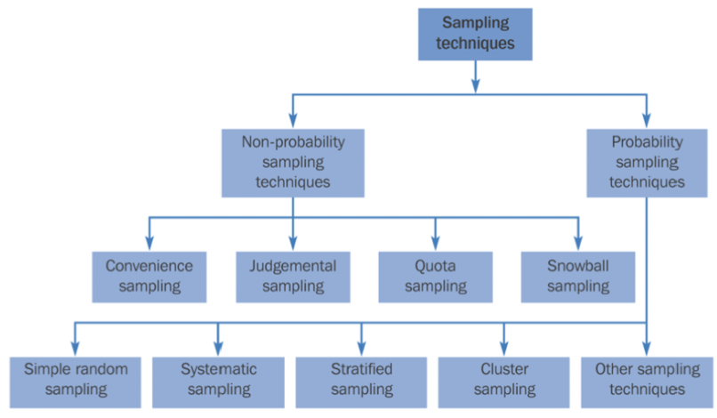
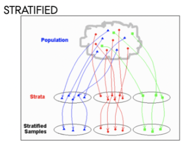
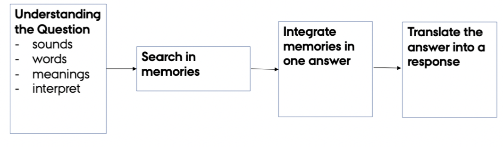
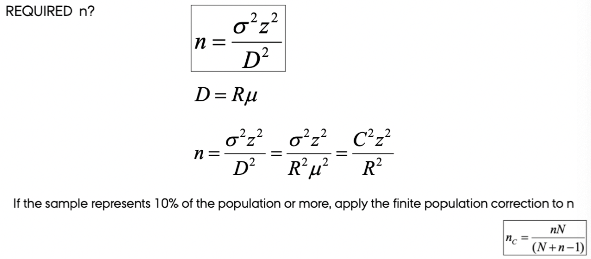
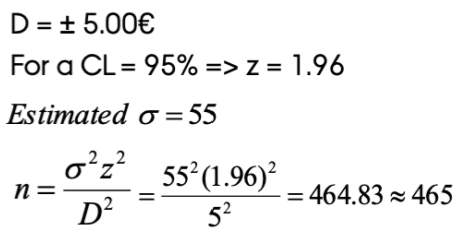
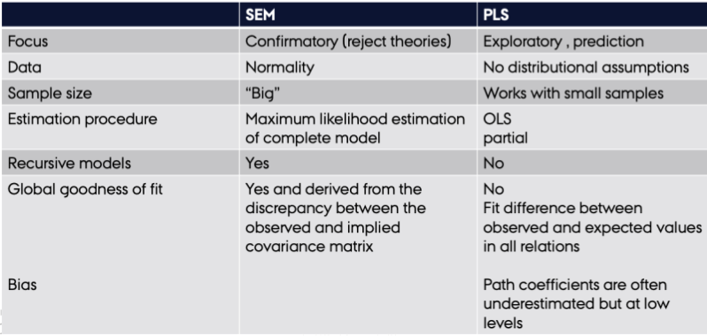
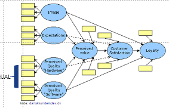
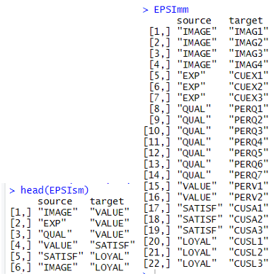
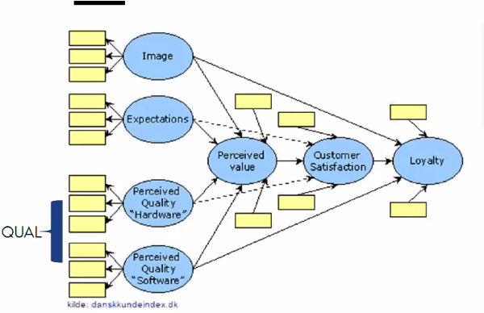
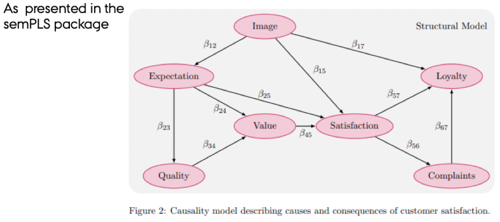

# Customer Satisfaction and Loyalty

I'll start of with some notes on constructing a survey.

## Customer surveys

The following sections are separated into five subsections:

1. Concepts and examples
2. Sampling and response rate
3. Pretesting and measurement validity
4. Questionnaire design
  a. Question types
  b. Scale labeling
  c. Question style
  d. Social desirability bias
  e. Optimizing versus satisfaction
5. Simple size

### (1) Concepts and examples

We have six types of data:

1. Customer identification data - information on the customer and who they are.
2. Demographic data - information on a more macroscale, where they are from, ethnicities, age etc.
3. Psychographic or lifestyle data - psychological characteristics and traits such as values, desires, goals, interests, and lifestyle choices.
4. Transaction data - Do we have transactional information on the customer? What should it be used for and should it be preprocessed.
5. Marketing action data
6. Other types of data - e.g., financial and competitive data

To get such data we can have three different sources.

1. Internal secondary data
2. External secondary data
3. Primary data - survey, focus groups, in depth-interviews, observational techniques. Notice that this is the most costly and time consuming, that is also why getting external secondary data can be extremely expensive.

Another thing that one must be aware of is **innovation in survey designs**, for instance, are we able to ask about what a customer wants in the future and if they answer. If you could rely on such answers, then I guess it would be very easy to be running a business.

In addition of this, it is often experienced, that people are reluctant to answer honestly in surveys, this can be due to several things, for instance you are:

+ Forced to answer - hence no motivation
+ You don't care about the purpose - hence no motivation.

### (2) Sampling and response rate

We need the sample to be representative of the population, e.g., equal amount of males and females to reflect real life. Naturally that comes down to what the purpose of the survey is.

We often get a problem with low response rate. And those that actually respond might share similarities, e.g., they are having a lot of free time, they need the rewards that you may get from answering etc. So you want to be cautous about how to get them to answer your survey.

We can overcome this by assigning statistical weigts to the **underrepresented** groups. Often we see that young and old adults, males and people with the highest income are underrepresented. Also there is a tendency to have few responses from busy people and those living in bigger cities.

On the other hand then people with low education and income is often **overrepresented.**

**Then how to do the sampling?**

We have the following two approaches:

1. Non-probability sampling - this is pretty much taking whom ever you feel like, for instance sharing a questionnaire on facebook, hence it will be distributed to your friends etc. *This is not representative*
2. Probability sampling - this is the go to approach. Here we have four approaches. This will be explained following the picture.



Probability sampling techniques

1. Simple random sampling: that is just a computer randomly selecting numbers. And then you select these observations.
2. Systematic sampling: we do 1) selecting a suitable sampling frame, 2) Each element is assigned a number from 1 to N (Population for instance Denmark), 3) Determine sampling interval, 4) Pcik every ith element in succession from the sampling frame.
3. Stratified sampling: where you group people in different stratas. They can be assigned on one or more parameters. *This is widely used.* See an illustration below
4. Cluster sampling.



***Subconclusion***

In the end, you always ask youself, is it representative. When you have the probabilty sampling methods, you randomly select a number of people that should answer, e.g., you selesct 1000, but only 543 answers, then do you know what people that actually replied, hence, do you know who answered and is it still representative? If you don't know, then the data is very **likely to be representative**.

Also often people will answer because you 'forced' them to answer, hence they are **not really reliable**, as we don't know how honest and thorough they where. That is also elaborated in the following slide. So again, if you need 1000 responses, and you force all 1000 to respond, then they will often just rush through and thus they are not reliable. Hence that is not better than not letting them answer.

### (3) Pretesting and measurement validity

We need to pretest the sampling, the tradition way, *conventional way*. How we do it, is just giving the test to a couple of people and see if they understand the questions. This is key, because if they do not understand then you cannot expect that the mass will understand the questions. In general there are two approaches:

1. Conventaional way: That is giving the questions to persons and they tell you their oppinion. One must be aware that this is very subjective and also a bit random.
2. Moden pretesting way: This has two alternatives
  a. Behavior coding: you have a third person, an observer, will take notes about the responends actions. 
  b. Cognitive pretesting: This is an alternative, the respondent must think out loud, hence verbalize whatever comes to mind when reading the questions.
  
***Subconclusion***

Conventional way has low reliability. And the behavior coding is the most reliable.

An complete alternative can be to have *conversational interviews* although this is very time consuming and often not applied.

### (4) Questionnaire design

The following subsections will cover this.

**(4a) Question types**

Are we going to make open or closed questions. It has the following advantages and disadvantages.

+ Closed questions: Respondents answer what they are given, henve we need to cover the different outcomes to have their experience reflected correctly.

+ Open questions: Some respondents have difficulty of expressing their feelings or people just get lazy and not answer faithfully. Also you will have a ton of different answers.

Hence they both have pros and cons, so one must be aware of when to choose what.

In general we must be cautious about how we use strong words, like very, extreme etc. because it can have several meanings to each individual.

To avoid mistakes, we can setup a questionnaire with questions that are essentially the same, but framed different, to get an idea of what the person intent to ask and also how consistent he is *(that being for instance a weak satisfier)*.

**(4b) Scale labeling**

It is very good to have both a range defined by words, e.g., going from very bad to very good.

Criticism of showing the numbers, let us say that it goes from -3 to 3, then  the distance between -2 and -3 is one, but the numerical distance between two categories it not necessarily between -1 and -2. To solve this, people sometimes puts a line, e.g., between 0 and 100, then the repsonded is able to point out where he is on the range.

Also, even though we produce numbers, people tend to do quantitative regression, while it is in fact a categorical variable.

There are much criticism on using numbers. Also, the middle point, what does it mean, to the respondend it can be many many things.

**(4c) Question style**

Will it be an open or a closed question.

**(4d) Social desirability bias**

Imagine a questionnaire where you are asked about what happens in the past, for instance

> over the last year, how many times pr. month on average have you eaten a burger? 1 time, 2 - 3 times, 4 - 5 times, more than five times, 0 times

This is often leading to over- and underreporting, as nobody can remember this.

Theory has lead to stages when answering questinons *(this should be taken with a grain of salt)*, see the following.



In short, one must look up what they have in their memory and then try to fit it into the boxes thzat you give them.

It is different how much effort a person is putting into the considerations, it can be generalized with:

1. **Optimizers**: A thourough person really considering what to answer, these you want the most of.
2. **Weak satisfaction**: This is just an optimizer which is less considerate.
3. **Strong satisficing**: A person which will just select what he thinks is the most appropriate for the interviewer or researcher, these you do not want any of. This leads to the next section.

**(4e) Optimizing versus satisfaction**

Conditions to foster satisfaction. We need to make the questions as short as possible and use common words. It must be easy for them to understand to avoid them not to understand. This can be cooked down to:

1. Task difficulty
2. Respondents inability
3. Respondents demotivation to optimize

We now that the *order of questions does matter*: it creates the following effects.

+ Primacy effects: That being prone to select the first question, *e.g., weak satisfiers seem to go for this one, because they are just not too considerate*
+ Recency effects: Often when solutions is presented orally then they go for the last option.

If we have a loooong list of questions, then people tend to either just agree or disagree. In general, people who want to save time, they tend to answer the same in each question, if they are similar.


### (5) Simple size

We can infer this statistically. Notice this example assume only one predictor variable.



We see that:

+ z = the confidence level, we go for 5% hence 1.96.
+ D = The interval you want to be within
+ sigma = Variance, notice that this must be estimated, as to get true sigma you need characteristics on the population, and we don't really have that.

And now we can plug it into the function



*Conducting a survey to estimate the monthly amount invested in savings schemes so that the estimate will be within 5 EUR, what would the sample size be?*

And we see that we need 496 respondents.

***Then what happens if we have multiple predictors?***

Then we can infer for each predictor and take the largest value. *A rule of thumb is that we need at least 5 observations for a predictor*


## NPS

```{r}
# x <- ##The ratings go here
# library(NPS)
# prop.table(table(x))
# nps.se(x)
# nps.var(x)
```


## CFA and SEM Application Lavann

*Data source: Hair et al., Multivariate Data Analysis, Pearson Education*

### Business Problem & Objectives

HBAT is a manufacturer of paper products who sells products to two market segments: the newsprint industry and the magazine industry. The current market is very competitive, so the manufacturer wants to understand how its customers perceive the company and make purchasing decisions, in order to enforce customers loyalty. The manufacturer commissioned a study asking its customers to complete a questionnaire on a secure website. In total, 100 customers - purchasing managers from different firms - buying from HBAT completed the questionnaire. The data consist of three main pieces of information:

• A 1st type of information is available from HBAT ́s data warehouse and includes information on:

-   customer type in terms of length of purchase relationship (X1)
-   industry type(X2)
-   size of the customer(X3)
-   region of the customer(X4)
-   distribution system(X5)

• The 2nd type of information is collected based on the online questionnaire and includes consumers' perceptions of HBAT ́s performance on 13 attributes using a continuous 0-10 (line) scale with 10 being "Excellent" and 0 being "Poor". The 13 attributes are:

-   X6 Product quality
-   X7 E-commerce
-   X8 Technical support
-   X9 Complaint resolution
-   X10 Advertising
-   X11 Product line
-   X12 Salesforce image
-   X13 Competitive pricing
-   X14 Warranty and claims
-   X15 Packaging
-   X16 Order and billing
-   X17 Price flexibility
-   X18 Delivery speed

• The 3rd type of information relates to purchase outcomes and business relationships:

-   satisfaction with HBAT, future purchase intention etc. (X19-X22)
-   whether the firm would consider a strategic alliance/partnership
    with HBAT (X23).

### Data

The dataset (HBAT.sav) consists of data for n = 100 customers. Each observation contains information on 23 variables described above. Consistent with the marketing theory, there is an underlying factor structure in the data. When designing the study, the company has clearly 4 types of factors in their mind. They expect that the customer satisfaction is determined by the following four type of perceptions: perceptions about the product value, perceptions about the marketing actions, perceptions about the customer service and perceptions about the technical support.These factors are abstract constructs that can be measured in a survey using multi-item scales. The following items define each construct:

-   X18 Delivery Speed

-   X9 Complain resolution

-   X16 Order and Billing, to express "Customer service"

-   X11Product line

-   X6 Product quality

-   X13 Competing pricing, to express "Product value"

-   X12 Salesforce image

-   X7 E-commerce

-   X10 Advertising, to express "Marketing"

-   X8 Technical support

-   X14 Warranty and claims, to express "Technical support"

```{r setup, include=FALSE}
knitr::opts_chunk$set(echo = TRUE)
```

```{r}
library(lavaan)
```

```{r}
library(foreign)
data <- read.spss("Data/CFA and SEM/HBAT.sav", to.data.frame=TRUE)
```

#### EFA

In the following we are going to identify the factors and what variables
that are related with the factors.

```{r }
# Exploratory factor analysis (EFA): explicitly assumes the existence of latent factors underlying the observed data. 

fit1 <- factanal(~ x6 + x7 + x8 + x9 + x10 + x11 + x12 + x13 + x14 + x15 + x16 + x17 + x18
                 ,factors = 4
                 ,data = data
                 ,lower = 0.1
                 ,rotation = "varimax")

print(fit1)

#We see that the p-value is highly signinficant, hence we reject the model.
```

A first exploration of the factors using the EFA reveals the factor loadings for each observable variable. High loadings (\>0.6 or \> 0.7) are expected for the items that theoretically define each construct. 

Items with cross-loadings should be removed.

One can observe:

1)  x9, x16, x17, x18 load high on Factor 1 (Customer service)
2)  x6, x11, x13, x17 load high on Factor 2 (Product value)
3)  x7, x10?, x12 load high on Factor 3 (Marketing)
4)  x8 and x14 load high on Factor 4 (Technical support)

x17 load high simultaneusly on two factors (Factor 1 and 2). This phenomenon is called "cross-loading".

one needs to remove the items with cross-loading from the measurement model. It means they do not measure a single construct.

x11 might also be a candidate for deletion (loading high on factor 1 and 2); keep it for the moment.

one can delete x15 which does not have high loadings on ANY of the four factors. Very low loadings (\<.10) are not displayed.

```{r }
# Run EFA without x15 and x17
fit2 <- factanal(~ x6 + x7 + x8 + x9 + x10 + x11 + x12 + x13 + x14 + x16 + x18
                 ,factors = 4
                 ,data = data
                 ,lower = 0.1
                 ,rotation = "varimax")
print(fit2,sort = T)
```


We want the cumulative variance to be above 60%, we see that we meet that criteria

+ Test of the hypothesis that 4 factors are sufficient.
+ The chi square statistic is 26.7 on 17 degrees of freedom.
+ The p-value is 0.0626 (n.s.) hence we cannot reject, that there is a relationship.

------------------------------------------------------------------------

**Using eigen value to assess amount of factors to select.**

```{r }
# NOTE
library(nFactors)
ev <- eigen(cor(data[,c(7:19)]))
ev

# EV = a measure of how much of varaince each factor explain.
# According to this, we select 5 factors, equal to the no. of values
# that is above 1.

```

------------------------------------------------------------------------

We defined the individual constructs based on the theory (Stage 1) and developed the overall measurement model making also a first exploration with EFA. The next stages (4 and 5) would be to assess the measurement  model validity (Confirmatory Factor Analsysis). Lastly, stages 5 and 6 implies to specify the structural model (SEM) and to asssess the structural model validity.

Hence, the next two main operational tasks are:

1.  Set up a confirmatory factor analysis to confirm the measurement model
2.  Given the measurement model has been examined and validated in the CFA analysis, set up a SEM model, to test the structural relationships between the four constructs identified and the customers´ likelihood to continue doing business with HBAT (X19-Satisfaction, X20-Likelihood of recommendation and X21-Likelihood of future purchase).

```{r }
variable.names(data)
VariableLabels <- unname(attr(data, "variable.labels"))
# data.label.table <- attr(sav, "label.table") # if you load it with read_sav()
summary(data)
```

#### CFA model

We use CFA to iterate through different models.

##### Initial model

+ CS = Customer Service
+ PV = Product value
+ MK = Marketing
+ TS = Technical support

```{r }
CFA.model <- 'CS =~ x18 + x9 + x16
             PV =~ x11 + x6 + x13
             MK =~ x12 + x7 + x10
             TS =~ x8 + x14
    # Correlations between exogeneous constructs are optional because
    # by default, all exogenous latent variables in a CFA model are allowed to correlate
        CS ~~ PV
        CS ~~ MK
        CS ~~ TS
        PV ~~ MK
        PV ~~ TS
        MK ~~ TS'

# fit the model
fit <- cfa(CFA.model, data = data)
# display summary output
summary(fit
        , fit.measures=TRUE
        , standardized = TRUE
        , modindices = FALSE) #If TRUE, then we would get modificantion index

# Check the model fit (see slides for references). 
# NOTE: we get "lavaan WARNING: some estimated ov variances are negative". 
# This is called in the literature "Heywood case". Heywood cases or negative variance estimates, are a common occurrence in factor analysis and latent variable structural equation models.
# There are several potential causes (https://journals.sagepub.com/doi/10.1177/0049124112442138). Here,eliminating the problematic item x11, will solve the problem.  
```

+ We see that we want to maximize TLI and CFI towards 1. Atm it looks well.

+ We want the RMSEA (Root Mean Square Error of Approximation) to be below the 5% level. This we obtain in this example with pointe estimate of 0.079 where the 5% level is at 0.097, hence we are below. She writes in the slides (54) that we just need to be below 8%, this we also meet. she also writes that above 10% is a poor fit.

We see that we get a warning, that is because there are negative variances, this is because of variable 11, that we ended up leaving in the model.

Now we can ask for the modification indexes.

```{r }
# Ask for the modification indiceslin
modificationindices(fit
                    ,sort = T
                    ,minimum.value = 10
                    ,op = "~~")
# MI reveal that x11 is correlated with x16 and x18; it means that x11 has substantial cross-loading on two factors (we also found this in EFA). Cross-loading goes against one of the principles of unidimensionality in SEM. We delete x11 from the analysis and re-run CFA. 
```

This confirms that we must do something with x11 (it should have been done in the exploratory assessment, but it was kept to show it)

##### Second model

**Model without x11**

Notice that the EFA already suggested this, but we wanted to explore how it affected the overall model. And we end up seeing the consensus that we need to do something with V11.

```{r}
# CFA model after deleting x11
set.seed(1234)
CFA.model <- 'CS =~ x18 + x9 + x16
             PV =~ x6 + x13
             MK =~ x12 + x7 + x10
             TS =~ x8 + x14'
# fit the model
fit <- cfa(CFA.model, data = data)
# display summary output
summary(fit, fit.measures=TRUE, standardized = TRUE, modindices = FALSE)
```

###### Intepretation of the model


####### **1.) Examine the MODEL FIT**

a much better fit than we obtained before

A decent model requires: 

+ CFI >.90, 
+ TLI>.90, 
+ RMSEA< 0.08, 
+ SRMR <.0.08. 

Check these indexes of model fit in your summary.

####### **2). Examine the LOADINGS significance, size and sign**

The (std.) loadings should be at least +-.40. It is desirable to have high and significant loadings - it reflects items convergent validity. 

In one factor 2, competitive pricing (x13) and product quality (x6) have opposite signs. It means that the product quality and competitive pricing vary together, but move in direction opposite to each other. Perceptions are more positive whether product quality increases or price decreases. This trade-off leads to naming the factor product value. When variables have different signs, we need to be careful to reverse one when creating summated scales or using further in SEM analysis. 

**Reverse scoring** is the process by which the data values for a variable are reversed so that its correlation with the other variables are reversed (go from negative to positive). The purpose of reversing is to prevent a canceling out of variables with positive and negative loading. Reverse coding is typically required if we have some negatively phrased statement items in our questionnaire. For a categorical variable e.g. 1-5, the reversing implies: 1->5, 2->4, 3->2, 4->1, 5->1 For a continous variable: newvar = oldvar * (-1) 

```{r,results='hold'}
summary(data$x13)
str(data$x13)

# reversing X13 :
library(dplyr)
library(tidyr)
data <- data %>%
  mutate(x13r = x13 * (-1))
str(data$x13r)
```

####### **3). Examine RELIABILITY of the factors**

Reliability = assessment of degree of consistency between multiple measurements of a variable (back to the slides to refer to this concept).

```{r}
library(semTools)
semTools::reliability(fit)
# alpha =  coefficient alpha (Cronbach, 1951) - should be > than 0.5 or 0.6 (some textbooks)
# omega = is similar to composite reliability index (CR) (Fornell & Larcker (1981) - should be > 0.7
# avevar = average variance extracted (AVE) (Fornell & Larcker (1981))  - should be > than 0.5.
# For PV factor, reliability was calculed with the non-reversed item; let´s change that:
```

We want the `avevar` to be above 0.60.

The omega is the composite reliability, it should be higher than 0.7.

We want the `alpha` to be close to 1.

We see that PV is not meeting the two above. that is because we have a negative variable.

Now we are going to reverse x13 to make the construct PV meet the requirements (or at least get closer to)


```{r}
set.seed(1234)
    CFA.model <- '
    # Measurement model
        CS =~ x18 + x9 + x16
        PV =~ x6 + x13r
        MK =~ x12 + x7 + x10
        TS =~ x8 + x14'
    
    fit <- cfa(CFA.model, data = data)
    summary(fit, fit.measures=TRUE, standardized = TRUE, modindices = FALSE)
    semTools::reliability(fit)
```

given alpha, omega and avevar values overpass the recommended values, one can conclude that all factors display good reliability.

Although it does not appear as if the PV `avevar` does not meet the 60% goal.

With x13 reversed, we see that the model is far better. Although it does not entirely meet the requirements.

####### **4). Examine DISCRIMINANT VALIDITY of the factors**

each pair of latent correlations (correlations between the principal components) should be sufficiently below 1 (in absolute value), that the latent variables can be thought of representing two distinct contructs. (to recall, back to the slides to refer to this concept).

```{r}
discriminantValidity(fit, merge=TRUE)
```

Output: 

+ The first set are factor correlation estimates and their confidence intervals.
+ Are these correlations sufficiently low to claim discriminant validity of the four constructs?
+ Based on Fornell & Larcker (1981), the square root of each construct´s AVE should have a greater value than the inter-constructs corelations (alternatitvely, AVE > corr^2). Let us check that:


```{r}
reliability_out = reliability (fit)
    AVEs = reliability_out[5,]
    sqrtAVEs = sqrt(AVEs)
    sqrtAVEs
```

Comparing the inter-constructs correlations (see "est"" column in the output of discriminantValidity(fit, merge=TRUE)) with the sqrtAVEs, we conclude that cf. Fornell & Larcker (1981) criterion, the four constructss display significant discriminat validity. 

Now we can plot the CFA. notice that the arrows are not yet directed hence you have not yet imposed the structure that we are going to do in SEM.

```{r, echo=FALSE}
library(lavaanPlot)
lavaanPlot(model = fit
           , node_options = list(shape = "box"
                                 , fontname = "Helvetica")
           , edge_options = list(color = "grey")
           , coefs = TRUE
           , covs=TRUE
           , stand=TRUE
           , sig=.05
           , stars="covs")    
```

#### SEM

NOTE: Three variables were not included in the CFA (x11, x15, x17) as these did not meet the assumptions, reasoning both in the EFA and CFA for x11.

Reason: These variables did not load high on any of the main constructs If they are important, they can be treated as separate explanatory variables in SEM 
last DV in our SEM model will be x19-Satisfaction. in other words, we build a model to explain x19

Notice that we are also continuing to use the reversed version of x13r.

```{r,results='hold'}
SEM.model1 <- '
# Measurement model
        CS =~ x18 + x9 + x16
        PV =~ x6 + x13r
        MK =~ x12 + x7 + x10
        TS =~ x8 + x14
# Structural model
        x19 ~ CS + PV + MK + TS'
```

Now we can fit the model

```{r,results='hold'}
fitSEM1 <- sem(SEM.model1
               ,data=data
               ,se="robust"
               ,estimator = "ML") #Maximum Likelihood, that is the standard

summary(fitSEM1, fit.measures=TRUE, standardized = TRUE, rsquare=TRUE)
```

If the message "lavaan WARNING: some estimated ov variances are negative" shows up. In this case, the problematic items are x12 and x14. It reflects that we would need more quality data and more items per construct to run this model. 

We set se="robust" to produce robust standard errors; setting se="boot" or se="bootstrap" will produce bootstrap standard errors.

Now we can check the information critera / indexes as we did in the CFA. The following is a summary of all important criteria.

```{r}
fitmeasures(fit) # alternative summary
```

Next, check the structural coeficients in summary(). Output partially reproduced below: 

Regressions:
                  Estimate  Std.Err  z-value  P(>|z|)   Std.lv  Std.all
  x19 ~                                                                 
   CS                0.787    0.116    6.758    0.000    0.534    0.450
   PV                0.663    0.110    6.022    0.000    0.746    0.629
   MK                0.518    0.078    6.671    0.000    0.595    0.502
   TS               -0.039    0.045   -0.870    0.384   -0.042   -0.035

Concl.: Customers perceptions about CS, PV and MK are positively and significantly correlated with  satisfaction. TS (Technical Service) perceptions is not significantly related to customer satisfaction.

**check modification indices if relevant**

```{r,results='hold'}
summary(fitSEM1, fit.measures=TRUE, standardized = TRUE, rsquare=TRUE, modindices=TRUE)
modificationindices(fitSEM1, sort = T, minimum.value = 10, op = "~~")
```

First we see the summary, and we can assess for improvements, there does not appear to be any.

no suggestion for improvement

```{r}
# If required, the bootstrap model parameters are available with:
# PAR.boot <- bootstrapLavaan(fitSEM1, R=10, type="ordinary",FUN="coef")
# T.boot <- bootstrapLavaan(fitSEM1, R=10, type="bollen.stine",FUN=fitMeasures, fit.measures="chisq")
```

### Plotting the model

```{r, echo=FALSE}
library(lavaanPlot)
labels <- list(x19 = "SATISFACTION")
lavaanPlot(model = fitSEM1
           , node_options = list(shape = "box"
                                 , fontname = "Helvetica")
           , edge_options = list(color = "grey")
           , coefs = TRUE
           , covs=TRUE
           , stand=TRUE
           , sig=.05
           , stars="regress"
           , labels = labels)    
```

and this is another plot

```{r, echo=FALSE}
library(semPlot)
semPaths(fitSEM1, "std", intercepts = FALSE, style="lisrel", layout="tree2")
# see ?semPaths
```

This also show what variables that should be exlcuded.

Note: to improve the model, exclude the items with the negative variance. hence the two items, x12 and x14

### Consider a more complex SEM model involving a mediating effect.

Consistent with the theory, Sem.model2 proposed x19 (Satisfaction) as mediator between the four latent constructs and Likelihood of future purchase (x21).

```{r}
SEM.model2 <- '
# Measurement model
             CS =~ x18 + x9 + x16
             PV =~ x6 + x13r
             MK =~ x12 + x7 + x10
             TS =~ x8 + x14
# Structural model
             x19 ~ CS + PV + MK + TS
             x21 ~ x19'

# fit the model
fitSEM2 <- sem(SEM.model2, data=data, se="robust") 
summary(fitSEM2, fit.measures=TRUE)
```


```{r,results='hold'}
summary(fitSEM2, fit.measures=TRUE, standardized = TRUE, rsquare=TRUE, modindices=TRUE)
modificationindices(fitSEM2, sort = T, minimum.value = 10, op = "~~")
```

Model has a good fit

Plotting the model

```{r, results='hold'}
library(lavaanPlot)
labels <- list(x19 = "SATISFACTION", x21 = "FUTURE PURCHASE")
lavaanPlot(model = fitSEM2
           , node_options = list(shape = "box"
                                 , fontname = "Helvetica")
           , edge_options = list(color = "grey")
           , coefs = TRUE
           , covs=TRUE
           , stand=TRUE
           , sig=.05
           , stars="regress"
           , labels = labels)
```

We see that satisfaction is the mediator, where the future purchase is the final construct that we want to measure.

```{r ,results='hold'}
# now
 # - summarize the findings 
 # - are the all structural paths in the sem model significant? (if so, which hypotheses are supported?)
 # - which is the most important determinant of customer satisfaction? (check std. path coefficients and conclude)
 # - does satisfaction act as a sigificant mediator? (check the sig. of mediating patterns and conclude)
 # - how much variance in x21 (Likelihood of future purchase) the model explains? (check R^2 associated)
```


\

## PLS

### Definition of PLS

We see that partial least squares can be used to make exploratiry analysis as well as prediction. Where SEM is used in a more confirmatory way of looking into relationships, where you assume some structure.

Hence we also assume normality in SEM, this is not the case with PLS. See more information in the following illustration.




### When to use PLS and when to use SEM

PLS if:

1. You have a goal of predicting a target construct
2. The structural model is complex (many constructs and indicators)
3. If the sample size is small, and then again, what is small?? Or if the data is not normally distributed.

SEM if:

1. The goal is theory testin or comparison of different theories
2. Error terms requires additional specificatio such as the covariation
3. The structural model is non-recursive
4. The research requires a global goodness-of-fit criterion


### Model construction

We have two types of variables:

1. Latent: These cannot be directly observed. These come in two classes:
    1. Exogenous latent variables: are independent variables
    2. Endogenous latent variable: are dependent variables.
2. Manifest: This is a directly observable. These come in two classes:
    1. Exogenous: reveal exogenious latent variables
    2. Endogenous: reveal endogenious latent variables

PLS is based on OLS and dont assume linearity and observations does not have to be independent.

### Model Estimation

It is called partial least squares as some of the model is changed while others is not changed, hence you change it partially. That comes in different procedures.

The iterative process is where you first estimate the outer variables and then you move onwards.

### Model evaluation

Look at the following criteria:

1. Loadings - items reliability. We want the above 0.7 as they indicate that the constrct explains more than 50% of the indicators variance. Thus proving reliability.
2. Internal reliability. 
3. Discriminant validity
4. The significance of the inner coefficients
5. The models ability to explain the endogenous latent variables

### Example for the lecture

PLS is estimated based upon OLS

-   It is always converging

    -   It provides an output although the constructs are poorly
        measured

-   It works with less assumptions than covariance based SEM

-   It has no overall fit criterion

-   it is very popular expecially in consulting

**Description of the following example:**

In epsi_pls.R the purpose was to estimate the EPSI model in a slightly modified form as given below. The only diference to the standard EPSI model was that all questions related to quality aspects were items for an overall Quality construct and not divided into Quality with respect to service (Quality soft ware)and Quality with respect to Product (Quality Hard ware)



If we take a look at the dataset (help(mobi) we can see that there are 24 items all in all. One question is about complaints (CUSCO). Complaints is not part of the model, so we do not include that one.

We see that the measurement model is all the relationships between the questions (the yellow boxes) to the constructs. They are called the *measurement model*, as these are the variables that you can measure.

Next step is to formulate the model. In semPLS we use a matrix format and not equations like in Lavaan.

We describe the measurement model and the structural model separately and in this case we should end up with two matrices like the following:

{width="311"}

```{r}
library(boot)  #Bootstrapping of standard deviations to outer loadings and path coefficients
library(semPLS)
library(psych)

# help(mobi)
data(mobi)
#names(mobi)
```

Before we run the model it is always a good idea to have an overview of the dataset. We can use the function describe from library psych to give this overview.

```{r,results='hold'}
#The dataset
summary(mobi)
describe(mobi) #from library(psych)
```

Here we can see that all items apart from CUSL2 has a negative skewness. If **skewness** is negative then it means that the tail in the distribution is to the left. Less than -1 then highly skewed, between -0,5 and -1 then moderately skewed. **Kurtosis** is the degree of peakedness in a distribution (how heavy tails). Negative kurtosis is an indicator of a more even distribution across possible outcomes.

It can be seen that CUSL2 has a positive skewness (more even distribution) and a negative kurtosis. Answers to this question behaves completely different compared to the rest. The question is also compared to the other questions that are more straightforward to answer.

We can plot the distribution of the CUSL1 and 2.

```{r,results='hold',fig.cap="Histogram CUSL1"}
hist(mobi$CUSL1)
```

```{r,results='hold',fig.cap="Histogram CUSL2"}
hist(mobi$CUSL2)
```

We see that they are not at all normally distributed. Notice that we are going to build the following model using in R.

{width="414"}

We see that we are going to use the arrows which are non-dotted.

We see that in the package we have **image** that is the only variable that are not described by other constructs.



Now we are going to define the structural model, by describing the varaibles that are linked to them, hence identifying the indicators of each of the latent variables.

Now we can 'draw' the model. We saw in SEM that we wrote it as a function, here we make it as a matrix.

#### Making structural- and measurement model

We relate the constructs and the varaibles in the following.

```{r,results='hold'}
#The structural model
EPSIsm <- matrix(c("IMAGE", "VALUE"
                   ,"EXP","VALUE"
                   ,"QUAL","VALUE"
                   ,"VALUE","SATISF"
                   ,"SATISF","LOYAL"
                   ,"IMAGE","LOYAL"),byrow=TRUE,ncol=2)
colnames(EPSIsm)=c("source","target")
EPSIsm
```


```{r,results='hold'}
#The measurement model
EPSImm1 <-matrix(c("IMAGE", "IMAG1","IMAGE","IMAG2","IMAGE","IMAG3","IMAGE","IMAG4"),byrow=TRUE,ncol=2)
colnames(EPSImm1)=c("source","target")
# EPSImm1

EPSImm2 <-matrix(c("EXP", "CUEX1","EXP","CUEX2","EXP","CUEX3"),byrow=TRUE,ncol=2)
colnames(EPSImm2)=c("source","target")


EPSImm3 <-matrix(c("QUAL", "PERQ1","QUAL","PERQ2","QUAL","PERQ3","QUAL","PERQ4","QUAL","PERQ5",
                   "QUAL","PERQ6","QUAL","PERQ7"),byrow=TRUE,ncol=2)
colnames(EPSImm3)=c("source","target")
head(EPSImm3,7)

EPSImm4 <-matrix(c("VALUE", "PERV1","VALUE","PERV2"),byrow=TRUE,ncol=2)
colnames(EPSImm4)=c("source","target")

EPSImm5 <-matrix(c("SATISF", "CUSA1","SATISF","CUSA2","SATISF","CUSA3"),byrow=TRUE,ncol=2)
colnames(EPSImm5)=c("source","target")

EPSImm6 <-matrix(c("LOYAL", "CUSL1","LOYAL","CUSL2","LOYAL","CUSL3"),byrow=TRUE,ncol=2)
colnames(EPSImm6)=c("source","target")
```

```{r,results='hold'}
EPSImm <-rbind(EPSImm1,EPSImm2,EPSImm3,EPSImm4,EPSImm5,EPSImm6)
EPSImm
```

#### Now we can estimate the model

estimating and looking at the matrices reflecting the relationships.

```{r,results='hold'}
#The whole model
EPSI <- plsm(data=mobi
             ,strucmod=EPSIsm
             ,measuremod=EPSImm)

EPSI[["D"]] #The structural model (inner relations)
EPSI[["M"]] #The measurement model
```


```{r,results='hold'}
#Estimation of model
epsi <- sempls(model=EPSI,data=mobi)

epsi
```

We see that we get the estimates, which are the coefficients.

Just as in the covariance based approach it is important to have a good measurement model and the criteria are the same.

Firstly we have to make sure that the items are good indicators for the latent constructs. Here we look at the loadings. The loadings are produced with the following line:

```{r}
# Evaluation of estimated model
plsLoadings(epsi)
```

We see that expectations are influenced by CUEX, and Image is defined by image etc. Although it is rather interesting to see that the satisfaction is defined by several variable.

When we look on the loyalty, we see that question no. 2 (CUSL2) that there is a very low relationship. ***The rule of thumb, is that the relationship needs to be at least 0.7.*** So we also have other variables that are questionable.

#### Measuring quality of the constructs

We can can compute the composite reliability by the following:

```{r}
#Composite reliability
dgrho(epsi)
```

We want the coefficients be higher than 0.8 (***rule of thumb***), hence we see that loyalty for instance is low. that is because of the question no. 2, that was very weak.

```{r}
# AVE is average of communality for a construct
communality(epsi)
```

now we can look at the inner relationtions.

```{r}
#Inner relations
pC <- pathCoeff(epsi)
print(pC,abbreviate=TRUE,minlength=3)
```

we see that the coefficients are standardized.

```{r}
#The total effects
tE<- totalEffects(epsi)
print(tE,abbreviate=TRUE,minlength=3)
```

The total effect includes the indirect effects, e.g., going between
latent variables.

```{r}
#R2
rSquared(epsi)
```

We see that the $R^2$ is rather low. It is common to say, that it needs to be at least 0.65, i.e., 65%.

#### Are the coefficients significant?

We can run a bootstrap to assess whether the coefficients are significant.

```{r}
#Bootstrapping - estimation of standard errors
set.seed(123)
epsiBoot <- bootsempls(epsi,nboot=500,start="ones",verbose=FALSE)
epsiBoot
```

E.g., we see that the relationship between the expectations (EXP) and the value (VALUE) is rather low and there does not appear to be any relationship.

```{r}
# Structural model coefficients
parallelplot(epsiBoot,reflinesAt=0, alpha=0.8,
             varnames=attr(epsiBoot$t,"path")[23:28])
```

We see that the dotted line = 0. This gives an idea of the stability of the estimation that we have done.

```{r}
#Constructing observations
plsWeights(epsi)
```

These are the factor scores.

```{r,results='hold'}
#Standardised observations for  (constructs)
epsi$factor_scores
densityplot(epsi)

densityplot(epsi,use="prediction")
```

```{r}
#Unstandardised solution

# Function to get unstandardized LV
unstandardized_LV <- function(data, sempls_model){
  # Save object to hold outer weights which will be scaled in loop
  outer_weights_resc <- sempls_model$outer_weights
  # Find standard deviation of indicators
  std_indicators <- unlist(lapply(data, FUN = sd))
  for (lv in colnames(sempls_model$model$M)) {
    # Check estimation mode of LV
    mode <- attr(sempls_model$model$blocks[[lv]], "mode")
    if (mode == "A") {
      tmp_indicator_names <- sempls_model$model$measuremod[sempls_model$model$measuremod[,1]==lv,2]
    } else {
      tmp_indicator_names <- sempls_model$model$measuremod[sempls_model$model$measuremod[,2]==lv,1]  
    }
    tmp_weights <- outer_weights_resc[tmp_indicator_names,lv]
    tmp_weights <- tmp_weights/std_indicators[tmp_indicator_names]
    outer_weights_resc[tmp_indicator_names,lv] <- tmp_weights/sum(tmp_weights)
    
  }
  # Data as matrix in order to perform matrix multiplication
  data_mat <- as.matrix(data[,rownames(outer_weights_resc)])
  unstandardized_LV <- data_mat %*% outer_weights_resc
  return(unstandardized_LV)
}

# Unstandardized LV
LV_unstand <- unstandardized_LV(data = mobi, sempls_model = epsi)
head(LV_unstand)
```

```{r,results='hold'}
plot(LV_unstand[,5:6])
pairs(LV_unstand,pch=19,cex=0.7,cex.axis=0.8,col.axis="gray70",gap=0.5)

summary(LV_unstand)
```

### Revised code

He made some changes, e.g., removing the question that was not relevant for the customer loyalty.

In this setup the only difference is that I have made some modifications to the model formulation.

1.  I have deleted CUSL2 for the reasons mentioned above
2.  I have included IMAGE5 that I actually forgot to include in the
    first setup (it does not have any real influence I found out)
3.  I have modified the Quality construct. Now it only has 2 items

So it is now a contruct that measures the perception of the service in an attempt to avoid it to be mixed up with SAT

If you run this model, you will see that the problem with EXP still remains and the effect of EXP is still insignificant, so it could be an idea simply to drop EXP from the model. The construct IMAGE still have a relative low AVE, but the effects from IMAGE are now significant.

```{r}
library(boot)  #Bootstrapping of standard deviations to outer loadings and path coefficients
library(semPLS)
library(psych)

help(mobi)
data(mobi)
names(mobi)


#The dataset
summary(mobi)
describe(mobi) #from library(psych)

hist(mobi$CUSL1)
hist(mobi$CUSL2)

#The structural model
EPSIsm <- matrix(c("IMAGE", "VALUE","EXP","VALUE","QUAL","VALUE","VALUE","SATISF","SATISF","LOYAL","IMAGE","LOYAL"),byrow=TRUE,ncol=2)
colnames(EPSIsm)=c("source","target")
head(EPSIsm)

#The measurement model
#IMAG5 has been added compared to the original setup (forgotten in original setup)
EPSImm1 <-matrix(c("IMAGE", "IMAG1","IMAGE","IMAG2","IMAGE","IMAG3","IMAGE","IMAG4", "IMAGE","IMAG5"),byrow=TRUE,ncol=2)
colnames(EPSImm1)=c("source","target")
head(EPSImm1)

EPSImm2 <-matrix(c("EXP", "CUEX1","EXP","CUEX2","EXP","CUEX3"),byrow=TRUE,ncol=2)
colnames(EPSImm2)=c("source","target")

# "Pure" service quality 
EPSImm3 <-matrix(c("QUAL","PERQ3","QUAL","PERQ4"),byrow=TRUE,ncol=2)
colnames(EPSImm3)=c("source","target")
head(EPSImm3,7)

EPSImm4 <-matrix(c("VALUE", "PERV1","VALUE","PERV2"),byrow=TRUE,ncol=2)
colnames(EPSImm4)=c("source","target")

EPSImm5 <-matrix(c("SATISF", "CUSA1","SATISF","CUSA2","SATISF","CUSA3"),byrow=TRUE,ncol=2)
colnames(EPSImm5)=c("source","target")

#Exclusion of CUSL2
EPSImm6 <-matrix(c("LOYAL", "CUSL1","LOYAL","CUSL3"),byrow=TRUE,ncol=2)
colnames(EPSImm6)=c("source","target")

EPSImm <-rbind(EPSImm1,EPSImm2,EPSImm3,EPSImm4,EPSImm5,EPSImm6)
EPSImm


#The whole model
EPSI <- plsm(data=mobi,strucmod=EPSIsm,measuremod=EPSImm)

EPSI[["D"]] #The structural model (inner relations)
EPSI[["M"]] #The measurement model

#Estimation of model
epsi <- sempls(model=EPSI,data=mobi)

epsi

# Evaluation of estimated model

plsLoadings(epsi)


#Composite reliability
dgrho(epsi)


# AVE is average of communality for a construct
communality(epsi)


### check for discriminant validity using loadings. If the relative difference between a loading and a cross-loading
# is more than 0.2 the the cross-loading will be printed

l <-plsLoadings(epsi)
print(l, type="discriminant", cutoff=0.5, reldiff=0.2)


pC <- pathCoeff(epsi)
print(pC,abbreviate=TRUE,minlength=3)

tE<- totalEffects(epsi)
print(tE,abbreviate=TRUE,minlength=3)

#R2
rSquared(epsi)
```

we still see that there are low $R^2$

```{r}
#Bootstrapping - estimation of standard errors
set.seed(123)
epsiBoot <- bootsempls(epsi,nboot=500,start="ones",verbose=FALSE)
epsiBoot
```

We see that again the relationship between EXP and VALUE is still very
low, perhaps one should drop the expectations.

```{r}
# Structural model coefficients
parallelplot(epsiBoot,reflinesAt=0, alpha=0.8,
             varnames=attr(epsiBoot$t,"path")[18:23])


#Constructing observations
plsWeights(epsi)

#Standardised observations for  (constructs)
epsi$factor_scores
densityplot(epsi)

densityplot(epsi,use="prediction")

#Unstandardised solution


# Function to get unstandardized LV
unstandardized_LV <- function(data, sempls_model){
  # Save object to hold outer weights which will be scaled in loop
  outer_weights_resc <- sempls_model$outer_weights
  # Find standard deviation of indicators
  std_indicators <- unlist(lapply(data, FUN = sd))
  for (lv in colnames(sempls_model$model$M)) {
    # Check estimation mode of LV
    mode <- attr(sempls_model$model$blocks[[lv]], "mode")
    if (mode == "A") {
      tmp_indicator_names <- sempls_model$model$measuremod[sempls_model$model$measuremod[,1]==lv,2]
    } else {
      tmp_indicator_names <- sempls_model$model$measuremod[sempls_model$model$measuremod[,2]==lv,1]  
    }
    tmp_weights <- outer_weights_resc[tmp_indicator_names,lv]
    tmp_weights <- tmp_weights/std_indicators[tmp_indicator_names]
    outer_weights_resc[tmp_indicator_names,lv] <- tmp_weights/sum(tmp_weights)
    
  }
  # Data as matrix in order to perform matrix multiplication
  data_mat <- as.matrix(data[,rownames(outer_weights_resc)])
  unstandardized_LV <- data_mat %*% outer_weights_resc
  return(unstandardized_LV)
}

# Unstandardized LV
LV_unstand <- unstandardized_LV(data = mobi, sempls_model = epsi)
head(LV_unstand)

plot(LV_unstand[,5:6])
pairs(LV_unstand,pch=19,cex=0.7,cex.axis=0.8,col.axis="gray70",gap=0.5)

summary(LV_unstand)
```

## Segmentation (Clustering)

### What is clustering

Basically what we aim to do, is separate e.g., customers into a given amount of groups.

We have the following measures:

1. Between-cluster variation: this is from one center to other cluster centers, we want to maximize this.
2. Within-cluster variation: this is the distance from the center of the clusters to the center.

### Clustering techniques

There are many techniques and no one size fits all.

We are gogin to focus on:

1. Hierarchical algorithms, and
2. Partitioning algorithsm, and main focus on
3. K-means, as this is the most widely used.

**K-means advantages and disadvantages**

+ Advantages:
  + Relatively efficient
  + Better than most hierarchical methods at handling noisy data and outliers

+ Disadvantges
  + Need to specify k, the number of clusters in advance
  + In small samples, results depend strongly on initial cluster centers
  + In principle k-means works only with continuous variables
  + it will always create the amount of groups, hence it is a good idea to see if you can visualize the data

### An example

#### 1. Background

The dataset for this case study is from Hair et al.2010, Multivariate Data Analysis, Pearson Education.

HBAT is a manufacturer of paper products who sells products to two market segments: the newsprint industry and the magazine industry.The current market is very competitive, so the manufacturer wants to understand how its customers perceive the company and make purchasing decisions, in order to enforce customers' loyalty. The manufacturer commissioned a study asking its customers to complete a questionnaire on a secure website. In total,100 customers (purchasing managers from different firms) buying from HBAT completed the questionnaire. The data consist of three main pieces of information:

(1) A 1st type of information is available from HBAT's data warehouse and includes information, such as: customer type in terms of length of purchase relationship(x1), industry type(x2), size of the customer(x3), region of the customer(x4) and distribution system(X5).

(2) The 2nd type of information is collected based on the online questionnaire and includes customers' perceptions of HBAT ́s performance on 13 attributes using a continuous 0-10 line scale with 10 being "Excellent" and 0 being "Poor". The 13 attributes are:

-   X6 Product quality
-   X7 E-commerce
-   X8 Technical support
-   X9 Complaint resolution
-   X10 Advertising
-   X11 Product line
-   X12 Salesforce image
-   X13 Competitive pricing
-   X14 Warranty and claims
-   X15 Packaging
-   X16 Order and billing
-   X17 Price flexibility
-   X18 Delivery speed

(3) The 3rd type of information relates to purchase outcomes and business relationships:

-   satisfaction with HBAT, future purchase intention, etc (X19-X22)
-   whether the firm would consider a strategic alliance/partnership with HBAT (X23).

##### 1.1. The primary objective is:

-   to develop a taxonomy that segments the customers into groups with similar perceptions. Once identified, separate strategies with different appeals can be formulated for each segment. In addition to forming a taxonomy of customers that can be used for market segmentation, cluster analysis also facilitates data simplification (each segment is used to define the basic character of segment members) and identification of relationships (e.g. for estimating the impact of customers perceptions on sales in each segment, enabling the analyst to understant what uniquely impacts each segment rather than the sample as a whole).

#### 2. The data (Data Understanding Phase)

##### 2.1 Load data correctly

```{r}
library(foreign)
HBAT <- read.spss(file = "Data/Clustering/HBAT.sav", to.data.frame=TRUE)
```

##### 2.2 Check if the data is numerical or categorical

```{r }
str(HBAT)
```

##### 2.3 Missing treatment

```{r }
library(DataExplorer)
plot_missing(HBAT)
any(is.na.data.frame(HBAT))
```

We will only work with the perceptions and hence not the factors.

##### 2.4 Select relevant variables

```{r }
# Select variables aimed for clustering
HBAT_CLU = HBAT[,c(7:19)]
```

##### 2.5.Identify extreme outliers (the most dissimilar customers)

There is no best single way to identify the outliers. Many methods are available. 

- One option when the variables are all metric is: 
     
  - Calculate the difference between the observed value for a variable and the variable mean
  - Square the difference
  - Sum the squared differences to get a total deviations for that observation across all variables 
  - Take the square root 
  - Repeat this process for all observations 
  - Observations with the highest dissimilarity have the potential to be outliers
  - Do not focus on the absolute value; rather, look for any value that is relatively large compare to others.


```{r }
diss = sqrt((HBAT_CLU$x6 - mean(HBAT_CLU$x6))^2 +
              (HBAT_CLU$x7 - mean(HBAT_CLU$x7))^2 +
              (HBAT_CLU$x8 - mean(HBAT_CLU$x8))^2 +
              (HBAT_CLU$x9-mean(HBAT_CLU$x9))^2 +
              (HBAT_CLU$x10 - mean(HBAT_CLU$x10))^2 +
              (HBAT_CLU$x11- mean(HBAT_CLU$x11))^2 +
              (HBAT_CLU$x12 - mean(HBAT_CLU$x12))^2 + 
              (HBAT_CLU$x13 - mean(HBAT_CLU$x13))^2 +
              (HBAT_CLU$x14 - mean(HBAT_CLU$x14))^2 +
              (HBAT_CLU$x15 - mean(HBAT_CLU$x15))^2 +
              (HBAT_CLU$x16 - mean(HBAT_CLU$x16))^2 +
              (HBAT_CLU$x17- mean(HBAT_CLU$x17))^2 +
              (HBAT_CLU$x18 - mean(HBAT_CLU$x18))^2)

# Add diss to the dataset
HBAT$diss = diss
# order by diss (decreasing order)
newHBAT<- HBAT[order(-diss),] 
# display the first 10% rows (the first 10 observations in our dataset)
head(newHBAT[,c(1,25)], 10)
# observe in the output that id 87 displays the largest diss value, meaning the highest average distance overall. However,it does not stand out over the others too much. In this dataset, we do not find any extreme outlier. 
```

##### 2.6 Standardize the variables (mean=0, std.dev=1)

```{r}
sd.data=scale(HBAT_CLU)
```

#### 3. Hierarchical clustering (using variables)

```{r}
# Using complete, avg and single linkage + Euclidian distance
 hc.complete = hclust(dist(sd.data), method="complete")  
 hc.average = hclust(dist(sd.data), method="average") 
 hc.single = hclust(dist(sd.data), method="single")  
```

```{r}
# Plot the dendograms
 par(mfrow=c(1,1))
 plot(hc.complete, main="Complete linkage", xlab="", sub="", ylab="")
 plot(hc.average, main="Average linkage", xlab="", sub="", ylab="")
 plot(hc.single, main="Single linkage", xlab="", sub="", ylab="")
```

Based on the dendograms we observe:

- the choice of linkage type affects the results
- none of the linkage methods yield a balanced, attractive cluster solution
- one reason could be that many of the variables in our dataset are highly correlated 
- multicolinearity (very highly correlated variables) can be an issue in cluster analysis
- in other words, the cluster analysis works best with uncorrelated features
- Therefore, we have two alternatives:  
  a. Select the variables so that the remaining ones are not strongly correlated to one another 
  b. Run a PCA to extract the most important principal components, and afterwards fit the cluster model using PCs vector scores, instead of  the original variables. PCs are expected to retain most of the information in the dataset and by definition they are orthogonal (uncorrelated) with one another. We adopt this alternative below. 


we see that the complete linkage appear to yield the best result.

#### 4. Hierarchical clustering (using PCs score vectors)

```{r results='hold'}
#Run PCA
HBAT.pca = prcomp(HBAT_CLU, scale = TRUE)  
HBAT.pca
summary(HBAT.pca)
screeplot(HBAT.pca, type="line")
abline(h=1, col="red", lty= 3)
```

Based on the elbow, eigen values and % of variance explained criteria, we may decide to select the first 4 PCs as the most important (see Case Study PCA from last week for full details).

Hierarchical clustering based on the first 4 PCs score vectors using Euclidian distance (dist)  using linkage=complete, average, or single

```{r results='hold'}
hc.complete= hclust(dist(HBAT.pca$x[,1:4]), method="complete")
hc.average= hclust(dist(HBAT.pca$x[,1:4]), method="average")
hc.single= hclust(dist(HBAT.pca$x[,1:4]), method="single")

plot(hc.complete, main="Hierarchical cluster with complete linkage")
plot(hc.average, main="Hierarchical cluster with average linkage")
plot(hc.single, main="Hierarchical cluster with single linkage")
```

Looking at the dendograms: Single linkage does not perform well again. Likewise, average linkage creates innapropriate clusters. Complete linkage creates more appropriate clusters. It comes out that 3-cluster is the most plausible solution. 
   
To visualize the dendogram with red borders around the 3 clusters uncomment the next lines:

+ hc.complete <- hclust(dist(HBAT.pca$x[,1:4]), method="complete")
+ plot(hc.complete, main="Hierarchical cluster with complete linkage")
+ rect.hclust(hc.complete , k = 3, border = "red")

Before proceeding with K-means, we can profile the original variables on the three clusters to confirm that the differences between the clusters are distinctive. 

```{r}
 # Save the clusters by cutting the tree into 3 clusters 
    hc.clusters = cutree(hc.complete,3)
 # Add the cluster variable to my data
    HBAT_CLU$clusters = hc.clusters
 # Check size of the clusters
    table(HBAT_CLU$clusters)
```

Run Anova to see if differences in means between clusters are significant and to define the characteristics of the clusters. The independent variable: cluster membership. The dependent variables: the 13 original variables.

***Does not appear to run***

```{r lastrun,results='hold',include=FALSE,eval=FALSE}
summary(aov(HBAT_CLU$x6 ~ HBAT_CLU$clusters , data=HBAT_CLU[ , 1:13]))
summary(aov(HBAT_CLU$x7 ~ HBAT_CLU$clusters , data=HBAT_CLU[ , 1:13]))
summary(aov(HBAT_CLU$x8 ~ HBAT_CLU$clusters , data=HBAT_CLU[ , 1:13]))
summary(aov(HBAT_CLU$x9 ~ HBAT_CLU$clusters , data=HBAT_CLU[ , 1:13]))
summary(aov(HBAT_CLU$x10 ~ HBAT_CLU$clusters , data=HBAT_CLU[ , 1:13]))
summary(aov(HBAT_CLU$x11 ~ HBAT_CLU$clusters , data=HBAT_CLU[ , 1:13]))
summary(aov(HBAT_CLU$x12 ~ HBAT_CLU$clusters , data=HBAT_CLU[ , 1:13]))
summary(aov(HBAT_CLU$x13 ~ HBAT_CLU$clusters , data=HBAT_CLU[ , 1:13]))
summary(aov(HBAT_CLU$x14 ~ HBAT_CLU$clusters , data=HBAT_CLU[ , 1:13]))
summary(aov(HBAT_CLU$x15 ~ HBAT_CLU$clusters , data=HBAT_CLU[ , 1:13]))
summary(aov(HBAT_CLU$x16 ~ HBAT_CLU$clusters , data=HBAT_CLU[ , 1:13]))
summary(aov(HBAT_CLU$x17 ~ HBAT_CLU$clusters , data=HBAT_CLU[ , 1:13]))
summary(aov(HBAT_CLU$x18 ~ HBAT_CLU$clusters , data=HBAT_CLU[ , 1:13]))
```

The F-statistic from one-way ANOVA examine if there are sig. differences between the three clusters on the respective independent variable. The results indicate sig. differences with respect to all the variables, except x6, x13 and x15.

We may examine the means for the significant variables and characterize the clusters. 

Examples:

***For some reason, this chunk cannot be knitted hence `eval=FALSE`***

```{r lastrun2,include=FALSE,eval=FALSE}
library(ggpubr)
ggboxplot(HBAT_CLU, x = "clusters", y = "x7", 
  color = "clusters", palette = c("#00AFBB", "#E7B800", "#FC4E07"),
  ylab = "x7-Ecommerce", xlab = "Clusters")

ggboxplot(HBAT_CLU, x = "clusters", y = "x8", 
  color = "clusters", palette = c("#00AFBB", "#E7B800", "#FC4E07"),
  ylab = "x8-Technical support", xlab = "Clusters")

ggboxplot(HBAT_CLU, x = "clusters", y = "x9", 
  color = "clusters", palette = c("#00AFBB", "#E7B800", "#FC4E07"),
  ylab = "x9-Complaint resolution", xlab = "Clusters")
 
ggboxplot(HBAT_CLU, x = "clusters", y = "x10", 
  color = "clusters", palette = c("#00AFBB", "#E7B800", "#FC4E07"),
  ylab = "x10-Advertising", xlab = "Clusters")

ggboxplot(HBAT_CLU, x = "clusters", y = "x11", 
  color = "clusters", palette = c("#00AFBB", "#E7B800", "#FC4E07"),
  ylab = "x11-Product line", xlab = "Clusters")

ggboxplot(HBAT_CLU, x = "clusters", y = "x12", 
  color = "clusters", palette = c("#00AFBB", "#E7B800", "#FC4E07"),
  ylab = "x12-Salesforce image", xlab = "Clusters")
```


```{r lastrun3}
# Run the same for:  x14, x16, x17, x18
# Interpreting the clusters by looking at the extremes (highest and lowest means): 
  # - Cluster 1 has a relatively lower mean on x9 and x11 variables than the other two clusters. This means that customers in this cluster are unhappy about complaint resolution (x9) and product line (x11) 
  # - Cluster 2 has a relatively higher mean on x8 (Technical support) and x11(Product line), than the other two clusters.
  # - Cluster 3 has a relatively higher mean on x7(E-commerce perceptions), x9(complain resolution), x10(advertising), x12 (salesforce image), than the other two clusters. 
#  - Overall, as expected, these results indicate that each of the three clusters exibit somewhat distinctive characteristics. 
# NOTE: the label assigned to clusters "1", "2", "3" can changes from one computer to another. 
  
```

#### 5. K-means

In k-means clustering the analyst must specify the number of clusters to extract. But how can one know how many segments exist in the population?

One possibility is to rely on theory. The analyst might expect a certain number of segments in the population investigated based on previous knowledge.

Another possibility is to use the results from Hierarchical Clustering.There we identified 3 clusters.Thus, we run K-means clutering with K=3. 

```{r lastrun4,results='hold'}
set.seed(1)
km.out= kmeans(HBAT.pca$x[,1:4], 3, nstart=20)
km.out # evaluate this output
km.clusters=km.out$cluster # saving the clusters
```

We can compare k-means with hierarchical solution (if we want) using a cross-classification table:

```{r lastrun5}
table(km.clusters, hc.clusters)
```

Perfect fit would appear if only one cell in each row or column of the table contained a value.

The two methods produce quite different clusters (this is typical), but most of the observations in k-means are grouped with the same observations they cluster with in the hc.cluster solution. In practice the researchers rely on the K-means solution. 

We now interpret the meaning of the clusters by analysing the pattern of their cluster means (as we did before with hierarchical clustering)

```{r lastrun6,results='hold'}
HBAT_CLU$clustersK = km.out$cluster

summary(aov(HBAT_CLU$x6 ~ HBAT_CLU$clustersK  , data=HBAT_CLU[ , 1:13]))
summary(aov(HBAT_CLU$x7 ~ HBAT_CLU$clustersK  , data=HBAT_CLU[ , 1:13]))
summary(aov(HBAT_CLU$x8 ~ HBAT_CLU$clustersK , data=HBAT_CLU[ , 1:13]))
summary(aov(HBAT_CLU$x9 ~ HBAT_CLU$clustersK , data=HBAT_CLU[ , 1:13]))
summary(aov(HBAT_CLU$x10 ~ HBAT_CLU$clustersK , data=HBAT_CLU[ , 1:13]))
summary(aov(HBAT_CLU$x11 ~ HBAT_CLU$clustersK , data=HBAT_CLU[ , 1:13]))
summary(aov(HBAT_CLU$x12 ~ HBAT_CLU$clustersK , data=HBAT_CLU[ , 1:13]))
summary(aov(HBAT_CLU$x13 ~ HBAT_CLU$clustersK , data=HBAT_CLU[ , 1:13]))
summary(aov(HBAT_CLU$x14 ~ HBAT_CLU$clustersK , data=HBAT_CLU[ , 1:13]))
summary(aov(HBAT_CLU$x15 ~ HBAT_CLU$clustersK , data=HBAT_CLU[ , 1:13]))
summary(aov(HBAT_CLU$x16 ~ HBAT_CLU$clustersK , data=HBAT_CLU[ , 1:13]))
summary(aov(HBAT_CLU$x17 ~ HBAT_CLU$clustersK , data=HBAT_CLU[ , 1:13]))
summary(aov(HBAT_CLU$x18 ~ HBAT_CLU$clustersK , data=HBAT_CLU[ , 1:13]))
```

According to Anova F-test, the K-means clusters differ significantly based on x6,x7,x8,x10,x11,x12,x13,x17. As we did before for non-hierarchical clustering, interpretation of differences among clusters begins by looking for extreme mean values associated with each cluster. In other words, variable means that are the highest or lowest compared to other clusters are useful in the process of interpreting the clusters. 

**We can take a look at the plots of the means:**

*Example for x6:*

```{r lastrun7,results='hold'}
 library("ggpubr")
        ggboxplot(HBAT_CLU, x = "clustersK", y = "x13", 
          color = "clustersK", palette = c("#00AFBB", "#E7B800", "#FC4E07"),
          ylab = "x13", xlab = "ClustersK")
# To complement the descriptive analysis, we ask for a statistical differences between means based on TukeyHSD(Honestly Significant Difference) 
TukeyHSD(aov(HBAT_CLU$x6 ~ as.factor(HBAT_CLU$clustersK), data=HBAT_CLU[ ,1:13]))
```

check the output

Idem evaluate the means for the rest of the variables.

Interpretation of the clusters: Cluster 1 has 39 observations and is most distiguished by a relatively higher mean on x6, and x?, x?..., than the other two clusters.  Cluster 2 has 31 observations and is mostly distiguished by a relatively higher /lower mean on ....,than the other two clusters. Cluster 3 has 30 observations and is most distiguished by a relatively higher /lower mean on ...., than the other two clusters. 

Using the pca3d library we represent the cluster solution into the first 2 PCs dimensions. This is another descriptive illustration of the clusters and their profile.

**For some reason this cannot be run when knitting**

```{r lastrun8,eval=FALSE,include=TRUE}
library(pca3d) 
pca2d(HBAT.pca, biplot=TRUE, group=km.clusters, legend = "topright", show.ellipses=TRUE, ellipse.ci=0.75, show.plane=TRUE, show.labels = TRUE)
# See Case Study PCA for biplot interpretation.
```

#### 6. Validation and profiling the clusters

-   The analyst should perform tests to confirm the validity of the cluster solution while also ensuring the cluster solution has practical significance.

##### 6.1. Assessing cluster stability

-   The stability of the cluster solution can be evaluated by splitting the data (if sufficiently big), running two cluster analysis and comparing the results.

##### 6.2. Assessing criterion (predictive) validity

-   To assess predictive validity of the clusters, we can focus on other variables that have a theoretically based relationship to the clustering variables, but were not included (!) in the cluster analysis. Given this relationship, we should see significant differences in these variables across the clusters. If significant differences do exist, we can draw the conclusion that the clusters depict groups that have predictive validity. For this purpose, we consider four outcome measures from the HBAT,

-   x19 Satisfaction
-   x20 Likelihood to recommend
-   x21 Likelihood to purchase
-   x22 Purchase level

```{r MANOVA}
# MANOVA allows us to compare simultaneusly the means of these continuous variables among the         clusters
manova.model <- manova(cbind(x19,x20,x21,x22) ~ HBAT_CLU$clustersK, data = HBAT)
summary(manova.model)
# The overall F-test is significant at 10% level of significance => initial evidence that some        these variables can be predicted by simply knowing to which cluster an HBAT customer belongs.
      
# To check individual F-tests: 
summary.aov(manova.model)
# Note the output reveals significant F-test for x20, x21 (at 10% level) and x22
      
# Digging more into which specific means differ between the three clusters: 
        
HBAT$clustersK = HBAT_CLU$clustersK
       
       library("ggpubr")
              ggboxplot(HBAT, x = "clustersK", y = "x20", 
                color = "clustersK", palette = c("#00AFBB", "#E7B800", "#FC4E07"),
                ylab = "x20", xlab = "ClustersK")
# For example we see that cluster 1 is the most likely to recommend and cluster 2 is the least    likely.
      
        library("ggpubr")
              ggboxplot(HBAT, x = "clustersK", y = "x21", 
                color = "clustersK", palette = c("#00AFBB", "#E7B800", "#FC4E07"),
                ylab = "x21", xlab = "ClustersK")
       # Idem we see that cluster 1 is the most likely to purchase and cluster 2 is the least likely.
      
         library("ggpubr")
              ggboxplot(HBAT, x = "clustersK", y = "x22", 
                color = "clustersK", palette = c("#00AFBB", "#E7B800", "#FC4E07"),
                ylab = "x22", xlab = "ClustersK")
# Idem we see that cluster 1 has the highest purchase level and cluster 2 is the lowest.
     
```

##### 6.3. Profiling the final cluster solution

-   A final task can be to profile the clusters on a set of additional
    qualitative variables, not included in the cluster analysis. In this
    example, five characteristics of HBAT customers are available:
-   length of purchase relationship(x1)
-   industry type(x2)
-   size of the customer(x3)
-   region of the customer(x4)
-   distribution system(X5)

```{r CrossClassification}
# Cross-classification table allows us to profile the clusters based on these categorical  variables 
# Chi-square test
library(MASS)       
tblx1 = table(HBAT$x1, HBAT_CLU$clustersK) 
tblx1
chisq.test(tblx1) 
# Significant chi-square value reveals for example that x1 (customer type) tends to be associated with certain clusters. In my output observe that customers of "Over 5 years" tend to be concentrated in cluster 1 (recall these were customers that were also most likely to recommend and to purchase). Cluster 2 consists predominantly of customers of "less than 1 year" (they were the customers least likely to recommend and ourchase in the future); and cluster 3 consists predominantly of customers between 1 to 5 years. Idem, we can evaluate x2, x3, x4 and x5. From these qualitative variables, distinctive profiles can be developed for each cluster. These profiles support the distinctiveness of the clusters on variables not used in the analysis at any prior point.
```

#### 7. Final remarks

-   The clustering techniques discussed (hierarchical and K-means) can
    be applied to numeric (continuous) variables. This course focuses
    exclusively on these two methods.
-   For clustering with categorical variables, one option is to use
    Expectation Maximization algorithm, which yields probabilistic
    classes (clusters).
-   Finally, if interested in clustering with both categorical and
    continous variables, refer to a new package in R called
    'clustMixType' (k-Prototypes Clustering for Mixed Variable-Type
    Data) which can handle mixed data.
