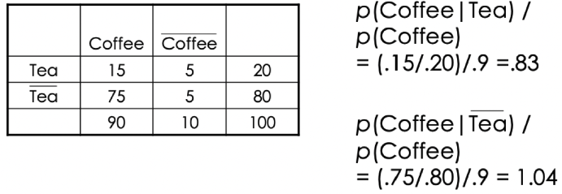
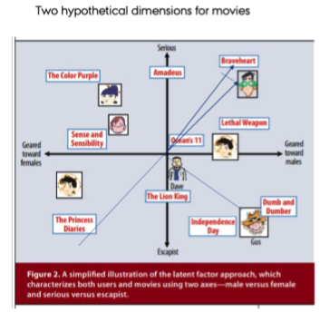

# Recommender Systems and Customer Targeting

This group of lectures cover three different approaches to mining associations.

1. Association rules
2. Collaborative filtering
3. Latent factor models

***Association rules***

We see that association rules looks at transactions and assess what products there appear to be on the same transaction, and thus creates association rules based on these.

With these rules you can start making recommendations or generate ideas of what products should be marketed together. For instance one of the fun examples is where you see that beers and diapers often comes together. When you think about it, it is very logical, because people with small kids cant go out, but they might still enjoy a beer, thus they have to do it at home.

***Collaborative filtering***

Then we have collaborative filtering. Here we will work on two different approaches, item-based and user-based.
+ User-based: we want to predict one users ratings of a given product/service based on similarity with other users.
+ item-based: we want to predict one users ratings of a given product/service based on its similarity with other products, e.g., if one consistenly rate thai food high, then he may also like other thai food, this is in principle also what I have explored with the recommender system on the DSP.

This is very much used for making recommender system. This was also very much applied in the Netflix competition.

With this, we have the term cold start, that is when you have a new user, you must make some recommendations before you can use the contents, e.g., what you are doing at Netflix, so it starts knowing your preferences.

***Latent factor models***

The last approach is the latent factor model, this is just an extension of the user-based and item-based, where both scenarios are considered. This method assumes that we make some constructs, e.g., as in SEM, where the constructs are explained by different items (movies). Then it would be obvious to make constructs based on different genres. These constructs are not directly observable, hence the name latent.

Within LFM cold start also applies.

In general we see that this model gives the best predictions. That is also due to the possibility of regularizing user ratings, hence accounting for user specific biases.

Notice that in the very end of this chapter a comparison between IBCF, UBCF, latent factor models and latent factor models accounting for user bias is shown.


## Association rule

Basically the method looks at what products that appear in the same transaction and the finds pairs, or items that come together.

Terms:
+ Items: these are the different products that can be bought, can also be a product group
+ Itemset: this is the dataset containing a list of all of the items
+ Syntatic Constrains:  constraints involving restrictions on items that can appear in a rule. E.g., one may say, that we only want to evaluate one item (product) or an itemrange.
+  Support Constraints: constraints the number of transactions in T that support a rule. Notice that in R there are default values for this.
+ Minsupport: This is the threshold assigned to item pairs, used in procedure 1.
		+ Large itemssets: Item combinations that meets the minsupport. This is denoted with I1,I2,…Ik.
		+ Small itemssets: Item combinations that does not meet the minsupport

Procedure:
	1. Generate all combinations of items that have fractional transactinos support. Perhaps above a certain threshold.
		a. We group all combinations in two groups:
			i. Large itemsets. Examples: 1) Diaper and beer, 2) Milk, Bread --> Eggs, Coke.
			ii. Small itemsets.
For a large itemset generate all rules, that use items from the large itemsets (I1,I2,…Ik). We call all of these rules subsets (X) of Y.


```{r RecSysLibs}
# https://www.datacamp.com/community/tutorials/market-basket-analysis-r

#install and load package arules
library(arules)
library(arulesViz)
library(tidyverse)
library(readxl)
library(knitr)
library(ggplot2)
library(lubridate)
library(plyr)
library(dplyr)
library(DataExplorer)
```


### Loading and data exploration

First we load it

```{r readdata}
#read excel into R dataframe
retail <- read_excel('Data/Recommender Systems/Online_Retail.xlsx')
attach(retail)
```

The data frame has rows with granularity of items, hence one item pr. line. Where one invoice may occur several times.

We also have some other information. notice that stock code is an ID for the product.

We see that some have some odd quantities, these are just plotted to see what is going on.

```{r QuantityAssessment}
plot(Quantity[StockCode == 23843])
plot(Quantity[StockCode == 23166])
```


### Data preprocessing

complete.cases(data) will return a logical vector indicating which rows have no missing values. Then use the vector to get only rows that are complete using retail[,]. That is because we have NA's.

```{r PlotMissing Retail}
plot_missing(retail)
```

We see that the customer ID is only there 75% of the time, also the description appear to be missing in some examples. Now we are going to remove these.

```{r,results='hold'}
retail <- retail[complete.cases(retail), ]
plot_missing(retail)
```

Now we see that we remove approx. 140.000 observations, where we had 541.909 observations before and 406.829 observations after removing NA's, corresponding with approx. 25% of the observations.


#### Encoding to correct data types

Now we want to make the description a factor instead of character.

```{r,results='hide'}
#The following prints whole tables, although I just show the first couple of rows in a following chunk
retail %>% mutate(Description = as.factor(Description))
retail %>% mutate(Country = as.factor(Country))
```

```{r,results='hide'}
retail$Date <- as.Date(retail$InvoiceDate)
```

```{r}
head(retail)
```

We also want a column with the date and one with the transaction time.

```{r}
#Extract time from InvoiceDate and store in another variable
TransTime <- format(retail$InvoiceDate,"%H:%M:%S")
#Convert and edit InvoiceNo into numeric
InvoiceNo <- as.numeric(as.character(retail$InvoiceNo))

#Bind new columns TransTime and InvoiceNo into dataframe retail
retail <- cbind(retail,TransTime)
```

Now we can glimpse

```{r}
glimpse(retail)
```


#### Create a data frame with one row pr. invoice

What you need to do is group data in the retail dataframe either by CustomerID, CustomerID, and Date or you can also group data using InvoiceNo and Date. We need this grouping and apply a function on it and store the output in another dataframe.

This can be done by ddply.

The following lines of code will combine all products from one InvoiceNo and date and combine all  products from that InvoiceNo and date as one row, with each item, separated by ",".

```{r}
library(plyr)
transactionData <- ddply(.data = retail
                         ,.variables = c("InvoiceNo","Date") #Group by
                         ,.fun = function(df1)paste(df1$Description #This concatenates the items
                                                    ,collapse = ","))
head(transactionData)
```

So we see that now we have granularity on invoiceNo, and the the date and lastly the items are listed, where they are separated with a comma.

Now we only want the items pr. invoice (basket), hence we remove the invoice InvoiceNo and Date.

```{r}
transactionData <- as.data.frame(transactionData$V1)
colnames(transactionData) <- c("items") #Rename column to items
transactionData[1,]
```

We see that the dataframe now consists of only on column with all items separated with a comma. Now we are going to save it, and load it back into the environment.

**Saving the data**

```{r}
write.csv(transactionData,"Data/Recommender Systems/market_basket_transactions.csv", quote = FALSE, row.names = FALSE)
```


### Loading transactions

```{r}
tr <- read.transactions('market_basket_transactions.csv', format = 'basket', sep=',')
summary(tr)
```

We see that when we load it back into the environment using `read.transactions()` we create something similar to a data term matrix, this is merely a sparse matrix, where we see that we have 7.876 items and 22.191 baskets/invoices. Hence each row is just 'ticked-off' if the basket contains the product.

We see the summary specify that we have 22.191 transactions and 7.876 items, the most frequent is 'white hanging heeart t-light holder'. We see that the largest basket has 419 units. Where basket sizes of 1 unit is the most typical.

Then the mean = 15 products and the median 10 products.


### Plotting

Now we want to plot the most frequent products.

```{r}
# Create an item frequency plot for the top 20 items
library(RColorBrewer)
itemFrequencyPlot(tr
                  ,topN = 20
                  ,type = "absolute"
                  ,col = brewer.pal(8,'Pastel2')
                  ,main = "Absolute Item Frequency Plot")
```

We see that top combinations. E.g., more than 1.500 baskets where the top combination occurs. Now we can look at it in a relative way instead.

```{r}
itemFrequencyPlot(tr
                  ,topN = 20
                  ,type = "relative"
                  ,col = brewer.pal(8,'Pastel2')
                  ,main = "Relative Item Frequency Plot")
```

This is basically the same, just written in percentage.

### Apriori calculation

We will now start looking at association rules. To do so, we apply the apriori principle. 

 We set the following:

+ supp = minimum support, where we see that the combinations must occur in at least 0.1% of the baskets
+ conf = the describes the conditional relationship between the left-hand and right-hand side. Hence we want a relationship that is greater than 80%, as we want to avoid random pairs.
+ maxlen = the maximum length of items in a basket.


```{r}
# Min Support as 0.001, confidence as 0.8.
association.rules <- apriori(data = tr
                             ,parameter = list(supp = 0.001 #we only see rules where the support is at least 0.001
                                               ,conf = 0.8 #The confidence should be at least 0.8
                                               ,maxlen = 10 #We only want ot look at a max length of 10 items pr. basket
                                               )
                             )
```

*The parameters can be seen as constraints, to lower the amount of rules that we are going to make*

Extra note on support. We only want to see combinations that occurs 1 out of 1000 times, hence `supp = 0.001`

Now we have calculated association rules lets call the summary.

```{r}
summary(association.rules)
```

We see some basic descriptions, e.g., we have the most combinations around 5 and 6. We see that the lower end and upper end has very few. My guess would be that for a basket combination of 10 to not be random, there are only few things that are naturally there. 

In the other end (e.g., with length of 2), then there are many products that comes in pairs, but it is also influenced  by a lot of randomness. Hence we are ruling out a lot of combinations with the confidence = 80%, if we were to decrease the confidence, then we could have found more association rules.

Now we can **inspect the first 10 combinations**

```{r}
inspect(association.rules[1:10])
```

We see that the confidence is one in many examples, that is for instance because when you have bought wobbly chicken, the you also buy decoration and for this pair it also goes the other way around.

We see an example where the coverage is not one, that is because when you buy one, then you do not always buy the other. That is calculated by:

$$\frac{support}{coverage} = confidence$$

We see that:

+ Support = $\frac{TotalInvoices}{AbsoluteNo.OfTransactions} = Support$
+ Coverage = $\frac{Support}{Confidence} = Coverage$
+ Lift = $\frac{P(A|B)}{P(A)} = Lift$, we see with lift, that we actually need to find out how the pairs appear. See an example in the following.



**Manual calculation of support, coverage and confidence**

We are going to do three things: 

1. Count no. of transactions with the left hand side combination
2. Count the no. of transactions where the right hand side combination is within the transactions found in step 1.
3. Divide support by coverage to find confidence. If 1 = the right hand side combination is always in the basket when the left hand side is, when e.g., 0.5 instead, then the right hand side is only half of the time in the basket when the left hand side is.

```{r}
#We are going to look at the pair woobly chicken and decoration

left <- "SUNSET CHECK HAMMOCK"
right <- "UNION STRIPE WITH FRINGE  HAMMOCK"

#Find row number of a given item
idx <- which(t(t(as.vector(tr@itemInfo))) == left)
table(tr@data[idx,])
coverage = as.vector(table(tr@data[idx,])[2]/ncol(tr@data))

idx <- which(t(t(as.vector(tr@itemInfo))) == left)
idx_right <- which(t(t(as.vector(tr@itemInfo))) == right)

#which(tr@data[idx,] == TRUE)
#which(tr@data[idx_right,] == TRUE)

right_side <- table(which(tr@data[idx,] == TRUE) %in% which(tr@data[idx_right,] == TRUE))
right_side #Inteprete to see if there are only T, F or both.

#We see that decoration is always in the basket when wobbly chicken is.


support = as.vector(right_side[2]/ncol(tr@data))
support

confidence = support / coverage 
confidence #Hence a very stron relationship from woobly chicken to decoration
```


**Now we can inspect the rules after they are sorted**

```{r}
sortedRules <- sort(association.rules,by="lift",decreasing=TRUE)
inspect(sortedRules[1:10])
```

The conclusions are the same, it is just sorted now.

The LIFT reflects how often the LHS is bought given the RHS is in the basket.

#### Another example where maxlen = 3

Here we only want to look at combinations with up to three items.

```{r}
shorter.association.rules <- apriori(tr, parameter = list(supp=0.001 #must occur in 1 in 1000
                                                          ,conf=0.8 #We need to pairs to be at least 80% of the time together
                                                          ,maxlen=3))
```

Notice that the RHS and LHS summarize up to 3, where before it could go all the way up to 10.

#### Filtering on right hand side. An example with the item {METAL}

We want to see what is purchased before buying metal.

```{r}
#For example, to find what customers buy before buying 'METAL' run the following line of code
metal.association.rules <- apriori(data = tr
                                   ,parameter = list(supp=0.001, conf=0.8)
                                   ,appearance = list(default="lhs",rhs="METAL"))
inspect(metal.association.rules)
```

Now we see the combinations where the metal is the right hand side. Where we which products that leads to purchase of metal.

#### Filtering on left hand side. An example with the item {METAL}

We can do the same for the left hand side.

```{r}
metal.association.rules <- apriori(data = tr
                                   ,parameter = list(supp=0.001, conf=0.8)
                                   ,appearance = list(lhs="METAL",default="rhs"))
inspect(head(metal.association.rules))
```

Where this is showing what products metal leads to buying.

We see only one item that is followed by buying metal.

### Plotting association rules

We want to get all where the confidence is greater than 40%.

```{r}
#This is just showed as an example, so we can do the filtering
association.rules <- apriori(data = tr
                             ,parameter = list(supp=0.001, conf=0.3,maxlen=10))

#Subsetting
subRules <- association.rules[quality(association.rules)$confidence>0.4]
```

We see that the higher the confidence the higher the lift, so there appears to be a strong relationship between these.

We can also show it in the following.

```{r}
#Plot SubRules
#plot(subRules)
```

We see that usually the lift is the greatest in the top left corner, where the confidence is high and support is low.

This makes sense, as you cannot lift (boost) the sales of another product, if their relationship is already rather high.

Now we can plot the length of the rule with respect to confidence 

```{r}
#The order is the number of items in the rule
#plot(subRules,method="two-key plot")
```

The following is supposed to be an interactive plot. But does not appear to work, missing a library.

```{r}
#plotly_arules(subRules)
```

Now we can plot some interactive plot, where one can explore the rules.

```{r}
#top10subRules <- head(subRules, n = 10, by = "confidence")
#plot(top10subRules, method = "graph",  engine = "htmlwidget")
```

```{r}
rm(list = ls())
```


## Colaborative filtering

As mentioned in the beginning of the chapter, we see that one can make recommendations based on similarity with other users and or similarity between products.

### Loading and formatting data

```{r}
library(recommenderlab)
library(tidyverse)
```

```{r,results='hold'}
data("MovieLense")

# Data is given in realRatingMatrix format  ; Optimized to store sparse matrices
class(MovieLense)
str(MovieLense,vec.len=2) #not as we normally reference list elements by \\$ but \\@
```

the following are the different methods that we can use.

```{r}
methods(class = class(MovieLense)) # methods applicable to this class
```

We see the dimensions of our matrix with users and the movies.

```{r,results='hold'}
dim(MovieLense)
```

We see that there 1.664 movies and 943 users.

#### Loading metadata that gets loaded with main dataset

___This is not applied in the exercise, but just shown___

```{r}
moviemeta <- MovieLenseMeta
class(moviemeta)
```

We see that it is a data.frame. It has the following column names:

```{r}
colnames(moviemeta)
```

We see that the genre for each movie is presented.

### Data Exploration

We can see the topics for each movie. Only used for exploration purposes.

```{r}
#What do we know about the films?
library(pander)
pander(head(moviemeta,2),caption = "First few Rows within Movie Meta Data ")
```

We can also interpret the ratings for a given customer

```{r}
## look at the first few ratings of the first user
head(as(MovieLense[1,], "list")[[1]])
```

#### Plotting

```{r}
## number of ratings per user
hist(rowCounts(MovieLense))
```

We see that most has reviewed less than 100 movies. Therefore we also see in the following plot, that most movies have less than 100 reviews, where we have a long tail with some movies that have very few ratings.

```{r}
## number of ratings per movie
hist(colCounts(MovieLense))
```

Now we can look at which movies that are top 10, based on number of times watched.

```{r}
#Top 10 movies
movie_watched <- data.frame(
  movie_name = names(colCounts(MovieLense)),
  watched_times = colCounts(MovieLense)
)

top_ten_movies <- movie_watched[order(movie_watched$watched_times, decreasing = TRUE), ][1:10, ] 

ggplot(top_ten_movies) + aes(x=movie_name, y=watched_times) + 
  geom_bar(stat = "identity",fill = "firebrick4", color = "dodgerblue2") + xlab("Movie Tile") + ylab("Count") +
  theme(axis.text = element_text(angle = 40, hjust = 1))
```

Looking at the overall data, we see that the mean rating is 3.5 where the median is actually 4, which seem pretty high.

```{r}
summary(getRatings(MovieLense))
```

This we can also plot.

```{r}
data.frame(ratings = getRatings(MovieLense)) %>%
  ggplot(aes(ratings)) + geom_bar(width = 0.75)+
  labs(title = 'MovieLense Ratings Distribution')
```


### What models can we use?

Here we can see some of the recommender models that are available.

```{r}
#Different recommender models
recommender_models <-  recommenderRegistry$get_entries(dataType="realRatingMatrix")
names(recommender_models)
#recommenderRegistry$get_entries(dataType="realRatingMatrix") #If run, you will see the parameters
```

We will focus on:

+ UBCF
+ IBCF
+ SVD 
+ ALS 
+ SVDF

### Training and test set

We want movies with at least 30 ratings and at least 100 users for each items. We see that the following approach is actually pretty clever, where we see that we filter on rows and columns by making the logical directly in the subsetting.

```{r}
#Training and test set At least 30 items evaluated or at least 100 users for each item
rates <- MovieLense[rowCounts(MovieLense) > 30
                    ,colCounts(MovieLense) > 100]

rates1 <- rates[rowCounts(rates) > 30,] #This is included again, to make sure that we have accounted for both
```

Now we can split the data into train and test data.

We randomly define the which_train vector that is `TRUE` for users in the training set and `FALSE` for the others. Will set the probability in the training set as 80%

```{r}
which_train <- sample(x = c(TRUE, FALSE), size = nrow(rates1), replace = TRUE, prob = c(0.8, 0.2)) #Random sampling

# Define the training and the test sets
recc_data_train <- rates1[which_train, ]
recc_data_test <- rates1[!which_train, ]
```

My guess is that `recc` is for recommender.

### A small example with IBCF (item based)

**Fitting the model**

```{r}
# Let's build the recommender IBCF - cosine:
recc_model <- Recommender(data = recc_data_train #On the train data
                          ,method = "IBCF" #The col. filt. model
                          ,parameter = list(k = 30) #No. of neighbors
                          )
```

We have now created a IBCF Recommender Model

**Predicting recommendations on test data**

We want 5 recommendations for each user, based on the test data set.

```{r}
n_recommended <- 5
recc_predicted <- predict(object = recc_model
                          ,newdata = recc_data_test
                          ,n = n_recommended)

# This is the recommendation for the first user
recc_predicted@items[[1]]
```

These are the recommendations for the given user. Now we can look for the movei name, which we are recommending. Now we want to convert the numbers into the actual movie names.

```{r}
# Now let's define a list with the recommendations for each user
recc_matrix <- lapply(recc_predicted@items, function(x){
  colnames(rates)[x]
})

# Let's take a look the recommendations for the first four users:
recc_matrix[1:4]
```

Then we see recommendations for four persons.

### UBCF - User based collaborative based

The method computes the similarity between users with cosine

#### Fitting the model

```{r}
# Let's build a recommender model leaving the parameters to their defaults. 
recc_model <- Recommender(data = recc_data_train
                          ,method = "UBCF")
```

A UBCF recommender has now been created

#### Predicting (making) recommendations

```{r}
n_recommended <- 5
recc_predicted <- predict(object = recc_model
                          ,newdata = recc_data_test
                          ,n = n_recommended)

# Let's define a list with the recommendations to the test set users.
recc_matrix <- sapply(recc_predicted@items, function(x) {
  colnames(rates)[x]
})

# Again, let's look at the first four users
recc_matrix[1:4]
```

Now we get recommendations based on user based filtering.

### Cross validation

*The purpose is to make a more stable model through cross validation.*

___The cross validation, that we set up here, is going to be used in the following code, for estimating models.___

We can split the data into some chunks, take a chunk out as the test set, and evaluate the accuracy. Then we can do the same with each other chunk and compute the average accuracy. Here we construct the evaluation model

```{r}
n_fold <- 4 
rating_threshold <- 4 # threshold at which we consider the item to be good
items_to_keep <- 20 # given=20 means that while testing the model use only 20 randomly picked ratings from every user to predict the unknown ratings
# in the test set the known data set has the ratings specified by given and the unknown data set the remaining ratings used for validation  

eval_sets <- evaluationScheme(data = rates1
                              ,method = "cross-validation"
                              ,k = n_fold, 
                              given = items_to_keep
                              ,goodRating = rating_threshold)

size_sets <-sapply(eval_sets@runsTrain, length)
size_sets
```

### IBCF - Item based collaborative based

#### Fitting the model (using CV)

```{r}
model_to_evaluate <- "IBCF"
model_parameters <- NULL  # we use the standard settings

eval_recommender <-Recommender(data = getData(eval_sets, "train")
                               ,method = model_to_evaluate
                               ,parameter = model_parameters)
```

#### Making predictions

The IBCF can recommend new items and predict their ratings. In order to build the model, we need to specify how many items we want to recommend, for example, 5.

```{r}
items_to_recommend <- 5

# We can build the matrix with the predicted ratings using the predict function:
eval_prediction <- predict(object = eval_recommender
                           ,newdata = getData(eval_sets, "known")
                           ,n = items_to_recommend
                           ,type = "ratings")
```

#### Performance metrics

**Per user**

By using the `calcPredictionAccuracy`, we can calculate: 

+ the Root mean square error **(RMSE)**, 
+ Mean squared error **(MSE)**, and 
+ the Mean absolute error **(MAE)**.

We want to compare the results on each user, hence we take the head. In the following we are also plotting a histogram.

```{r}
eval_accuracy <- calcPredictionAccuracy(
  x = eval_prediction
  ,data = getData(eval_sets, "unknown")
  ,byUser = TRUE #Because, how good does the model work for each user
)

# This is a small sample of the results for the Prediction and Accuracy
head(eval_accuracy)
```

```{r}
# Now, let's take a look at the RMSE by each user
qplot(eval_accuracy[,"RMSE"]) + geom_histogram(binwidth = 0.1) +
  ggtitle("Distribution of the RMSE by user")
```

We see that the typical RMSE is between 1 and 1.5.

**Overall**

The following is the average for all users

```{r}
# However, we need to evaluate the model as a whole, so we will set the byUser to False
eval_accuracy <- calcPredictionAccuracy(
  x = eval_prediction
  ,data = getData(eval_sets, "unknown")
  ,byUser = FALSE #We want it for the whole model
)
eval_accuracy #for IBCF
```

The mean absolute error is just above 1, hence one rating off. Lets us take a look at the confusionmatrix to see how it looks there.

Notice that we specificy n, that is because we want predictions for different number of predictions.

```{r}
# Confusion matrix good threshold =4
results <- evaluate(x = eval_sets #Using the Cross validation
                    ,method = model_to_evaluate
                    ,n = seq(10, 100, 10)) #We make from 10 to 100 recommendations
```

results object is an evaluationResults object containing the results of the evaluation.
Each element of the list corresponds to a different split of the k-fold.
Let's look at the first element

```{r}
#Results for each CV
getConfusionMatrix(results)[[1]] #the first cross validation, 2 would be the second CV etc.
#getConfusionMatrix(results)[[2]] #the first cross validation, 2 would be the second CV etc.
#getConfusionMatrix(results)[[3]] #the first cross validation, 2 would be the second CV etc.
#getConfusionMatrix(results)[[4]] #the first cross validation, 2 would be the second CV etc.
```

We see that the more recommendations we make, the 'better' does the results get, although making 100 recommendations also means that the FP is also increasing, hence we start recommending something, where it did not turn out to be purchased. Hence it is a trade-off.

In this case, look at the first four columns

+ True Positives (TP): These are recommended items that have been purchased.
+ False Positives (FP): These are recommended items that haven't been purchased
+ False Negatives (FN): These are not recommended items that have been purchased.
+ True Negatives (TN): These are not recommended items that haven't been purchased.

**Manually making the ROC curve**

```{r}
# If we want to take account of all the splits at the same time, we can just sum up the indices:
columns_to_sum <- c("TP", "FP", "FN", "TN")
indices_summed <- Reduce("+", getConfusionMatrix(results))[, columns_to_sum]
TPR <- indices_summed[,"TP"]/(indices_summed[,"TP"] + indices_summed[,"FN"])
FPR <- indices_summed[,"FP"]/(indices_summed[,"FP"] + indices_summed[,"TN"])
indices_summed <- cbind(indices_summed,TPR,FPR)
indices_summed
plot(x = TPR <- indices_summed[,"FPR"],y = TPR <- indices_summed[,"TPR"],type = "b"
     ,cex = 0 #To remove dots.
     ,xlab = "FPR"
     ,ylab = "TPR"
     )
text(x = TPR <- indices_summed[,"FPR"],y = TPR <- indices_summed[,"TPR"],labels = seq(10,100,10))
title("ROC")
```

### Building ROC curve and precision / recall rate

Building an ROC curve. Will need these factors

1. True Positive Rate (TPR): Percentage of purchased items that have been recommended. TP/(TP + FN)
2. False Positive Rate (FPR): Percentage of not purchased items that have been recommended. FP/(FP + TN)

```{r}
plot(results, annotate = TRUE, main = "ROC curve")
```

Now we can also make a precision / recall rate

We can also look at the accuracy metrics as well:

+ Precision: Percentage of recommended items that have been purchased. FP/(TP + FP)
+ Recall: Percentage of purchased items that have been recommended. TP/(TP + FN) = True Positive Rate

```{r}
plot(results, "prec/rec", annotate = TRUE, main = "Precision-Recall")
```

The plots above gives an indication of how many recommendations to make. Notice that it is based upon the results object that we are making, there we specify the intervals for which we are going to recommend.


### Comparing UBCF and IBCF

let us see how the models compare

```{r}
#Comparing models
models_to_evaluate <- list(IBCF_cos = list(name = "IBCF", param = list(method = "cosine")),  #Cosine correl. coef.
                           IBCF_cor = list(name = "IBCF", param = list(method = "pearson")), #Pearson correl. coef.
                           UBCF_cos = list(name = "UBCF", param = list(method = "cosine")), 
                           UBCF_cor = list(name = "UBCF", param = list(method = "pearson")), 
                           random = list(name = "RANDOM", param = NULL))

# In order to evaluate the models, we need to test them, varying the number of items.
n_recommendations <- c(1,5,seq(10,100,10))

# Now let's run and evaluate the models
list_results <- evaluate(x = eval_sets, method = models_to_evaluate, n = n_recommendations)
```

Now we can plot the roc curves and the and the precision - recall rate. 

```{r,results='hold'}
plot(list_results, annotate = 1, legend = "topleft")
title("ROC curve")

plot(list_results, "prec/rec", annotate = 1, legend = "bottomright", ylim = c(0,0.4))
title("Precision-recall")
```

We see that the IBCF Pearson correlation coefficient gets the best result. We also see that the random recommendations is almost as good as some of the other methods.

**Other evaluation criteria**

1. Coverage - what we have seen earlier
2. Diversity and novelty - To avoid monotone lists, discover new families of items
3. Serendipity - Unexpected and surprisng items might be valuable
4. Familiarity - GIve the user the impression of understanding his/her needs
5. Biases - Do we just end up recommended the best movies? hence there is a great bias.

```{r}
rm(list = ls())
```


## Latent Factor Models

This is a snippet from the introduction in the chapter:

*The last approach is the latent factor model, this is just an extension of the user-based and item-based, where both scenarios are considered. This method assumes that we make some constructs, e.g., as in SEM, where the constructs are explained by different items (movies). Then it would be obvious to make constructs based on different genres. These constructs are not directly observable, hence the name latent.*

*Within LFM cold start also applies*


**How is correlation measured?**

We see that the dot product (inner product) between items and users, here we are able to interpret the projection of these from the center to see how similar/dissimilar they are. From the image we can see that Gus and the guy in the top right is more or less perpendicular, so they do not share much interest on the y axis, although on the x axis they appear to be equally far out, hence the dot product appears to be able to reflect similarity between perople.

.

Hence to make these projections we need to find to matrices - namely U and V. To estimate the values for these to matrices, we have used one approach, the **Signular Value Decomposition (SVD)**. Notice that this approach demands that we have a full matrix, as we often have sparse matrices, is that it replace missing values with the column means. This introduce a lot of bias, but makes the model work. For this method we cannot really avoid it, because each movie is never reviewed by all users.

Notice that for this method we are able to account for bias for ratings, e.g., one person may often give relatively higher ratings than other, hence we can regularize this to get rid of some bias.

```{r}
library(recommenderlab)
library(tidyverse)
```

```{r}
data(MovieLense)
class(MovieLense)
help(MovieLense)
dim(MovieLense)
```

Select only the users who have rated at least 50 movies or movies that had been rated more than 100 times. As if they did not rate more than this it starts getting difficult recommeding movies for them.

```{r}
(ratings_movies <- MovieLense[rowCounts(MovieLense) > 50,
                              colCounts(MovieLense) > 100])
```


```{r,results='hold'}
# use the minimum number of items purchased by any user to decide item number to keep
min(rowCounts(ratings_movies))

n_fold <- 4
items_to_keep <- 15 #randomly chosen items from a given responded
rating_threshold <- 3 #A good rating is three or higher
```

In the following we include SVD-Funk, there is a bunch of tuning parameters, these are:

+ k = number of topics
+ gamma = Learning parameter / learning rate
+ lambda = The regularization

*Notice that there are default values, although we choose to set k to 50.*

```{r,results='hold'}
# Use k-fold to validate models
eval_sets <- evaluationScheme(data = ratings_movies
                              ,method = "cross-validation"
                              ,k = n_fold
                              ,given = items_to_keep
                              ,goodRating = rating_threshold)

#We want to comapre different approaches
models  <- list(
  IBCF = list(name = "IBCF",param = list(method = "cosine")),
  UBCF = list(name = "UBCF", param = list(method = "pearson")),
  SVD = list(name = "SVD", param = list(k = 50)), #50 concepts included
  SVDF = list(name = "SVDF", param = list(k = 50)) #50 concepts included
  )
```

notice that the SVDF takes some time to compute. That is beacuse it has to go through all the known ratings and construct the U and V matrix.

```{r,results='hold'}
# varying the number of items we want to recommend to users
n_rec <- c(1, 5, seq(10, 100, 10))

# evaluating the recommendations
results <- evaluate(x = eval_sets, method = models, n= n_rec)
```


```{r,results='hold'}
# extract the related average confusion matrices
(avg_matrices <- lapply(results, avg))

plot(results, annotate=TRUE)
plot(results, "prec/rec", annotate = TRUE, main = "Precision-Recall")
```

We will see from the plot how the different models perform. We see that the SVDF appear to have the best performance.

### Fitting the model

```{r,results='hold'}
recommender_ibcf <- Recommender(data = getData(eval_sets, "train"),
                                method = "IBCF",parameter = list(method = "cosine"))

recommender_ubcf <- Recommender(data = getData(eval_sets, "train"),
                                method = "UBCF",parameter = list(method = "pearson"))

recommender_svd <- Recommender(data = getData(eval_sets, "train"),
                                method = "SVD",parameter = list(k=50))

recommender_svdf <- Recommender(data = getData(eval_sets, "train"),
                               method = "SVDF",parameter = list(k=50))

items_to_recommend <- 10
```

### Making predictions

```{r,results='hold'}
#Produce predictions based upon the known dataset
eval_prediction_ibcf <- predict(object = recommender_ibcf
                                ,newdata = getData(eval_sets, "known")
                                ,n = items_to_recommend
                                ,type = "ratings")

eval_prediction_ubcf <- predict(object = recommender_ubcf
                                ,newdata = getData(eval_sets, "known")
                                ,n = items_to_recommend
                                ,type = "ratings")

eval_prediction_svd <- predict(object = recommender_svd
                               ,newdata = getData(eval_sets, "known")
                               ,n = items_to_recommend
                               ,type = "ratings")

eval_prediction_svdf <- predict(object = recommender_svdf
                                ,newdata = getData(eval_sets, "known")
                                ,n = items_to_recommend
                                ,type = "ratings")
```

Now we want to compare the different models on the unknown data.

```{r,results='hold'}
######################RANDOM######################

#UBCF
eval_accuracy_ubcf <- calcPredictionAccuracy(
  x = eval_prediction_ubcf, data = getData(eval_sets, "unknown"), byUser = F)

eval_accuracy_ubcf_user <- calcPredictionAccuracy(
  x = eval_prediction_ubcf, data = getData(eval_sets, "unknown"), byUser = TRUE)

print("UBCF")
head(eval_accuracy_ubcf_user)

#IBCF
eval_accuracy_ibcf <- calcPredictionAccuracy(
  x = eval_prediction_ibcf, data = getData(eval_sets, "unknown"), byUser = F)

eval_accuracy_ibcf_user <- calcPredictionAccuracy(
  x = eval_prediction_ibcf, data = getData(eval_sets, "unknown"), byUser = TRUE)

print("IBCF")
head(eval_accuracy_ibcf_user)

#SVD
eval_accuracy_svd <- calcPredictionAccuracy(
  x = eval_prediction_svd, data = getData(eval_sets, "unknown"), byUser = F)

eval_accuracy_svd_user <- calcPredictionAccuracy(
  x = eval_prediction_svd, data = getData(eval_sets, "unknown"), byUser = TRUE)

print("SVD")
head(eval_accuracy_svd_user)

#SVDF
eval_accuracy_svdf <- calcPredictionAccuracy(
  x = eval_prediction_svdf, data = getData(eval_sets, "unknown"), byUser = F)

eval_accuracy_svdf_user <- calcPredictionAccuracy(
  x = eval_prediction_svdf, data = getData(eval_sets, "unknown"), byUser = TRUE)

print("SVDF")
head(eval_accuracy_svdf_user)
```

We can then assess the RMSE for each model.

```{r,results='hold'}
eval_accuracy_ubcf
eval_accuracy_ibcf
eval_accuracy_svd
eval_accuracy_svdf
```

We see that the SVDF appear to do the best.
