# Probabilistic Models for Customer Analytics

## Bayesian Networks

***Why do we use bayesian network analysis?***

We have seen EFA, CFA and lastly SEM, which are structural models where you assume relationships among variables. Bayesian network is applied to *identify causality* in the data.

Notice that Bayesian Networks ONLY deals with categorical data, hence if you are given a continous dataset, then you want to encode it as factors before modeling, e.g., in ordered categories, non-ordered, or as binary.

### ***Why Bayesian?***

We apply the bayes theorem to update probabilities in light of new evidence. A quick summary:

$$P(A|B) = P(A)\frac{P(B|A)}{P(B)}$$

Where we see A is the outcome given event B happening. This means:

+ $P(A)$ = prior, i.e., unconditional probability, hence not accounting for event B.
+ $P(A|B)$ = the posterior, i.e., conditional probaiblity, here we account for event A happening given event B is happening.
+ $P(B)$ = Plausible cause, i.e., the predictor.
+ $P(B|A)$ = The likelihood, i.e., conditional probability of B given that event A occurs.

We should notice that this assumes that there is a dependency between the variables. As if there were no dependence then event A happening given event B happening is not changed at all, for instance wind gusts in Denmark and temperature in Denmark must have a dependency on each other, e.g., when it is very windy it is probable that the temperature will decrease. Although when it is windy in Australia one may not infer a relationship between these two variables. This could also be written with $P(A|B) = P(Y)$, as event B has no effect at all.

#### **Many names for Bayesian Networks**

+ Causal probabilistic networks
+ Probabilistic graphical models
+ Bayesian Belief networks
+ Causal networks
+ Directed graphs
+ Probabilistic expert systems
+ Influence diagrams


### Terms and explanatory examples

Whe have the following **terms:**

+ DAG: Directed Acyclic Graph: meaning that we have graphs with directed arrows that cannot lead to cycles. Within the structure we have the following terms:
    + Nodes = variable
    + Arcs = links = relationships (the arrows)
    + Path = A path where you are only able to directions of the arrows.
    + Chain = This is path, but you are not constrained to following the directions.
    + A cycle = that would be that a path is starting and able to end in the same node. in BN we are not able to have these instances.
    + Connected graph = Where all nodes are connected
    + Empty graph = A graph with nodes, but not with arcs.
+ Multivariate analysis: Where the graph is the means and the variable relationships the ends.
+ Bayesian Networks is a stochastic data-mining technique. It applies different elements to construct the model.

We see in the following picture, that there is a relationship from Job down to Credit. These we call the parent and the child (root and non-root). Hence it is clear the the direction is also from Job to Credit.

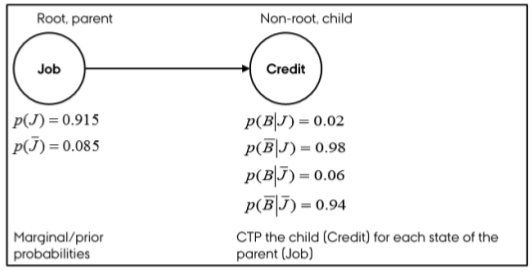

It can be seen in the model that the prior $P(A) = 0.915$, hence a probability of approx. 91% being that you have a job. Then we see the different kinds of probabilities of B and non B (credit) given a person having a job or not having a job.

We see a more extensive example here:

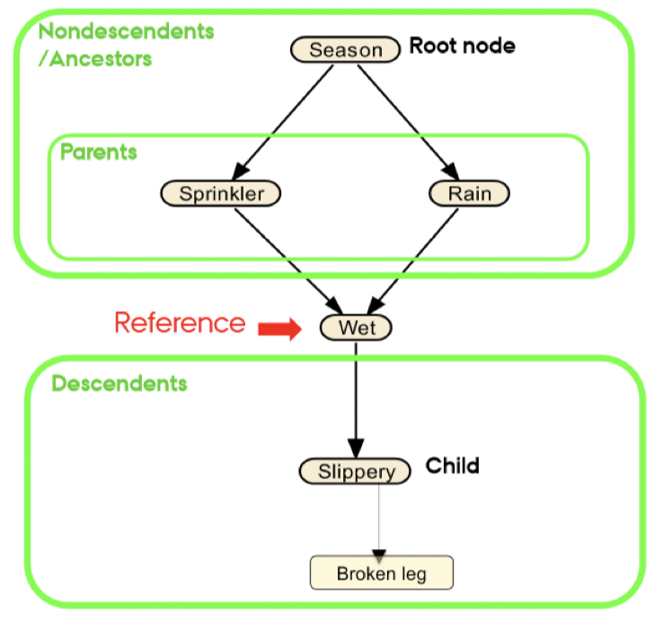

Notice that the decendents are effetcs of the given variables, e.g., that a given season influence the probability of how it is going to rain or sprinkle etc. In general we should be able to say, that a guy has a broken leg and then we can calculate backwards what the probabilities of the different variables being occurent.

Recall that each connected variables (and adjacent) have a conditional probability between them, meaning that we can take the same example as above:

___

_**Example:** We know a guy has broken his leg, we can now calculate backwards and use the probabilities for the certain events to get an idea of the whole situation. Hence it is probable that it was slippery, due to rain or sprinkles and ultimately due to the season, hence the information flows._

_On the other hand, if we find out that it was in fact slippery, hence we impose **evidence**, i.e., control for slippery, we see that `broken leg` and `(sprinkle,rain)` is completely independent of each other, as we know that it was slippery, hence no more information is needed._

___


#### Types of connections

We have three types of connections:

1. Serial connection,
2. Explaining away (discounting),
3. Common cause (divergent)

I have summarized the approaches in the following visualization and following by an example for each.

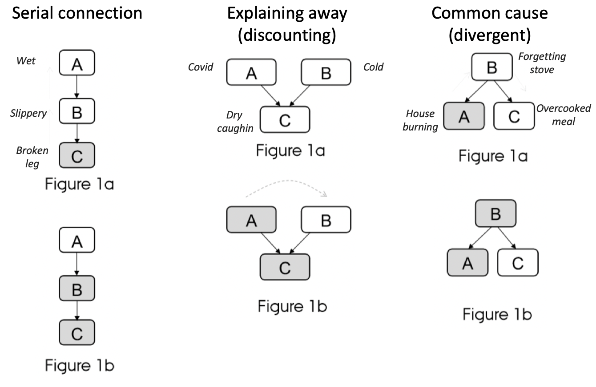

_**Serial connection example:**We have a scenario where wet is the cause of slippery, and slippery is the cause of breaking legs. Lets say that we know that a person has a broken leg, hence we can update the probability for it being slippery and then if it was wet. this will also increase probabilities for B (slippery) and C (Wet)_

_Now lets say that we also know that it was slippery any new information about C (broken leg condition) is not changing A. And changes in A (the wet condition) will not affect C (broken leg condition) because these are now known as we found evidence, e.g., if we find out that it was not wet, but we still know that it was slippery (I guess that would also require some other relationship to B)_

_**Explaining away example:** We have a scenario where both having covid and a cold is the cause of dry coughing, hence dry coughing being the children while the others the parents. Notice that A and B is completely independent._

_Lets say that a person has symptoms C and we later find out that the person has covid (A). Hence we set probability of A = 100 (or in practive it would probably be 99%) then the probability of B will decrease as it is now less likely that the person is also having a could, because we have found one cause for the symptoms._

_**Common cause example:** We have a scenario where we have children that are related to the same parents._

_We now know that the house is burning, this will increase the probability that of B (forgetting stove) is also higher. This leads with the probability of food being overcooked is also increasing._

_Now lets say that we get the information that you did in fact forget the stove. Hence any new information in A (about burning house) will not change anything to the probability of C (overcooked meal)_

#### Variable selection based on a Bayesian Network

We know that a Bayesian network can be used to indentify causality and hence dependencies among variables, _given that we apply an algorithm for this (more about this in a later section)_, we can now start inferring important variables based on this.

But how to do this? Recall that parents are the causes while the children being the outcome. Let us say that we have a child, which we want to analyze, e.g., a burning house, and we want to explore the causes. What would be natural to do?

One could take the following variables:

1. The child's parents'
2. The child's children.
3. Other parents of the child.

This is called the ***the Markov Blanket***. Hence one is able to find the Markov Blanket of a variable, meaning identifying variables that you must find information about (hence control for, i.e., evidence) making the child conditional independent of all other variables. Meaning that any change in any given non-related variable will not affect the variable that we want to look into.

Therefore, Bayesian networks in combination with Markov Blanket method is a strong combination for variable selection.

Although one must be aware that, the Markov Blanket model build on the Markov property:

<center>

_For each variable X in a graph, X is conditionally independent of the set of all nondescendents given the set of all its parents_ That means that all we need to do is check for a nodes parents, if we can find evidance on these, then the given node is not dependent on all non descendents. In laymans words it can be said, that if a node is not a descendent (can be found by following the arc directions), then it is a nondescendent. The following draws an example.

</center>

```{r}
library(ggdag)

#Generating the relationships
dag <- dagitty::dagitty("dag {
    X -> Y -> W
    X -> Z -> W
    X -> Z -> V
  }"
)

tidy_dag <- tidy_dagitty(dag)

#Adding information on the color
tidy_dag$data <- dplyr::mutate(tidy_dag$data,
                               colour = ifelse(tidy_dag$data$name == "Z"
                                               ,"Reference point"
                                               ,ifelse(tidy_dag$data$name == "X","Parent"
                                                       ,ifelse(tidy_dag$data$name %in% c("V","W"),"Descendent","Non descendents"))))

#Making the plot
tidy_dag %>%
  ggplot(aes(
    x = x,
    y = y,
    xend = xend,
    yend = yend
  )) +
  geom_dag_point(aes(colour = colour)) +
  geom_dag_edges() +
  geom_dag_text() +
  theme_dag()
```

We that for Z, V and W are its descendents. We see that X is its parent and Y being its ancestor i.e., nondescendent. We can make Z independent (hence it being conditionally independent of Y) of Y, if we just control for X as it is its parent.

This mean that the graph must include all relevant variables, hence you cannot have _hidden causes_. In such as case we cannot say that it is a complete Bayesian Network, although the model may still hold and can be used for prediction.

In general what we see here, is that this is no different that we have previously seen in machine learning, that you can search for the true model, although truth is utopia that can only very rarely if ever be achieved.

_I am actually a bit in doubt whether this is actually a true statement I make here, perhaps one could perhaps just say that when you have found the Markov Blanket in your model, then changes in all variables that become conditional independent cannot have an effect on the variable under evaluation if their 'state' changes, e.g., we impose evidence._


### Independence

We have three different scenarios:

1. No dependence between two variables.
2. Dependence between two variables.
3. Conditional independence between two variables. This is the example with the broken leg, where we can make two non adjacent nodes in a serial correlation independent if we control for a given variable, that is why the name _conditional independence_, because variables can become independent, if check for the variable inbetween, because then you don't need to know the ancestor (parent of the parent).

See a visual example of these.

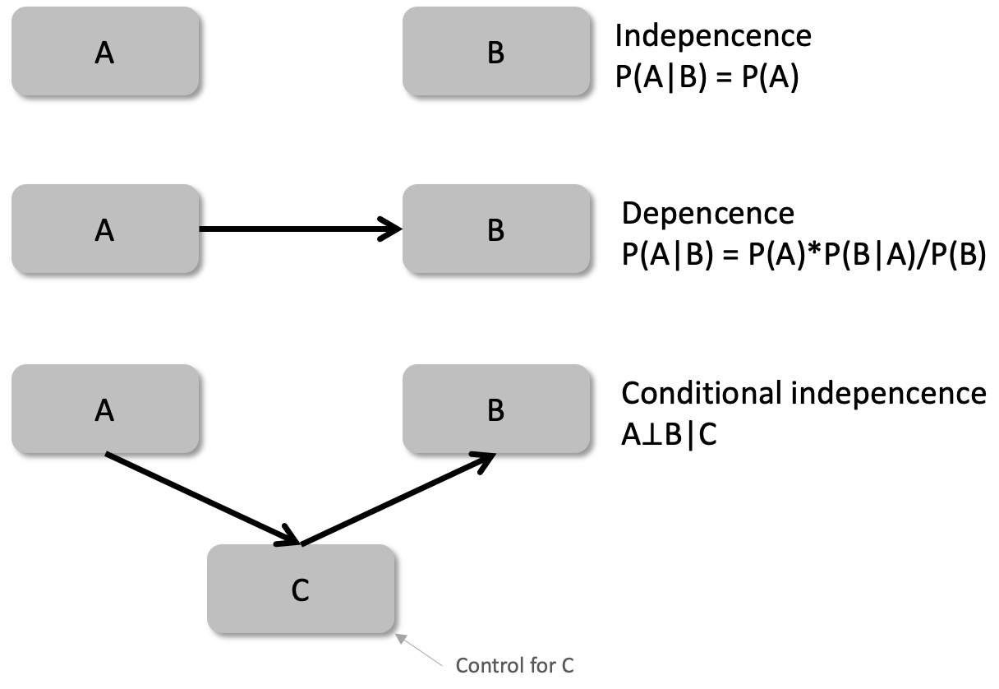

Notice that in the last scenario we see that the A is no longer depend on B because we account for C, hence we have a conditional indepedency, where we see the chain reaction, that A is dependent on C which is dependent on B.

With Bayesian networks we are able to graph this and find the dependencies and independencies and also the directions hence the causality among the variables. Therefore, we see that `constrained based algorithms` explores this, where `score-based algorithms` it primarily focusing on making good predictions.


### Methods for identifying the network

There are many different methods, although we are going to focus on two different schools:

#### 1. ***Algorithms focused on causality discovery***

We are going to work with `constrained based algorithms`. Basically what this is doing is:
      1. Assess data
      2. Identify conditional independence tests
      3. Create arcs (arrows, i.e., dependencies) based on the dependencies we find in step two.

Therefore, this approach is heavily relying on the principles found the section above, regarding independence.

Algorithms: There are different approaches, we are going to apply the ***Grow-Shrink (gs)***.

Limitations: 1) This approach requires sufficient data to learn conditional independencies; 2) we manually have set the significance levels, hence we introduce bias.

Hence we want the graph to be stable, e.g., if we introduce new data we should not see that the model changes.
   
#### 2. ***Algorithms focused on prediction*** 

We are going to work with `score-based algorithms`. This is developed after the method above, hence it is also building on their algorithms. The aim for this algorithm is to make predictions, and hence not primarily identify causalities. It works in the following way:

1. All possible DAGs (Directed Acyclic Graphs) are drawed.
2. Evaluate and score all DAGs based on different information criteria, e.g., AIC and BIC.
3. Choose the DAG with the highest score.

We are going to work with the algorithm ***Hill Climbing (hs)***, which is a greedy search algorithm, hence acting according to the procedure above.

The reason that this is not used for discovering causality, is that for instance the HS approach is looking at the model on an overall level and not on each ARC, hence we cannot rely on actual causality in the ARC, although it we can by coincidence find actual causalities.


### **Real life application**

There are not many applications for Bayesian Networks within Customer Analytics, but there are some examples. Although it is becoming more used. But examples are:

-   Medical diagnostics
-   Mechanical diagnostics
-   Weather prediction
-   Stock market prediction
-   Bank services
-   Insurances
-   Computer science for robotic vision
-   And other examples, all though they are limited, see the slide

We see that we can use this to find the directions between the nodes and we are able to infer the probabilities between the nodes and scenarios.

___

_Example from the slides: We can use the network to simulate situations, f.eks. if we have some information on customers and we want to know if we should send out mails/commercials to the given customer. Hence we can apply a BN to see how characteristics of a given customer affects him making a purchase or not. Then we can introduce a variable about marketing or not to see how this affects the outcome. Naturally, this requires that we have data to support this._

_Assume that we have the data from the example, then we can calculate the **expected Lift in profit** for a customer by simulating whether we market or not, e.g., finding out whehter it is worth to market or not by looking at the probabilities of making a purchase._

___


## Application 1: Explaining and Predicting Customer Retention in a Virtual Community

1.  Getting the structure
      a.  Building the structure manually. Here we manually decide the arrows and hence the directions.
      b.  Learning the structure from data. Here we are going to learn the arcs based on actual data.
3.  Model evaluation
4.  Making inference


### 1.  Getting the structure

#### A. Building the structure and parameters manually

##### Approaches to make the network

**Three approaches:** we are going to see three different approaches to making this.

1. Use `set.arc()`
2. Construct a matrix, with two columns, `from` and `to`
3. Manually write the conditional probabilties.

First we will build the graph based on a given structure.

Notice that this corresponds with the graph in the slides:

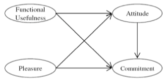

###### First approach

```{r,results='hold'}
library(bnlearn)

# Create an empty graph 
dag <- empty.graph(nodes = c("Fuse","Plea","Atti","Comm"))
dag
```

We see that the arcs are empty. Now we can start building the structure, hence adding arrows.

```{r,results='hold'}
# Add the arcs that encode the direct dependencies between variables
dag <- set.arc(dag, from = "Fuse", to = "Atti")
dag <- set.arc(dag, from = "Plea", to = "Atti")
dag <- set.arc(dag, from = "Fuse", to = "Comm")
dag <- set.arc(dag, from = "Plea", to = "Comm")
dag <- set.arc(dag, from = "Atti", to = "Comm")

# Print the DAG
dag
```

we see the directed graph here.

Now we can get the model string, also show the nodes.

```{r,results='hold'}
# Direct dependencies are listed for each variable: 
modelstring(dag)
```

*Notice that this is written as the conditional probabilities.*

We see that Fuse and Plea are parent nodes. We see that attitude is based on Functional usefulness and Pleasure

Now we can explore it visually.

```{r,results='hold'}
# Explore the elements of the graphical network
nodes(dag)
arcs(dag)
plot(dag)
```

_Notice that throughout the code, the `Rgraphviz` package is applied to better looking plots, although I have not been able to install it. Although it is not necessary._

```{r,results='hold'}
# Optional
# library(Rgraphviz) 
# graphviz.plot(dag)
```

######  Second approach

Another way to build a large network from scratch is to define the nodes and create a matrix to set the whole arc set at once:

```{r,results='hold'}
dag2 <- empty.graph(nodes = c("Fuse","Plea","Atti","Comm"))
arcs(dag2) = matrix (c("Fuse", "Atti",
                       "Plea", "Atti",
                       "Fuse", "Comm",
                       "Plea", "Comm",
                       "Atti", "Comm"),
                     byrow  = TRUE, ncol = 2,
                     dimnames = list (NULL, c("from", "to")))
plot(dag2)
```

We see that we get the exact same plot.

######  Third approach

An even easier way to build the DAG when we know the structure:

Notice that this is the output that we have seen from the first approach. When we are having a simple network it is doable, but with larger networks it gets more difficult.

```{r,results='hold'}
dag3 <- model2network("[Fuse][Plea][Atti|Fuse:Plea][Comm|Fuse:Plea:Atti]")
plot(dag3)
# graphviz.plot (dag3)
```

We see that they are the same. Although we can also use a function to check for this.

```{r,results='hold'}
# Compare dags
all.equal(dag, dag2)
all.equal(dag, dag3)
```

We see that all methods are the same.

##### Loading/entering data

We see that we are manually entering the matrices:

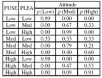

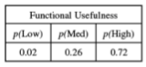

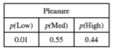

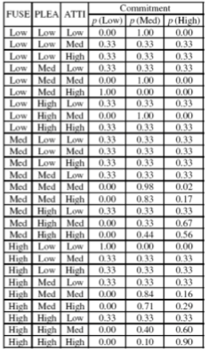

```{r,results='hold'}
# Introducing the parameters manually
Fuse.lv <- c("Low", "Med", "High") 
Plea.lv <- c("Low", "Med", "High")
Atti.lv <- c("Low", "Med", "High")
Comm.lv <- c("Low", "Med", "High")

Fuse.prob <- array(c(0.02, 0.26, 0.72), dim = 3, dimnames = list(Fuse = Fuse.lv))
Fuse.prob
Plea.prob <- array(c(0.01, 0.55, 0.44), dim = 3, dimnames= list(Plea = Plea.lv))
Plea.prob
Atti.prob <-      array(c(0.99, 0.01, 0.00,
                          0.00, 0.67, 0.33,
                          0.01, 0.99, 0.00,
                          0.34, 0.33, 0.33, 
                          0.00, 0.79, 0.21,
                          0.00, 0.40, 0.60,
                          0.99, 0.01, 0.00,
                          0.00, 0.47, 0.53,
                          0.00, 0.09, 0.91), 
                        dim = c(3, 3, 3), 
                        dimnames = list(Atti = Atti.lv, 
                                        Plea = Plea.lv, 
                                        Fuse = Fuse.lv))
Atti.prob
```

We see that all these are probabilities for the given situations, just as we have seen previously with naive bayes.

```{r,results='hold'}
Comm.prob <-    array(c(0.00, 1.00, 0.00, 
                        0.34, 0.33, 0.33, 
                        0.34, 0.33, 0.33, 
                        0.34, 0.33, 0.33, 
                        0.00, 1.00, 0.00, 
                        1.00, 0.00, 0.00, 
                        0.34, 0.33, 0.33,
                        0.00, 1.00, 0.00, 
                        0.34, 0.33, 0.33,
                        0.34, 0.33, 0.33,
                        0.34, 0.33, 0.33,
                        0.34, 0.33, 0.33,
                        0.34, 0.33, 0.33,
                        0.00, 0.98, 0.02,
                        0.00, 0.83, 0.17,
                        0.34, 0.33, 0.33,
                        0.00, 0.33, 0.67,
                        0.00, 0.44, 0.56,
                        1.00, 0.00, 0.00,
                        0.34, 0.33, 0.33,
                        0.34, 0.33, 0.33,
                        0.34, 0.33, 0.33,
                        0.00, 0.84, 0.16,
                        0.00, 0.71, 0.29,
                        0.34, 0.33, 0.33,
                        0.00, 0.40, 0.60,
                        0.00, 0.10, 0.90), 
                 dim = c(3, 3, 3, 3), 
                 dimnames= list(Comm = Comm.lv, 
                                Atti = Atti.lv, 
                                Plea = Plea.lv, 
                                Fuse = Fuse.lv))
Comm.prob
```

Now where we have defined the numbers, we want to combine the matrices and the graphical structure.

##### Conditional probability table (CPT)

Now we are going to combine the probabilities into a list

```{r,results='hold'}
# Relate the CPT to the labels
cpt <- list(Fuse = Fuse.prob, 
            Plea = Plea.prob,
            Atti = Atti.prob, 
            Comm = Comm.prob)
#  Relate the DAG and CPT and define a fully-specified BN
bn <- custom.fit(dag, cpt)
bn
```

#### B. Learning the structure and parameters from observational data

We have seen in the previous section, that we are able to manually set the directions. We can also use a constrained based algorithms to learn the links based on historical data.

```{r,results='hold'}
retention <- read.csv("Data/Probabilistic Models for Customer Analytics/retention.csv"
                      ,header = T
                      ,colClasses = "factor")
retention_test <- read.csv("Data/Probabilistic Models for Customer Analytics/retention_test.csv", header = T, colClasses = "factor" )
 
head(retention)
str(retention)
```

We see that we have four vectors with three factor levels, high, low and medium.

Notice that the data must be factors. Although she does mention that one can also have all numeric data, we did not explore this.

bn are particularly designed for categorical variables, continuous variable require to be discretisized if all variables are continuous, a Gausian bn can be built (not discussed here).

##### Grow-shrink (gs) - Learning a structure using a constrained-based algorithm 

2.1 Learning a structure using a constrained-based algorithm 

"grow-shrink (gs)", with conditional independence test chi-squared Constrained-based alg. do not work with missing data 

```{r,results='hold'}
bn.gs <- gs(retention #The data
            ,alpha = 0.05 #The signifance level, for deciding if there is a relationship
            ,test ="x2") # alternative test ="mi"
plot(bn.gs, main = "Grow shrink_X2")
```

We see that this is the model that the model suggests, purely on the data. We see that it could not draw the direction of the Communicating and Attitude, but the rest, it was able to identify the arrows.

Hence we must set the arrow ourselves. Then how do we set the arrow?

+ A rule of thumb, is chronological order, if it cannot be applied, derive it theoretically

The following is just an example with graphviz but not mandatory.

```{r,results='hold'}
#graphviz.plot (bn.gs, main = "Grow shrink_X2") 
    # notice that in the constrained-based alg some links are undirected.
    # this occurs because the algorithm cannot establish the direction of "causality".
```


###### Identifying undirectred links

Notice that when we do not manually set the links, then there is a risk of having variables where the technique is not able to identify directions. As we cannot have bidrectional links, we much search for these.

If we already have knowledge about what relationships that can and cannot be there, we can ***blacklist*** and ***whitelist*** these.

Blacklisting is about prohibiting a relationship while whitelisting a relationship if it should be there. Notice that you must specify the directions correctly, if a relationship just cannot be there, then you blacklist both directions.

Now we can look into which links that the algorithm could not define. We can see the undirected arcs in the following.

```{r,results='hold'}
undirected.arcs(bn.gs)
```

We need to set the direction of the undirected arcs to be able, this is done in the following.

**Setting directions manually**

Now we can set the relationship manually.

```{r,results='hold'}
bn.gs1 <- set.arc(bn.gs, from = "Atti", to = "Comm") # to learn the parameters from observational data
plot(bn.gs1, main = "Grow Shrink_") 
#graphviz.plot(bn.gs1, main = "Grow Shrink")
```

Now we see that all variables are directed.

**Blacklisting and whitelisting relationships**

In the following we blacklist a relationship, hence we see that there can be no relationship from commitment to attitude, but not the other way around. Hence if we know such, it could be a good idea to provide that information.

Therefore we are now going to imposing restrictions to the algorithm based on previous knowledge
    + blacklist() and whitelist(): e.g., if Comm cannot theoretically determine Atti, but Atti can determine Comm 

```{r,results='hold'}
bn.gs <- gs(retention, blacklist = c("Comm", "Atti"))
    # graphviz.plot(bn.gs, main = "Grow Shrink_ with restriction 1")
```

Now we can **blacklist** one more relationship

if arc Atti - Comm should not be there at all 

```{r,results='hold'}
blacklist <- data.frame(from = c("Comm", "Atti"), to = c("Atti", "Comm"))
blacklist
bn.gsb <- gs(retention, blacklist = blacklist)
plot(bn.gsb, main = "Grow Shrink_with restriction 2")
# graphviz.plot(bn.gsb, main = "Grow Shrink_with restrictions")
```

Now we see that the link between Comm and Atti is not there.

We can also allow for a relationship, that is done by **white listing**.

if theoretically the arc Atti -> Comm should be there 

```{r,results='hold'}
bn.gsw <- gs(retention, whitelist = c("Atti", "Comm"))
plot(bn.gsw, main = "Grow Shrink_with restriction 3")
# graphviz.plot(bn.gsw, main = "Grow Shrink_with restriction 3")
```

We see that the arrow is not there again, going from attitude to commitment, because we whitelisted that relationship.


##### Hill-Climbing (hc) - Learning the structure using a score-based algorithm 

**Hill-Climbing (hc) greedy search**, this is made for prediction.

Here we are using an information criteria to predict the relationships and choose on the IC.

```{r,results='hold'}
bn.hc <- hc(retention, score = "bde")
plot (bn.hc, main = "Hill Climbing_BDe") 
#graphviz.plot (bn.hc, main = "Hill Climbing_BDe")

bn.hc <- hc(retention, score = "bic")
plot (bn.hc, main = "Hill Climbing_BIC") 
#graphviz.plot (bn.hc, main = "Hill Climbing_BIC") 
```

We see that this suggests two different structures.


##### Fitting the model to the data (learning the probabilities)

_Notice that in the first section with the manual method, we manually made the conditional probabilities._

We are going to learn the model parameters using the Grow-Shrink model that was created earlier.

**Bayesian network model**

I chose bn.gs1.

```{r,results='hold'}
bn.mle <- bn.fit(bn.gs1, data = retention, method = "mle")
bn.mle

#One by one
bn.mle$Fuse #Parent
bn.mle$Plea #Parent
bn.mle$Atti
bn.mle$Comm
    
    # Other useful functions 
    # set.arc(net, from = "A", to = "T")
    # drop.arc(net, from="A", to=""T)
    # e.g. newnet = drop.arc(net, from = "T", to = "A")
    # Test for the conditional independence between variables 
    # ci.test("T", "E", c("O", "R"), test = "x2", data = data)
```

##### Alternatives to Grow-Shrink and HC

These are others algorithms to constructing the Bayesian Network.

```{r,results='hold'}
# other constraint-based algorithms have been developed
    bn2 <- iamb(retention, alpha = 0.05, test ="mi")
    #graphviz.plot (bn2, main = "Iamb1_mi" ) 
    bn3 <- fast.iamb(retention, alpha = 0.05, test ="mi")
    #graphviz.plot (bn3, main = "FastIamb_mi") 
    bn4 <- inter.iamb(retention, alpha = 0.05, test ="mi" )
    #graphviz.plot (bn4, main = "InterIamb_mi") 
    # in the optimal case, all will return the same graph
```


### 2. Model evaluation

Now we are going to test how good the model is.

#### I. Metrics of model complexity 

```{r,results='hold'}
nodes(bn.mle)
arcs(bn.mle)
bn.mle
plot(bn.gs1)
```

We see that the model is rather simple, not many variables and links.

#### II. Metrics of model sensitivity

Test if any two nodes are d-separated, meaning that information for one variables to another flows or not. For this I refer back to the conditional independence. In the following we see that we just compare two nodes, although one could also add the scenario of imposing evidence (hence controlling for a given variable).

```{r,results='hold'}
dsep(bn.mle, x = "Plea", y = "Fuse")
dsep(bn.mle, x = "Plea", y = "Comm")
```

We see that Pleasure and functional usefulness is not dependent on each other, although pleasure and communication is not separated, hence dependent.

#### III. Evaluate the arc.strength()

##### For the growth shrink 

Now we want to see how strong the relationship is between the nodes. Normally we have beta values as normally, hence we can look at:
 
1. p-values: with criterion = "x2" or "mi" (mutual information), the output reports the p-value for the test. The lower the p-value, the stronger the relationship.
2. using BIC: with criterion ="bic" reports the change in the BIC score of the net caused by an arc removal.The more negative the change, means the BIC score will go worse if we delete that arc (i.e. the arc is important for the model).

```{r,results='hold'}
library(dplyr)
options(cipen = 0)
arc.strength(bn.gs1, retention, criterion = "x2") %>% 
   as.data.frame() %>% 
   arrange(strength)
```

We see that the strength between Pleasure and Attitude is not strong, hence it makes sense that not all models find the relationship. That also means the the significance of this relationship is low.

```{r,results='hold'}
arc.strength(bn.gs1, retention, criterion = "bic") %>% 
   as.data.frame() %>% 
   arrange(strength)
```

The output reveals that, if we remove Plea -> Comm, BIC will decrease with -668.211, which in bnlearn means the model will get worse. The output reveals that, if we remove Atti -> Comm, BIC will increase with 40.48, which in bnlearn package means the model may improve based on this index.

We see that the relationship between Pleasure and commitment for instance is very high.

##### For the hill-climbing structure

Notice that we are just merely repeating the same here, just with the other method.

```{r,results='hold'}
arc.strength(bn.hc, retention, criterion = "bic") %>% 
   as.data.frame() %>% 
   arrange(strength)
```

As expected, all strenghts are negative as the model is fitted against BIC, hence if it could improve the model by removing the given link, then it would do so.

##### Different information criteria evaluations

Metrics of evaluation and selection among several dags: 

+ BIC, BDe, AIC scores are used to compare alternative structures and choose the best. In bnlearn, AIC, BIC, BDE closer to zero means better model; often the three indexesdo not agree. See the following examples:

```{r,results='hold'}
bnlearn::score(bn.gs1, retention, type = "aic")
bnlearn::score(bn.hc, retention, type = "aic")

bnlearn::score(bn.gs1, retention, type = "bic")
bnlearn::score(bn.hc, retention, type = "bic")

bnlearn::score(bn.gs1, retention, type = "bde")
bnlearn::score(bn.hc, retention, type = "bde")
```

We see that the models that we have learned through HC ans GS, they appear to all be the same. Probably because they were trained on the same IC, during the lecture we see that there is a difference.

#### IV. Metrics of predictive accuracy (error rate, confusion matrix, AUC)

Here we are going to predict one variable and see what the error rate will be.

```{r,results='hold'}
library(gRain)
library(gRbase)
library (caTools)
```

##### Cross validation

This function requires as one of its parameters only structure (not the full bayesian model). We use classification error ("pred") for the node Comm (our target) as a loss function. 

```{r,results='hold'}
netcv <- bn.cv(retention, bn.gs1
               ,loss ="pred" #Gives error rate
               ,k = 5
               ,loss.args = list(target = "Comm")
               ,debug = TRUE)
netcv
```

The prediction accuracy of Comm based on 5-fold cross validation is quite high (1-0.18 = 0.82) one can also look at each individual variables.

Using a testing sample to evaluate the model performance ***we need to transform the full bayesian model into a gRain object***

```{r,results='hold'}
net1 <- as.grain(bn.mle)
net1
```

assuming Comm is the target node, we predict the probability of Comm being High, Medium and Large using net1 in the test sample.

```{r,results='hold'}
predComm <- predict(net1
                   ,response = c("Comm")
                   ,newdata = retention_test
                   ,predictors = names(retention_test)[-4] #Removing target variable
                   ,type = "distribution" #This returns likelihoods
                   )
predComm = predComm$pred$Comm
#View(predComm) #Shows the likelihood
# write.csv(predComm, "PredComm.csv", row.names = FALSE) 
```

Or add the predictions to the data file creating a new variable.

Instead of probabilities of 0 or 1, one can save the actual CLASS (0/1). 

```{r,results='hold'}
predComm_class <- predict(object = net1
                          ,response = c("Comm")
                          ,newdata = retention_test
                          ,predictors = names (retention_test)[-4] #Removing target variable
                          ,type = "class" #This just returns the class
                          )
predCommclass <- predComm_class$pred$Comm
#View(predCommclass)
# write.csv(predictionsTclass, "PredictedTclass")
```

##### Alternative approach to fit and predict (Without gRain)

A quick method WITHOUT using package gRain.

```{r,results='hold'}
#Speficy network
model <- model2network("[Fuse][Plea][Atti|Fuse:Plea][Comm|Fuse:Plea:Atti]")
 
#Fit the data
bn.mle1 <- bn.fit(model
                  ,retention) 

#Make predictions
predComm1 <- predict(bn.mle1
                     ,node = "Comm"
                     ,data = retention_test)

#See the predictions compared to previous predictions.
table(predCommclass, predComm1)
```

We see that this methods almost makes the same results.

We cam also make a **confusion matrix**.

```{r,results='hold'}
table(predComm_class$pred$Comm, retention_test$Comm)
```

Plotting **ROC and AUC**

*Notice that ROC and AUC is made for a two class scenario, hence it returns nine lines, one for each line.*

```{r,results='hold'}
library(caTools)
colAUC(predComm, retention_test[ ,4], plotROC = TRUE) #requires the predicted probabilities, not the predicted class
```

we get an AUC for every column of the prediction matrix our DV has 3 categories: Low, Med and High we observe that the model has problems when d istiguisging between high and medium but performs pretty well when indentifying the Low category (customers who are not commited)


### 3. Making inference and queries based on the model

How do we use the model in practice to make inference with incomplete data? Below we consider several hypothetical situations.  

A customer is considered retained if he has a positive attitude and high commitment to the Virtual Community (hereafter, VC). How do functional usefulness and pleasure influence on attitude and commitment? We know the strength of the relationship based on the arc strength. The following analysis helps to understand the relationship, which we will see that it is not be necessarily linear Using BN, one can evaluate the expected changes in attitude, and respectively, commitment due to changes in functional usefulness and pleasure. We will set evidence in the network for Fuse and Plea and we´ll look at the cpt (conditional probability table) for Atti and Comm before and after setting the evidence. Setting (hard) evidence means setting one of the states of the variable at probability 1 (that is, as 100%).

Transform the `bn` into a junction tree

We are going to make two types of diagnositcs:

1. *Forward inference:* following the directions, hence setting evidence for the parents and then see how that affects the children
2. *Backward inference:* going against the directions, hence setting evidence for children and then seeing how that affects the parents.

**The following is also forward integration**

```{r,results='hold'}
library (gRain)
junction <- compile(as.grain(bn.mle))
# "querygrain" function extracts the marginal distribution of the nodes
```

First we are going to look at the prior probabilities, that is done in the following.

```{r,results='hold'}
# ctp for atti and comm are:
querygrain(junction, nodes = "Atti")
querygrain(junction, nodes = "Comm")
```

Imagine a new person joins the VC reporting a Low, Medium, or High Functional Usefulness perception. This information can be fed to the network as evidence in order to predict the conditional probability of his/her attitude and commitment to VC. 

```{r,results='hold'}
# new ctp(if Fuse = Low)
jLow <- setEvidence (junction, nodes = "Fuse", states = "Low")
A1 <- querygrain(jLow, nodes = "Atti")
A1
```

We see that we enter a piece of information and then see how the attitude changes. So we see that it went from 59% to 15%, which is a strong decrease.

We can do the same with commitment

```{r,results='hold'}
C1 <- querygrain(jLow, nodes = "Comm")
C1
```

We see that the High segment in the commitment as weel.

```{r,results='hold'}
# new ctp (if Fuse = Med)
jMed <- setEvidence (junction, nodes = "Fuse", states = "Med")
A2 <- querygrain(jMed, nodes = "Atti")
A2
C2 <- querygrain(jMed, nodes = "Comm")
C2


# new ctp (if Fuse = High)
jHigh <- setEvidence (junction, nodes = "Fuse", states = "High")
A3 <- querygrain(jHigh, nodes = "Atti")
A3
C3 <- querygrain(jHigh, nodes = "Comm")
C3
```

#### Diagnostics (Forward inference)

Here we are going to set evidence for a given customer and see how probabilities for other variables are affected.

We see that we get likelihood of the different states where attitude is set to low, medium and high. We see that when attitude = low, then changes in fuse will have no effect.

```{r,results='hold'}
# Summary (only for Atti)
AttiHigh <-c(A1$Atti[[3]], A2$Atti[[3]], A3$Atti[[3]])
AttiLow <- c(A1$Atti[[1]], A2$Atti[[1]], A3$Atti[[1]])
AttiMed <- c(A1$Atti[[2]], A2$Atti[[2]], A3$Atti[[2]])
df1 <- data.frame(Fuse = c("Low", "Med", "High"), AttiLow, AttiMed, AttiHigh)
df1
matplot(rownames(df1), df1
        ,type = 'l'
        ,xlab = 'Fuse'
        ,ylab = 'Probability'
        ,ylim = c(0,1)
        ,col = c(3,4,2))
legend('topright'
       ,inset = .01
       ,legend = colnames(df1[,2:4]) #"AttiLow"  "AttiMed"  "AttiHigh"
       ,pch = 1,horiz = T
       ,col = 2:4)
```

***Discussion***

+ as Fuse changes from low to medium to high, 
   - the high state of attitude shows an increasing trend, 
   - the medium state of attitude shows a decreasing trend,
   - the low state of attitude shows a constant trend. 

+ it depicts that when functional usefulness is low, the probability of attitude medium is quite high (0.80) and thus functional usefulness does not radically affect the customer´s attitude.  

##### *let us repeat the same analysis by setting evidence in Pleasure*

We can do the same graphs, just where we see the relationship between pleasure and attitude.

```{r,results='hold'}
# new ctp 
jLow <- setEvidence (junction, nodes = "Plea", states = "Low")
A1 = querygrain(jLow, nodes = "Atti")
C1 = querygrain(jLow, nodes = "Comm")

# New ctp
jMed <- setEvidence (junction, nodes = "Plea", states = "Med")
A2 = querygrain(jMed, nodes = "Atti")
C2 = querygrain(jMed, nodes = "Comm")

# New ctp
jHigh <- setEvidence (junction, nodes = "Plea", states = "High")
A3 = querygrain(jHigh, nodes = "Atti")
C3 = querygrain(jHigh, nodes = "Comm")

# summary
AttiHigh <- c(A1$Atti[[3]], A2$Atti[[3]], A3$Atti[[3]])
AttiLow <- c(A1$Atti[[1]], A2$Atti[[1]], A3$Atti[[1]])
AttiMed <- c(A1$Atti[[2]], A2$Atti[[2]], A3$Atti[[2]])
df2 <- data.frame(Plea = c("Low", "Med", "High"), AttiLow, AttiMed, AttiHigh)

options(scipen = 999)
df2
matplot(rownames(df2), df2, type = 'l', xlab = 'Plea'
        ,ylab = 'Probability', ylim = c(0,1)
        ,col = c(3,4,2))
legend('topright', inset=.01, legend=colnames(df2[,2:4]), 
       pch=1, horiz=T, col=2:4)
```

We see that the probability of a high attitude increases as pleasure increases. Although we see that the low attitude probability decrease as pleasure increases, and at some point, the low attitude will 

__Discussion__

as Plea changes from low to medium to high,

 - the high state of attitude shows an increasing trend
 - the medium state of attitude shows a mixed trend and
 - the low state of attitude shows a decreasing trend

When pleasure is low, the probability of attitude being low is high (0.8592). This means pleasure has a stronger relationship with attitude; hence, to increase the attitude of customers, it is more important to enhance their perceived pleasure than to enhance functional usefulness.

Similar influences of changes of FUSE, PLEA and ATTI on commitment can be similarly explored. To conclude, the above inference is called forward inference because we set evidence in the parent and look at ctp changes in the child. Next, we look at backward inference - a great type of inference offered by BN models.

#### Diagnostic (Backward inference)

Here we are going to go against the arrows.

Let’s assume that the evidence given is that the customer’s attitude towards VC is high. This information is fed to the network by setting the probability of attitude being high (that is, as 1.00) and observing the changes in the parent variables (Fuse and Plea)

```{r,results='hold'}
# Prior ctp
querygrain(junction, nodes = "Fuse")
querygrain(junction, nodes = "Plea")

# New ctp
jHigh <- setEvidence (junction, nodes = "Atti", states = "High") 
querygrain(jHigh, nodes = "Fuse")
querygrain(jHigh, nodes = "Plea")
```

__Discussion__

The probability of the high state of Plea and Fuse is increasing, while the probability of the low and medium states of Plea and Fuse is decreasing. This implies that increased attitude towards interaction in a VC is because of person’s increased perception of pleasure and functional usefulness in the VC.

__An example__

_Assume that the online vendor observes decreasing commitment towards participation_ among its customers. He can set evidence to the network that the probability of commitment is low and see the effect of the parent variables (attitude, functional usefulness and pleasure).

```{r,results='hold'}
#Prior ctp 
querygrain(junction, nodes = "Atti")
querygrain(junction, nodes = "Fuse")
querygrain(junction, nodes = "Plea")
```

```{r,results='hold'}
# New ctp
CLow <- setEvidence (junction, nodes = "Comm", states = "Low") #We set commitment to low
querygrain(CLow, nodes = "Atti")
querygrain(CLow, nodes = "Fuse")
querygrain(CLow, nodes = "Plea")
```

A vendor, therefore, needs to take corrective action to enhance customers’ pleasure aspect in the VC to improve customers’ commitment toward the VC. we found that it is mainly due to lack of enhancement of the pleasure aspect of the website; the vendors needed to take corrective action to provide the customers with more fun and enjoyment.

We see that when the communication is set to low, then the probability of pleasure being high is 0.

**Modeling contradictory behavior**

 _Assume some customers interact in the VC to seek information from the VC, but do not participate in VC activities_. Such customers can be considered persons with positive attitudes but low commitment. Can BN predict the reasons behind such contradictory behavior?

```{r,results='hold'}
# Prior ctp
querygrain(junction, nodes = "Fuse")
querygrain(junction, nodes = "Plea")

# New ctp
AHigh <- setEvidence (junction, nodes = "Att", states = "High")
AHighCLow <- setEvidence (AHigh, nodes = "Comm", states = "Low")
querygrain(AHighCLow, nodes = "Fuse")
querygrain(AHighCLow, nodes = "Plea")

```

__Discussion__

The probability of attitude high and commitment low was set to 1.00. 

The results imply that FUSE is 0.3 likely to be low but a significant proportion is still likely to be high (0.62); instead, PLEA is most likely to be low (0.7) and unlikelly to be high (0%). This reveals that customers interact primarily because of fun, and they do not perceive the VC to be sufficiently useful to them to commit to.


## Application 2: Identifying populations with Positive Expected Lift in Profit (ELP) and targeting

The idea is to use BN to identify segments of customers that will most *likely purchase* when sending the ad (persuadable segments) and **avoid** sending the ad to the rest: 1) to the ones who will not buy the advertised product ever, 2) to the ones who will be offended by receiving an unwanted advertisement or call, 3) or to the ones who will always buy)

If historical data is available, we start learning the relationships between the variables train and select the best model as a prelimimnary step. Below we use the model structure from the text (given),and we only have to learn the parameters (probabilities). Next,we focus exclusively on how model is used as a decision support for marketing managers.

```{r,results='hold',include=TRUE}
targeted.adv <- read.csv("Data/Probabilistic Models for Customer Analytics/targeted.adv.csv"
                         ,header = T, colClasses = "factor")
head(targeted.adv)
str(targeted.adv)
```

We see that the table contains 5 columns, ID, Buy, Income, Sex and Mailed. All the variables are factor variables 

```{r,results='hold',include=TRUE}
# Build the structure
dagTA <- model2network("[Income][Sex][Mailed][Buy|Income:Sex:Mailed]")
plot(dagTA)
```

We see that the all variables leads towards buy.

```{r,results='hold',include=TRUE}
# Learn the cpt (conditional probability table)
bnTA.mle <- bn.fit(dagTA, data = targeted.adv[, c(2:5)], method = "mle")
bnTA.mle
```

We know that the whole network is based upon the conditional probabilities.

Now we want to calculate the **ELP (Expected Lift in Profit)**

The function is basically

$$ELP = P(Buy = Yes| Mailed = yes) * r_s  - P(Buy = Yes| Mailed = no) r_u - c$$

That applies for any given population Y. We see that we have the following notations:

+ $c$ = cost of mailing the ad to a give person
+ $r_u$ = the income obtained from a sale to en unsolicited customer
+ $r_c$ = the income obtained from a sale to en solicited customer
+ $r_u$ and $r_s$ = are different because we may offer some discount in the ad

We can take the following assumptions.


Now we need to do three different scenarios:

a. Compute the ELP for the population consisting of individuals with medium income who are male. Should we mail an ad to this population?

b. Compute the ELP for the population consisting of individuals with medium income who are female. Should we mail the ad to this population?

c. Compute the ELP for the population consisting of individuals with low income. Should we mail an ad this population?

**Scenario 1**

We are going to evaluate males with high income. First we see the probability of buying when mailed and when not.

```{r,results='hold',include=TRUE}
c = 0.5 #Cost
r_s = 8 #Income with discount
r_u = 10 #Income obtained from a sale to en unsolicited customer
```

```{r,results='hold',include=TRUE}
# set evidence and get the cpt 
library (gRain)
junctionTA <- compile(as.grain(bnTA.mle))

#We have mailed
Med_male_yes <- setEvidence(junctionTA, nodes = c("Income", "Sex", "Mailed")
                             , states = c("medium", "male", "yes"))
querygrain(Med_male_yes, nodes = "Buy")
```

Probability of buying when mailed = 41.46%.

```{r,results='hold',include=TRUE}
#Not mailed
Med_male_no <- setEvidence(junctionTA, nodes = c("Income", "Sex", "Mailed")
                            , states = c("medium", "male", "no"))
querygrain(Med_male_no, nodes = "Buy")
```

Probability of buying when not mailed = 19.56%

Calculate expected lift.

```{r,results='hold',include=TRUE}
options(digits = 2)
ELP = querygrain(Med_male_yes, nodes = "Buy")$Buy[[2]] * r_s -
     querygrain(Med_male_no, nodes = "Buy")$Buy[[2]] * r_u - c
ELP
```

We see that the expected lift (ELP) is positive hence, we should mail the high income males.

**Scenario 2**

In this examplle we basically do the same, just with females instead.

```{r,results='hold',include=TRUE}
#Assumptions
c = 0.6 #Cost
r_s = 7 #Income with discount
r_u = 9 #Income obtained from a sale to en unsolicited customer

Med_fem_yes <- setEvidence(junctionTA, nodes = c("Income", "Sex", "Mailed")
                           ,states = c("medium", "female", "yes"))
querygrain(Med_fem_yes, nodes = "Buy")
```

We see the probability of buying = 72% when they are mailed.

```{r,results='hold',include=TRUE}
Med_fem_no <- setEvidence(junctionTA, nodes = c("Income", "Sex", "Mailed")
                          ,states = c("medium", "female", "no"))
querygrain(Med_fem_no, nodes = "Buy")
```

We see that the probability of buying = 44% when mailed.

```{r,results='hold',include=TRUE}
ELP = querygrain(Med_fem_yes, nodes = "Buy")$Buy[[2]] * r_s -
 querygrain(Med_fem_no, nodes = "Buy")$Buy[[2]] * r_u - c
ELP
```

We see that the ELP = 0.48, hence positive. Meaning that we should mail the medium income females as well, because we see that we earn more on these.

**Scenario 3**

We go with the same assumptions this time.

We are going to look at low income customers.

```{r,results='hold',include=TRUE}
Low_yes <- setEvidence (junctionTA, nodes = c("Income", "Mailed")
                        ,states = c("low", "yes"))
querygrain( Low_yes, nodes = "Buy")
```

We see that the probability of buying = 60%

```{r,results='hold',include=TRUE}
Low_no <- setEvidence (junctionTA, nodes = c("Income", "Mailed")
                       ,states = c("low", "no"))
querygrain(Low_no, nodes = "Buy")
```

Now we see that there is 47% probability of buying when they are mailed.

```{r,results='hold',include=TRUE}
ELP = querygrain(Low_yes, nodes = "Buy")$Buy[[2]] * r_s -
 querygrain(Low_no, nodes = "Buy")$Buy[[2]] * r_u - c
ELP
```

We see that it is negative, hence we should not email the low income people.

Discussion: 

Using BN in this application allows to identify persuadable segments of individuals who would buy only if they are sent an ad. It avoids sending ads to those who will never buy those who always buy (thus avoid wasting the ad), and those who are turned off by the advertisement when they receive it. The network can be extended with more nodes according to the characteritics of the pop. in the dataset


## Application 3: Product Recommendation using Probabilistic Models (BN)


### Method 1: Learn the probabilistic relationships using a Bayesian network learning

Now we are going to use the Hill+Climbing algorithm to estimate the model.

We are going to use the Bayesian Network for Collaborative Filtering.

```{r,results='hold',include=TRUE}
library(bnlearn)
library(Rgraphviz)
data = read.csv("Data/Probabilistic Models for Customer Analytics/CollFilforR.csv"
               ,header = T,colClasses = "factor",sep = ";")
head(data)
```

We see that we have information on four different items.

Structural expectation-maximization function learns with mising data a Hill-Climbing structure and further predict the missing values, which will be the recommendations

```{r,results='hold',include=TRUE}
mystructural <- structural.em(data, maximize = "hc", return.all = TRUE) 
graphviz.plot(mystructural$dag)
```

We see the structure.

```{r,results='hold',include=TRUE}
mystructural$dag # the structure
```

In the following see the conditional probabilities.

```{r,results='hold',include=TRUE}
mystructural$fitted # the parameters
```

Now we see that the method imputed the NA that we had in row 6.

```{r,results='hold',include=TRUE}
head(data)
head(mystructural$imputed) # the predictions based on the probabilistic structure
```

**Alternatively**, BN model is trained with any other algorithm using non-missing registers, and used afterwards for making inference; `impute()` function allow us to make inference in a new data set of customers for which we want to make recommendations.

```{r,results='hold',include=TRUE}
data_wNA = na.omit(data)
dag = tree.bayes(data_wNA, "V4") # a tree bayes
graphviz.plot(dag)
myBN = bn.fit(dag, data_wNA)
```

Assuming the model was trained and tested through a cross-validation procedure (as in App 1), one can further use it for making recommendations with impute() function in a new dataset

```{r,results='hold',include=TRUE}
dataimputed = bnlearn::impute(myBN, data, method = "parents", debug = TRUE)
table(is.na(dataimputed))
```

compare the recommendations made by the two methods. We make confusion matrices.

```{r,results='hold',include=TRUE}
table(mystructural$imputed$V1, dataimputed$V1)
table(mystructural$imputed$V2, dataimputed$V2)
table(mystructural$imputed$V3, dataimputed$V3)
table(mystructural$imputed$V4, dataimputed$V4)
```

as seen, the recommendations made by the two methods are almost the same

### Method 2: Finding latent segments

A latent class (segment) that can accurately predict the ratings for the user on all items. The advantages of this method is that is considers both the similarities between users, items and their interaction.

Hence we want to use Bayesian Networks to identify segments / or clusters. These are latent, hence we cannot directly measure them. Therefore we are going to test different number of latent segments and see which has the lowest best performance according to the log likelihood.

Notice that the data consists of four different variables, these could for instance be movies.

```{r,results='hold',include=TRUE}
library(poLCA)
# Define the variables used for (the model ~1 means without covariates)
f <- cbind(V1, V2, V3, V4)~1
```

We are going to run several models with the for() function. We are going to evaluate BIC. One also have used AIC, $G^2$, $X^2$.

```{r,results='hold',include=TRUE}
min_bic <- 100000
for(i in 2:10){ #We test from 2 to 10 segments.
 lc <- poLCA(f, data, nclass=i #We iterate through no. of classes.
             , maxiter=3000,
             tol=1e-5, na.rm=FALSE,
             nrep=1, verbose=TRUE, calc.se=TRUE)
 
 if(lc$bic < min_bic){
   min_bic <- lc$bic
   LCA_best_model<-lc
 }
}
LCA_best_model
```

We see that the best model is with 2 segments.

For the best model we can look at the posterior probabilities.

```{r,results='hold',include=TRUE}
head(LCA_best_model$posterior) # matrix of posterior class membership probabilities
```

Instead of looking at the probabilities we can also look at the actual class predictions.

```{r,results='hold',include=TRUE}
LCA_best_model$predclass %>% head() # class membership
table(LCA_best_model$predclass)
LCA_best_model$P # size of each class
```

We see the different predictions, and the table shows the distribution. Lastly we have the proportions for each class.

```{r,results='hold',include=TRUE}
options(scipen = 0)
# The estimated class-conditional response probabilities
LCA_best_model$probs
# Ploting (graph=TRUE) them for better interpretation
ch2 <- poLCA(f, data, nclass = 2, graph = TRUE)
```

We see the values for each variable, e.g., in class 1 V2, we primarily have 1's and 2's. Where the class 2 vector 2 has only values 1 and 5.

```{r,results='hold',include=TRUE}
# save the class
data_copy <- data
data_copy$class <- factor(LCA_best_model$predclass)
head(data_copy)
```

Now we see that the class that we estimate the observation to be within is added.

```{r,results='hold',include=TRUE}
# learn a BN classifier considering the class as the root node
mystructural <- structural.em(data_copy, maximize = "hc", return.all = TRUE) 
graphviz.plot(mystructural$dag)
```

We see that the hill climbing method actually sets V3 as an ancestor and not class. This we want to correct.

```{r,results='hold',include=TRUE}
mystructural$dag <- set.arc(mystructural$dag, from = "class", to = "V3")
graphviz.plot (mystructural$dag)
bn.mle <- bn.fit (mystructural$dag, data = data_copy, method = "mle")
```

Now we have corrected the DAG that is not correct. Hence, we are able to start making inference.

*Lets say we have a customer who has reported the following: V1 = 1, V2=5, V3=5. Then what would the rating for V4 be?*

```{r,results='hold',include=TRUE}
library(gRain)
junction <- compile(as.grain(bn.mle))

#We set evidance
V1V2V3 <- setEvidence(junction, nodes = c("V1", "V2", "V3")
                      ,states = c("1", "5", "5"))
querygrain(V1V2V3, nodes = "class")
```

It is most likely that this person is in class 1.

```{r,results='hold',include=TRUE}
querygrain(V1V2V3, nodes = "V4") #estimated preference: 0.12*4 + 0.88*5 = 4.88
```

We see that there is 12% probability of rating 4, and 88% probability of rating 5, hence we can aggregate on those.

$0.12 * 4 + 0.88 * 5 = 4.88$

## Latent models for cross selling and acquisition sequence

In this section I will introduce two methods.

1. Latent trait model - which is for corss selling, so leans towards the recommender systems as we have previously seen.

2. Latent Markov approach (the hidden Markov chain) - for time-series (dynamic approach).

Compared to association rule models, Bayesian Networks collaborative filtering etc. we see that the methods introduced in this chapter is more about the sequence of events and analyzing these.

> The new method will look at what the customer has bought up until now, or a given date and make recommendations based on these.

What **data type?**, we will see that the two approaches need data in products as column dummies and users as rows, e.g.,

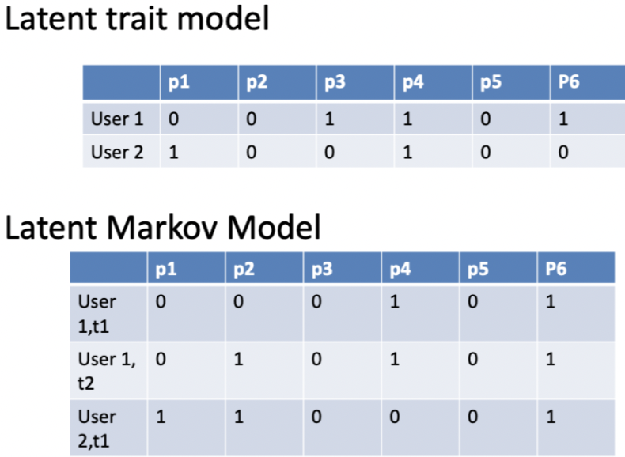

*Notice that the LMM model needs one row pr. user pr. timeperiod.*

Lets recap, ***what is a latent trait?*** This is an udnerlying factor that is unknown hence latent. Therefore, we are going to esimate these.

Latent train = underlying characteristics. This is something that cannot be directly measured, that meaning be answered by one question (e.g., as how old are you?), but must be answered through a number of questions.

> Example of a latent trait. Let's say that we want to measure intelligence. The procedure would be to ask several questions. So this is basically like an exam, the more correct answers you have, the higher the intelligence.

Then one may say, can we assume if a student can answer the most difficult question, will he then be able to answer all the other less difficult questions? If yes, then we in principle only need to know which question was the hardest that he correctly answered, and then we basically just need to look at this item to make recommendations, that could be grading in this example.

If not, then we need to know all the other answers as well.

**Different models needs different solutions.**

He shows this:

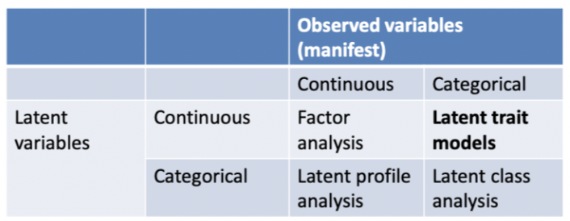

*Observed variables = manifest variables*

We see that the ***latent trait models***, which we are going to work with, takes categorical input but will give an continous output. (or more correct, we assume that the underlying scale is continuous).

***This is also known as Item Response Theory (IRT)***

He then introduce the *item response function (IRF)*, it looks like the following

$$P(Y = 1 | O_j,a_i,b_i) = 
\frac{e^{a_i(O_j-b_i}}
{1+e^{a_i(O_j-b_i}}$$

Where

+ $a_i$ = an items location is defined as the amount of latetn trait needed  to have a 50% probability of endorsing the item.
+ $b$ = the higher on the trait level a respondent needs to be in order to endorse the item.

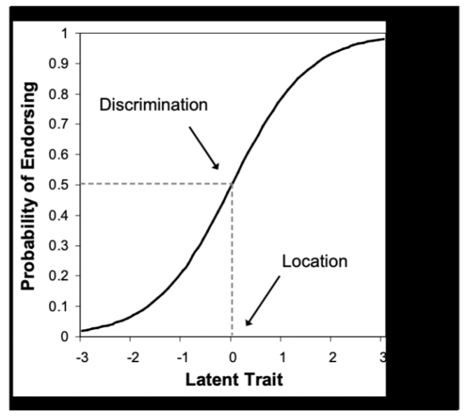

Endorsing an item = the probability of buying the product.

In the following plot we see two different persons, where the their latent scores are estimated to be different, although they share the same probability of buying the product, hence such curves could look like this:

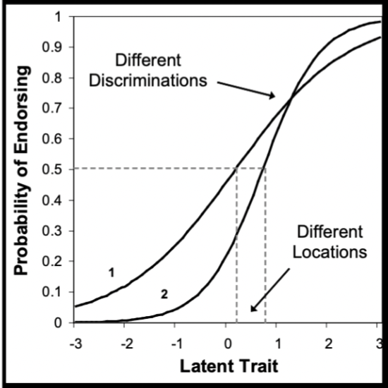

We see that they have different latent scores. In a later example we are going to look at bank customers. Where we base the latent score on what financial services that a given customer has. Hence `the latent score = financial maturity`, this is visualized with the following:

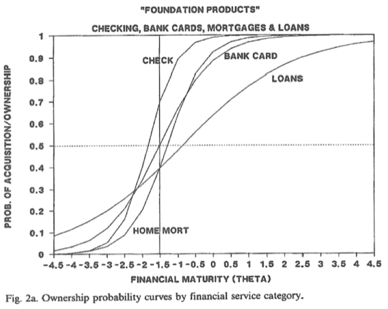

Here we see the relationships between getting the financial services and the expected financial maturity, for instance to have probability of 50% of having a check account, the maturity is low, although to have a loan, you expect the persons to be much much more mature.

We see that -1 maturity = 50% probability of having a loan, but that also implies that almost certainty of a person having a check account.

Naturally that means that one could also make a list of these models, and we want to know:

1. $a_i$ = the slope parameter, the slope of the sigmoid at 50%
2. $b_i$ = Position parameter, this is the latent score (financial maturity in the example above) at 50% buying probability. See an example below.

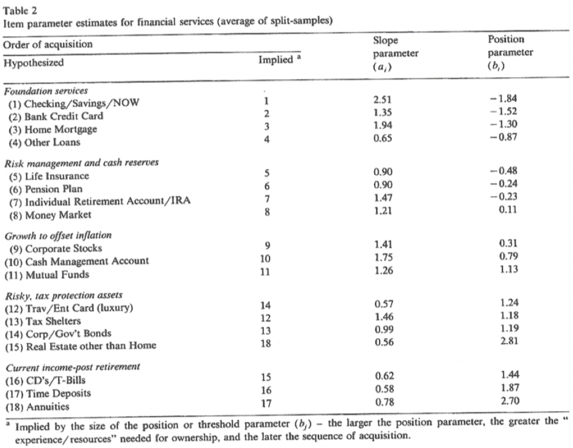

Notice that financial maturity is merely an expression for how far up the ladder (what products a customer have) a given person is and then we can set the B value to plot into the function to assess what products you expect the customer to have.

Hence we should be able to calculate the latent score for a given customer based on a set of predictor variables, an example in the following:

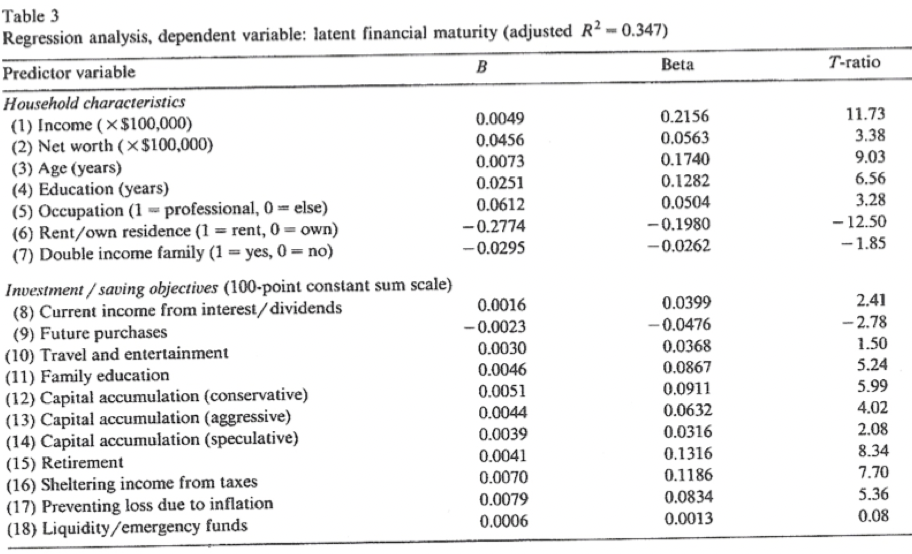

We see that the higher th T-ratio, the higher significance. Then we can also look at the B, e.g., if you are renting, it is a negative effect on financial maturity.

**Why is this important?**

We need to know this, to make appropriate recommendations, hence a person with a low latent score (financial maturity) may not get a mortgage loan although he may get a check account.

### Latent Trait Model - Applying the LTM Package in R

The LSAT data is having 5 questions of increasing difficulty (although not in the actual order) (5 items) and we are going to make an analysis on this.

```{r}
library(ltm)
head(LSAT) #We see that itmes are one hot encoded

#Some summary descriptions
des <- descript(LSAT)
des
```

We can see the frequency of the different scores etc.

+ The important thing with the descriptive statistics
+ In *the proportions for each level of response*: We see that item 1 is the simplest and item 3 is the most difficult. That we will be clear from the `res` output. 0 = proportion of wrong answers, 1 = proportion of correct answers.
+ The other important thing is the *pairwise associations*: where we see that if there is correlation between the different questions. High p = correlation, low correlation = low p-value. We want to find some high p-values, of not, the model does not make any sense.

Now lets fit the model.

```{r}
fit <- ltm(LSAT ~ z1) #z1 for the birnbaum model
fit
```

We see:

+ *Coefficients*: that is where they are placed on the scale, e.g., item 3 (Q3) leads to the highest maturity.
+ Dffclt = location parameters
+ Dscrmn = the slope

We can look at the different scores depending on the correct answers, that is for each of the persons.

```{r}
res <- factor.scores(fit)
res #Fore respondents
```

We see that

+ Z1 is where a person is set on a the latent scale. where person no. 30 (or this group of persons as there are 298) has a latent score of 0.606. He is also plotted with the red line in the following plot.

Now we can also plot the item response functions.

I have added ablines in the plot, to visualize the latent scores of 50% probability of buying.

```{r}
plot(fit)
#Lets add plot the coefficient and check if it adds up to 50% prob.
abline(h = 0.5,lty = 2,col = "darkgrey")
abline(v = -0.280,lty = 2,col = "darkgrey")
text(x = -0.0280,y = 0.024,"-0.0280 (coef)",col = "green",cex = 0.7)
text(x = 1.9,y = 0.51,"50% prob.",col = "green",cex = 0.7)
abline(v = 0.606,lty = 2,col = "darkred") #Group 30 from the res
text(x = 1.0,y = 0.26,"Person 30",col = "darkred",cex = 0.7)
```

We see that at the visualize maturity, there is almost certinaty that the person is correctly answering item 1 (Q1).

### The latent (hidden) Markov model

***Let me first summarize the Markov Chain***

The Markov chain model looks as the following:

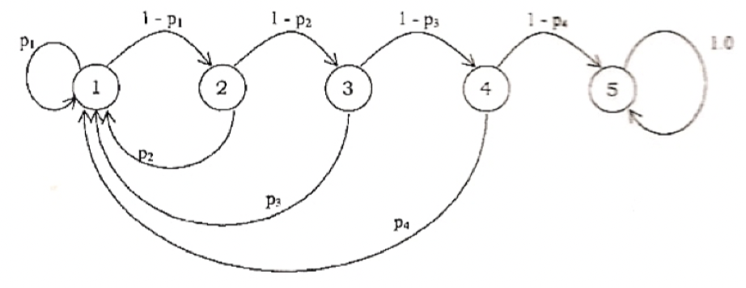

This model has some transition probabilities assigned.

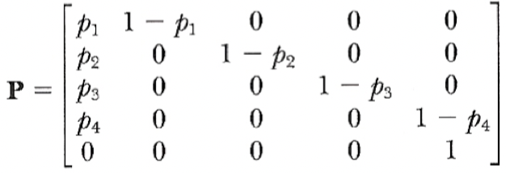

We see that state 1 is the most recent purchasers and then state 5 is the lost customers. Hence we see one can move from e.g., state 4 to 1.

> The Markov Chain is that there is a probability of moving upwards in the states (recency states) or they can move down in states. In the end there is a catch all sate, where we assume that you will stay the rest of the time, namely where you dont buy again.

**But what is the Hidden Markov Chain? (HMC)**

It is basically what it says, *it is hidden*. But what does the states then reflect? In the hidden markov chain the states reflect different buying patterns, hence you will try to estimate if a given person has changed his buying patterns and what that means for him.

*The difference to the Latent Trait Model (LTM)*: It is that previously we just had one row pr. person (or group with identical person) we are now having one row pr. customer pr. transaction.

To explain this, he applied a **case with COOP**, the data looked the following:

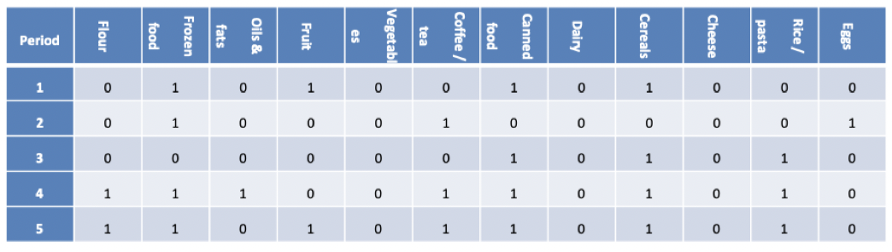

Characteristics of the study (hence also the HMC)

+ Assume that households may be in different states with different purchasing patterns, which is in general also the assumption for the HMC.
+ Across time a household is allowed to switch form one state to another, which is also the assumption for HMC.
+ Then the Markovian assumption, meaning that the latent state membership for a household in a given time period is assumed to only depend on the state membership in the previous time period. *Why* take a look at the chain above, and see that this is the only thing we need to know, to address which outcomes there may be.

**The procedure:**

1. They calculated the probability of a households buying products within given categories, see the following:

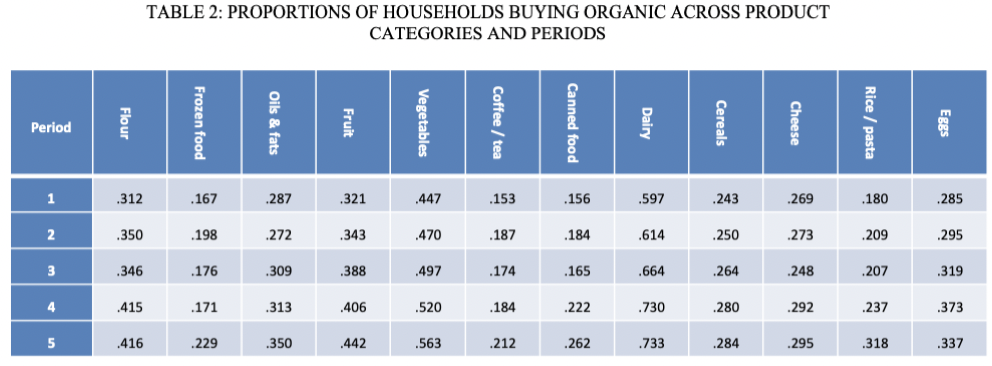

We see that for instance there is a tendency to buy more vegetables in the periods.

We can also show the **probability of buying an item in the different states**, see the following:

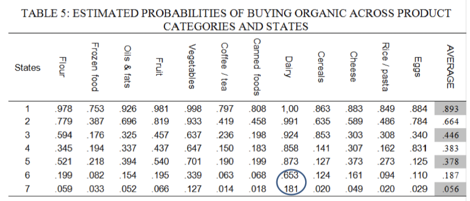

Hence we see that in the overall probability of buying something decrease as the state lowers. The same goes for each group.

Now we can also look at the transition probabilities. We see:

1. Big values omn the diagonal, indicating that there is a great probability of a person staying in the same state.
2. We see that the probability of moving from state 7 to state 6 is 18.6%, on the other hand if you are in state 6, there is a probability of going to state 7. In general, we see a very low probability of reaching state 7 (those buying the least).

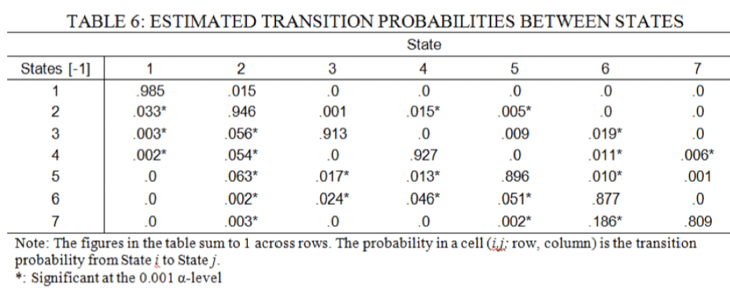

Then the question is, *what are we actually adopting, when moving from one state to another*.

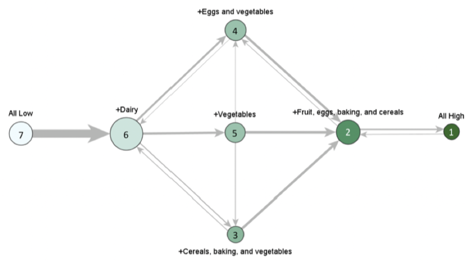

Hence we see that adding dairy indicating that a customer on an upwards journey. Then we can see that if a person starts adding vegetables he will end in state 5 and if he adds eggs and vegetables, he will end up ion state 4.

**What do we get out of this?**

In the example he showed one of the COOP private label milk, where they originally marketed a beer on one side of the beers, where they then added ecological eggs, as we see that this will manipulate the customer upwards in the states. This was a great results.

Hence again, it about knowing enough about the customer to know what to recommend them, and not just market some random product.