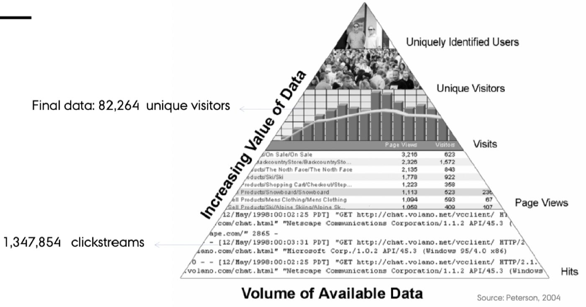

```{r, include = FALSE}
knitr::opts_chunk$set(eval = FALSE)
```

# Customer behavior

## Characteristics of cliskstream

We see that this can be organized in a pyramid.



We see that the more information we have about the actual user the more valuable is the clickstream data.

We saw an example with clickstreams from the google merchendise, here we information on the cookie, timestamps, eventID, sessionID, destination (the actual page they are visiting etc.). Naturally this must be organized so it can be used for analysis.

It the slidedeck there is a bunch of steps for preparing data, although I would argue that they are very case sensitive.

**Challenges with clickstreams:** 

1. One must choose the right period for evaluation, as we want to have as many full cycles as possible, hence if we start the survey at the 1 of january, then customers starting to visit the page in december will appear as new customers, while they are not. The same applies at the end of the period.

2. Customer use different devices for the same purposes, these are difficult to track.

3. Cookies expires after a certain time period.

4. If a user is having different windows open, it is difficult to know which page the user is actually on.

5. Many patterns in the data is due to how the website is constructed.

**Where do customers come from?**: one could investigate the following:

+ What type of device is used, PC, tableg, mobile etc.
+ What product category is visited.
+ What is the entry channel? advertising, direct access, social media etc.
+ Time of entry: At what time the person visit the page?

**How does the person behave on the webiste?**: it is important to know which panels the customer choose, where they go from a product page, from the front page, from the basket etc.

**Conversion rates**: We need to know the conversion rates of the customers.


## Applications with clickstream data

For modeling sequences of clicks: neural networks (NN) and Markov chains are two of the most common type of models. NN are black-box models best for prediction (not covered here). Markov models are transparent models that are used both for predicting and understanding customer behavior. In this application, I focus on the "clickstream" library to model the data with Markov chains models. From time to time I refer to other R packages that offer similar functionality.

**What is a (discrete state) Markov Chain?**

*(note: we can have Markov chains with discrete and continous states and in discrete and in continuous time).*

+ A Markov chain is a stochastic process *X* that takes state *m* from a finite set of states *M* at each time *n*. If the state in *n* only depends on the recent *k* states, we call *X* a Markov chain of order *k*. For example:

+ 0-order Markov chain = the probability to be in any of the *m* states in the next step is independent of the present state. Hence states are completely independent of each other.
+ 1st-order Markov chain = the probability to be in any of the *m* states in the next step is independent of the previous states given the present state (one-period memory) 
+ 2nd-order Markov chain = two-periods memory 
+ 3rd-order Markov chain = three-periods memory 
+ ...so on

Markov chains can be described by transition probability matrices => Each value in these matrices is a parameter Higher-order Markov chains have $(m−1)m^k$ model parameters => the number of lag parameters increases exponentially


__Markov Chain__

It is about sequences of events and we want to use markov chain to analyse the sequence of events, i.e. the clickstream. Hence what we want to get out of it, is the likelyhood of converting.

Recall in a Bayesian Network, that variables would only have influence in one direction and hence not create loops etc. So we see that for instance a sequence of events, you would only assess the adjacent click events.

With markov chain, we are able to make more relationships e.g., non adjacent events having influence of each other.

Recall that HJ showed a hidden markov chain where this is not a hidden markov chain.

**Why Markov Chain and not a Bayesian Network?**

We see that a person can be jumping among a set of pages, hence we can create cycles (where one person can start and end at the same page), this is not allowed in a bayesian network, hence we cannot apply this.

__How we select the Markov Chain order:__

+ Usually, a user considering a Product Page might either Add the product to the shopping cart,
+ view Product Reviews, follow a Product Recommendation, or Search for another product.
+ Moe (2003) proposes that the probability for a transition to either of the possible next states depends on the MODE (browsing, searching, or buying) the user is currently in.
+ This MODE (latent state) can be identified when considering the recent *k* states.

+ Model order selection is usually based on a criteria like AIC or BIC. The function `fitMarkovChain()` estimates the parameters of a Markov chain model of order k.


__How does R interpret the clickstreams?__

Clickstreams = collection of data sequences - with different sizes!

Notice that 

+ session = an individual, i.e., their user session.
+ P = page

An example:

+ Session 1: P1 P2 P1 P3 P4 Defer 
+ Session 2: P3 P4 P1 P3 Defer
+ Session 3: P5 P1 P6 P7 P6 P7 P8 P7 Buy
+ Session 4: P9 P2 P11 P12 P11 P13 P11 Buy
+ Session 5: P4 P6 P11 P6 P1 P3 Defer
+ Session 6: P3 P13 P12 P4 P12 P1 P4 P1 P3 Defer - *this is examplified in the DAG*
+ Session 7: P10 P5 P10 P8 P8 P5 P1 P7 Buy
+ Session 8: P9 P2 P1 P9 P3 P1 Defer
+ Session 9: P5 P8 P5 P7 P4 P1 P6 P4 Defer

There are 13 possible product pages and two **absorbing** stages, that are stages you can end up in.

Hence we see that a clickstream is a sequence of events. This can naturally be shown as a vector in R and we can apply the function `readClickstreams()`, the input must be a commaseperated file.

The following is an example where we start in P3, then go to p13, P12, P4, P12, P1, P4, P1 back to P3 and then leave. The graph may be a biiit difficult to follow, but following the path (directions) one will end up in defer.

*Notice that we did not do this during the class, although I did it for fun.*

```{r,fig.cap="We see that we start on P3 and then we follow the path we will end up in defer"}
library(ggdag)

#Generating the relationships
dag <- dagitty::dagitty("dag {
    P3 -> P13 -> P12 -> P4 -> P12 -> P1 -> P4 -> P1 -> P3 -> Defer
  }"
)

tidy_dag <- tidy_dagitty(dag)

#Adding information on the color
starting_page <- "P3"
tidy_dag$data <- dplyr::mutate(tidy_dag$data,
                               colour = ifelse(tidy_dag$data$name == starting_page
                                               ,"Starting page", "Visited page"))

#Making the plot
tidy_dag %>%
  ggplot(aes(
    x = x,
    y = y,
    xend = xend,
    yend = yend
  )) +
  geom_dag_point(aes(colour = colour)) +
  geom_dag_edges() +
  geom_dag_text() +
  theme_dag()
```


### A motivating example

```{r,results='hold'}
library(clickstream)
cls <- readClickstreams(file = "Data/Customer behavior/sample.csv"
                        , sep = ","
                        , header = TRUE) 
cls #Shows sessions
summary(cls) #Summary stats
# writeClickstreams(cls, "sample.csv", header = TRUE, sep = ",")
```

We see the frequencies of each page, where it is clear that P1 is most visited, hence might also be the front page.

Now we can **fit** the model and s

```{r,results='hold'}
options(scipen = 999,digits = 2)
order <- 2
mc <- fitMarkovChain(clickstreamList = cls,order = order #= two-periods memory, i.e. 2 lags
                     ,control = list(optimizer = "quadratic")) 
mc
```

The otucome:

+ the two transition probabilities matrices for the two lags
+ start probabilities for the states the corresponding clickstreams started 
+ end probabilities for the states the corresponding clickstreams ended

We see that with lag = 1, ther is only conversion (buying probability) from P11 and P7, although looking one further step back, we see more pages may also lead to a purchase. I guess P11 and P7 have something to do with a basket or a checkout.

Then we can also see the different probabilities of moving from one page to another.

Lastly we can see the different start probabilities, that is the probability of a person starting on a given page. Also we can see the end probabilities, that being posterior probabilities of buying or not.

Lets now compute the summary of the fitted model and plot the transition probabilities.

```{r,results='hold'}
summary(mc)
plot(mc, order = order)
```

We see that `fitMarkovChain()` computes the log-likelihood, hence we can calculate AIC and BIC.

Here we see the flow of typical flow

#### i)  Predict either the next click or the final click (state) of a customer.

Now we can use it to make a prediction. *If a customer starts with the clickstream P9 P2, what will do next?*

```{r,results='hold'}
#Pattern to evaluate
pattern <- new("Pattern", sequence = c("P9", "P2"))

#using predict
resultPattern <- predict(mc
                         , startPattern = pattern
                         , dist = 1 #How far we want to predict, when he has clicked p9 and p2
                         )
resultPattern #the user will most likely click on P1 next
```

There is a 66% chance of clicking P1.

Now we make another prediction where a person has viewed page 9 and 2, with the following:

1. Predict 2 steps into the future. 
2. Here we want the likelyhood of purchase

```{r,results='hold'}
pattern <- new("Pattern"
               ,sequence = c("P9", "P2") #A sequence for the session
               ,absorbingProbabilities = data.frame(Buy = 0.333, Defer = 0.667) #provide probs for buying
               )
resultPattern <- predict(mc, startPattern = pattern, dist = 2)
resultPattern
```

The person visit products P1 and then P3, although this pattern only has a 26% probability. Purchasing probability is 5.83% after 2 further clicks, and the person is most likely to defer the purchase.

Online stores often have evidence on how many of the visitors convert to a buyer (this info is typically used to formulate initial absorbing probabilities for all users). But, particularly for customers who log on to their account, the online stores can also know how many times a particular user has been only visiting the online store and how often she has bought a product, This information can be used to formulate initial absorbing probabilities for a user. 

If for example a user has been logged in and finally bought a product in 50% of her log-ins, we can compute absorbing probabilities (posterior) for a stream of clicks:
  
Now imagine that the probability of buying and defering is 50/50.

```{r,results='hold'}
absorbingProbabilities <- c(0.5, 0.5)
sequence <- c("P9", "P2")
for (s in sequence) {
     absorbingProbabilities <- absorbingProbabilities * 
       data.matrix(subset(mc@absorbingProbabilities, state == s,
                          select = c("Buy", "Defer")))
     }
absorbingProbabilities <- absorbingProbabilities /sum(absorbingProbabilities)
absorbingProbabilities
```

22.62% to finally buy a product after she has visited products P9 and P2.

Although we see that it is cumbersome to just hardcode the patterns and the absorbing rates, because the customer journey is not homogenious for all customers.

Therefore, we can define cluster and generalize on the clusters instead of on all customers. That is done in the following section

#### ii) Clustering and generalizing upon clickstreams

An alternative before running the model is to identify segments of customers by clustering clickstreams and afterwards building a model for each cluster (Huang, Ng, Ching, Ng, and Cheung, 2001, k-means alg. and Euclidean distance) 

```{r,results='hold'}
set.seed(12345)
clusters <- clusterClickstreams(clickstreamList = cls, order = 1,centers = 3)
clusters
```

We see that this creates three clusters. Notice that this is a list element, hence we could also look them up individually.

Now we can fit a Markov Chain each of the clusters

```{r,results='hold'}
mc_clu1 <- fitMarkovChain(clickstreamList = clusters$clusters[[1]], order = 2,control = list(optimizer = "quadratic"))
mc_clu1

mc_clu2 <- fitMarkovChain(clickstreamList = clusters$clusters[[2]], order = 2,control = list(optimizer = "quadratic"))
#mc_clu2
mc_clu3 <- fitMarkovChain(clickstreamList = clusters$clusters[[3]], order = 2,control = list(optimizer = "quadratic"))
#mc_clu3
# or write these objects to file with writeClickstreams().
```

We see that this construct the same output as we have previously seen, when just analyzing one session.

### Second exercise (clickstream) more extensive

(2) Full example with simulated data:

- clickstreams for 100,000 user sessions 
- clicks are either 1 of 7 products or on one of the two final states "Buy" and "Defer".

```{r,results='hold'}
set.seed(123)
cls <- randomClickstreams(states = c("P1", "P2", "P3", "P4", "P5", "P6", "P7", "Defer", "Buy"),
                          startProbabilities = c(0.2, 0.25, 0.1, 0.15, 0.1, 0.1, 0.1, 0, 0),
                          transitionMatrix = matrix(c(0.01, 0.09, 0.05, 0.21, 0.12, 0.17, 0.11, 0.2, 0.04,
                                                      0.1, 0, 0.29, 0.06, 0.11, 0.13, 0.21, 0.1, 0,
                                                      0.07, 0.16, 0.03, 0.25, 0.23, 0.08, 0.03, 0.12, 0.03,
                                                      0.16, 0.14, 0.07, 0, 0.05, 0.22, 0.19, 0.1, 0.07,
                                                      0.24, 0.27, 0.17, 0.13, 0, 0.03, 0.09, 0.06, 0.01,
                                                      0.11, 0.18, 0.04, 0.15, 0.26, 0, 0.1, 0.11, 0.05,
                                                      0.21, 0.07, 0.08, 0.2, 0.14, 0.18, 0.02, 0.08, 0.02,
                                                      0, 0, 0, 0, 0, 0, 0, 0, 0,
                                                      0, 0, 0, 0, 0, 0, 0, 0, 0), nrow = 9),
                          meanLength = 50, n = 100000)

summary(cls)
```

Here we want to select the right orders. Here we test all the models in order 1 to 5 and then we evaluate BIC for each.

```{r,results='hold'}
maxOrder <- 5 #Max no. of previous steps to evaluate
result <- data.frame()
for (k in 1:maxOrder) {
  mc <- fitMarkovChain(clickstreamList = cls, order = k)
  result <- rbind(result, c(k, summary(mc)$aic, summary(mc)$bic))
}
names(result) <- c("Order", "AIC", "BIC")
result
```

We see that order 2 has the BIC closest to 0, hence we go for order 2.

Now we can fit the model with order of 2.

```{r,results='hold'}
mc <- fitMarkovChain(clickstreamList = cls, order = 2,control = list(optimizer = "quadratic")) 
mc
```

We see:

1. Transition probabilities between different pages and outcomes both at lag 1 and lag 2 (that is two steps back)
2. Start probabilities: there is the highest chance of starting on page 2.
3. End probabilities: We see the probabilities of ending on different pages or in the absorbing stages, buying or deferring.

Now we can start making predictions.

We see that for a customer visits product 3 and 4

```{r,results='hold'}
pattern <- new("Pattern", sequence = c("P3", "P4") #If a person visit P3 and then P4
               , absorbingProbabilities = data.frame(Buy = 0.22 #mc@end["Buy"] 
                                                     , Defer = 0.78 #mc@end["Defer"]
                                                     )
               )
resultPattern <- predict(mc, startPattern = pattern, dist = 1) #Pred one step ahead
resultPattern
```

We see that there is a 15% chance of visiting page 1, and 7% chance of buying.

Now we do some **clustering.** Hence, we predict for clusters instead of depicted clickstreams.

```{r,results='hold'}
library(doParallel)
CoreCount  <- makePSOCKcluster(detectCores()-1)
registerDoParallel(CoreCount)

clusters_sim <- clusterClickstreams(clickstreamList = cls, order = 1, centers = 3)  # takes 5-10 min. to converge

stopCluster(CoreCount)
registerDoSEQ()
```

Now we could look at each cluster, I choose not to. It is basically what we have seen before with the transition probabilities, start and end probabilities.

```{r,results='hold',eval=FALSE}
summary(clusters_sim$clusters[[1]]) 
summary(clusters_sim$clusters[[2]]) 
summary(clusters_sim$clusters[[3]])
```

Now we can loop through the the no. of steps to use for prediction. The following is merely for cluster 1.

```{r,results='hold'}
# mc for clu 1 
maxOrder <- 5 
result <- data.frame()
for (k in 1:maxOrder) {
  mc <- fitMarkovChain(clickstreamList = clusters_sim$clusters[[1]], order = k)
  result <- rbind(result, c(k, summary(mc)$aic, summary(mc)$bic))
}
names(result) <- c("Order", "AIC", "BIC")
result
```

We see that the best model is an order one, as BIC is closest to 0.

```{r,results='hold'}
mc_clu1 <- fitMarkovChain(clickstreamList = clusters_sim$clusters[[1]], order = 1) 
summary(mc_clu1)
```

We see that there are states and also includes absorbing states. Based on this model we can also make predictions

```{r,results='hold'}
pattern <- new("Pattern", sequence = c("P1", "P4", "P6")
               ,absorbingProbabilities = data.frame(Buy = 0.22, Defer = 0.78))
resultPattern <- predict(mc_clu1, startPattern = pattern, dist = 1)
resultPattern
```

Hence a person that cluster of clickstreams will have a 7.7% chance of buying something.


### A concrete eaxmple with real data

The following sections include four different options.

1. Applying the Markov Chain model.
2. Modeling click streams with higher-order. This is basically what we saw in the latent trait model, where we just needed to know the maturity to estimate how likely a person is to have other financial services.
3. Use frequencies of events instead of sequences.
4. Use neural networks, either with sequence data or not.

#### (1) Markov Chain

Example with real data (A Danish company provided us with a file of clickstream data on their e-commerce customers).

```{r,results='hold'}
mydata  <- readClickstreams(file = "Data/Customer behavior/StepsDesktop.csv", sep=",",header = T)
summary(mydata)
```

We see that there are 37k observations and then we can see the frequencies of the different events.

Now we are going to analyze which order to apply.

```{r,results='hold'}
maxOrder <- 3 #One could also use 5 for instance
result <- data.frame()
for (k in 1:maxOrder) {
  mc <- fitMarkovChain(clickstreamList = mydata, order = k)
  result <- rbind(result, c(k, summary(mc)$aic, summary(mc)$bic))
}
names(result) <- c("Order", "AIC", "BIC")
result
```

We see that order of 1, i.e., looking one step back in time is the most appropriate.

```{r,results='hold'}
mc <- fitMarkovChain(clickstreamList = mydata, order = 1,control = list(optimizer = "quadratic")) 
mc
```

Since we have names on the rows and columns, it is a bit more confusion to read. Although the principle is the same as we have seen previously.

Notice that we are not having any absorbing states.

Lets predict what happens one step ahead given the different pages are visited.

```{r,results='hold'}
pattern <- new("Pattern", sequence = c("DeliveryPage"))
resultPattern <- predict(mc, startPattern = pattern, dist = 1)
resultPattern

# pattern <- new("Pattern", sequence = c("AddCartPage"))
# resultPattern <- predict(mc, startPattern = pattern, dist = 1)
# resultPattern
# 
# pattern <- new("Pattern", sequence = c("AddCartPage", "CartPage"))
# resultPattern <- predict(mc, startPattern = pattern, dist = 1)
# resultPattern
# 
# pattern <- new("Pattern", sequence = c("DeliveryPage"))
# resultPattern <- predict(mc, startPattern = pattern, dist = 1)
# resultPattern
```

We see that when you have visited the delivery page, then there is a 20% probability that you will go to the channel direct access, whatever that is.

Now we can cluster the different click streams and make predictions based on these.

```{r,results='hold'}
# Clustering first 
library(doParallel)
CoreCount  <- makePSOCKcluster(detectCores()-1)
registerDoParallel(CoreCount)

clusters_ex <- clusterClickstreams(clickstreamList = mydata, order = 1, centers = 3)  # takes 5-10 min. to converge

stopCluster(CoreCount)
registerDoSEQ()

summary(clusters_ex$clusters[[1]]) # clu 1
```

We see that the first cluster contain approx. 3.100 observations out of the 37.644 observations.

**Lets find optimal order based on AIC and BIC**

```{r,results='hold'}
maxOrder <- 2
result <- data.frame()
for (k in 1:maxOrder) {
  mc <- fitMarkovChain(clickstreamList = clusters_ex$clusters[[1]], order = k)
  result <- rbind(result, c(k, summary(mc)$aic, summary(mc)$bic))
}
names(result) <- c("Order", "AIC", "BIC")
result #Lag = 1 is the best.
```

Now we can do the same for the other clusters. Notice that I have commented out the prints, in general we just see that a lag of 1 is the most approapriate.

```{r,results='hold',eval=FALSE,include=TRUE}
#summary(clusters_ex$clusters[[2]]) # clu 2
# mc for clu 2 
maxOrder <- 5 
result <- data.frame()
for (k in 1:maxOrder) {
  mc <- fitMarkovChain(clickstreamList = clusters_ex$clusters[[2]], order = k)
  result <- rbind(result, c(k, summary(mc)$aic, summary(mc)$bic))
}
names(result) <- c("Order", "AIC", "BIC")
#result

#summary(clusters_ex$clusters[[3]]) # clu 3
# mc for clu 3
maxOrder <- 5 
result <- data.frame()
for (k in 1:maxOrder) {
  mc <- fitMarkovChain(clickstreamList = clusters_ex$clusters[[3]], order = k)
  result <- rbind(result, c(k, summary(mc)$aic, summary(mc)$bic))
}
names(result) <- c("Order", "AIC", "BIC")
#result
```

Result = lag of 1 is the most appropriate.

```{r,results='hold'}
mc_clu1 <- fitMarkovChain(clickstreamList = clusters_ex$clusters[[1]], order = 1) 
summary(mc_clu1)
mc_clu2 <- fitMarkovChain(clickstreamList = clusters_ex$clusters[[2]], order = 1) 
mc_clu3 <- fitMarkovChain(clickstreamList = clusters_ex$clusters[[3]], order = 1)
```

Plot some graphical representations. Although we see that there are so many outcomes making it difficult to interpret.

```{r,results='hold'}
par(mfrow = c(1,1)) #SEE IF THIS WORKS TO COLLECT THE PLOTS.
plot(mc_clu1, order = 1)
#plot(mc_clu2, order = 1)
#plot(mc_clu3, order = 1)
```

The following is another way of representing the same.

```{r,results='hold'}
# model graphical representation (ii)
par(mfrow=c(1,3))
par(mar=c(1, 1, 4, 0))
set.seed(11)
plot(mc_clu1, order = 1, digits = 1, minProbability = 0.40,
     vertex.color=0,
     vertex.frame.color=0,
     vertex.shape="none",
     vertex.size=8, 
     vertex.size2=3,
     vertex.label.dist=0.4, 
     vertex.color="transparent",
     vertex.label.font=2,
     vertex.label.cex=0.95, 
     vertex.label.degree=1,
     vertex.label.color="black",
     edge.arrow.size=0.2,
     edge.label.cex = 0.9, 
     edge.curved=0,
     edge.label.font=4,
     margin=c(0,0,0,0.15),
     main ="Cluster 1")

set.seed(11)
plot(mc_clu2, order = 1, digits = 1, minProbability = 0.40,
     vertex.color=0,
     vertex.frame.color=0,
     vertex.shape="none",
     vertex.size=8, 
     vertex.size2=3,
     vertex.label.dist=0.4, 
     vertex.color="transparent",
     vertex.label.font=2,
     vertex.label.cex=0.95, 
     vertex.label.degree=1,
     vertex.label.color="black",
     edge.arrow.size=0.2,
     edge.label.cex = 0.9, 
     edge.curved=0,
     edge.label.font=4,
     margin=c(0,0,0,0.15),
     main ="Cluster 2")

set.seed(11)
plot(mc_clu3, order = 1, digits = 1, minProbability = 0.40,
     vertex.color=0,
     vertex.frame.color=0,
     vertex.shape="none",
     vertex.size=8, 
     vertex.size2=3,
     vertex.label.dist=0.4, 
     vertex.color="transparent",
     vertex.label.font=2,
     vertex.label.cex=0.95, 
     vertex.label.degree=1,
     vertex.label.color="black",
     edge.arrow.size=0.2,
     edge.label.cex = 0.9, 
     edge.curved=0,
     edge.label.font=4,
     margin=c(0,0,0,0.15),
     main ="Cluster 3")
```

Characterizing the clusters. Who are the customers underlying the three patterns of movement within the website?

+ cl.2 and cl.3 search a lot through Category page;
+ cl.1 search more through Product page;
+ cl.1 and cl.3 search more varied (use more channels than cl.2)
+ cl.3 are more likely to enter through DirectAccess -> Front page pattern than the other two clusterss.

In this application the product page was generalized. However, if a more fine-grained clicktream data were available by product brand it will allow the manager to take informed decisions about the preferences of each cluster.

Now we can **predict** the next step for each cluster. Notice that the sequence for each prediction is the same.

```{r,results='hold'}
# predicting the next steps
pattern <- new("Pattern", sequence = c("AddCartPage", "CartPage"))
resultPattern <- predict(mc_clu1, startPattern = pattern, dist = 1)
resultPattern

pattern <- new("Pattern", sequence = c("AddCartPage", "CartPage"))
resultPattern <- predict(mc_clu2, startPattern = pattern, dist = 1)
resultPattern

pattern <- new("Pattern", sequence = c("AddCartPage", "CartPage"))
resultPattern <- predict(mc_clu3, startPattern = pattern, dist = 1)
resultPattern
```

We see the following:

+ Cluster 1 has 25% probability of going to conversion
+ Cluster 2 has 32% probability of going to the product page
+ Cluster 3 has 22% probability of going to the product page

#### (2) Using association rule mining

Here we loose the sequence of events, but we use association rules. So like the maturity example we had with Hans, where if you have been at product 2 then you assume he has seen product 1.

That might not always be true. Hence we don't see how many times a customer has visited a product, as it is just looking at whether we visited a product or not.

*Summary if the method:* we are going to apply arules to visualize association rules. Also we are going to calculate minsupport using the apropri algorithm.

Notice that we are going to apply three clusters again.

```{r,results='hold'}
library("arules")
library("arulesSequences")

# looking by clustered data
trans_clu1 <- as.transactions(clusters$clusters[[1]]) 
sequences_clu1 <- as(apriori(trans_clu1, parameter = list(support = 0.50)), "data.frame") 
sequences_clu1 %>% head()
# subrules <- subset(sequences_clu1, support>0.05)
```

We see the different rules in the rows above. The following runs the same for the other clusters.

```{r,results='hide'}
trans_clu2<- as.transactions(clusters$clusters[[2]]) 
sequences_clu2 <- as(apriori(trans_clu2, parameter = list(support = 0.50)), "data.frame")
#sequences_clu2

trans_clu3<- as.transactions(clusters$clusters[[3]]) 
sequences_clu3 <- as(apriori(trans_clu3, parameter = list(support = 0.50)), "data.frame")
#sequences_clu3
```

The corresponding output shows that pattern sequences are supported by at least 50% of the clickstreams in each cluster. cluster 1 of clickstream is the most heterogeneeous. The most common pattern `{ChannelAd} => {ProductPage}` has support in 41% of the clicks in clu1. This patterns reflects that this customers are most likely acquired through re-targeting.

**Visualizing**

```{r,results='hold',eval=FALSE}
library("arulesViz")
sequences_clu1 <- apriori(trans_clu1, parameter = list(support = 0.40))
ruleExplorer(sequences_clu1)
sequences_clu2 <- apriori(trans_clu2, parameter = list(support = 0.50))
ruleExplorer(sequences_clu2)
sequences_clu3 <- apriori(trans_clu3, parameter = list(support = 0.50))
ruleExplorer(sequences_clu3)
# this approach is also useful for discovering product/brands that are seen together
```

#### (3) Use frequencies instead of the sequence

If we dont want to work with sequences, we just look at frequencies. This has the advantage as many machine learning methods now can be applied, for instance a random forest. Although we do completely miss out on the sequence.

```{r,results='hold'}
frequencyDF <- frequencies(mydata)
frequencyDF
```

Here we just get a table showing each IDs for visitors and then you just get to see how many times the given person has visited the page.

#### (4) Neural networks

This is just using Neural Networks

```{r,results='hold'}
# (6) A fourth option is to use Neural Networks (recurrent or not) with sequences 
  # of clickstream data purely for prediction purposes.
```

### Optional exercise

```{r,results='hold',eval=FALSE}
# (6) Optional
  # Consider another real-life data set from Cadez, I., Heckerman, D., Meek, C., 
  # Smyth, P., White, S. (2003) Model-based clustering and visualization 
  # of navigation patterns on a web site, Data Mining and Knowledge Discovery, 399-424.
  # The dataset msnbc323 (Melnykov 2016a) is available 
  # in data("msnbc323", package = "ClickClust"). 
  # There are 323 clickstream sequences that involve 17 different states:
  
  # (1) frontpage, (2) news, 
  # (3) tech, (4) local, 
  # (5) opinion, (6) on-air,
  # (7) miscellaneous, (8) weather, 
  # (9) msn-news, (10) health-on-air, 
  # (11) living, (12) business, 
  # (13) msn-sports, (14) sports, 
  # (15) summary-news, (16) bbs, 
  # and (17) travel. 
  
  # The length of sequences varies from 35 to 362. 
  # There are 289 possible transitions among the 17 states. 
  
  library(ClickClust)
  data("msnbc323", package = "ClickClust")
  summary(msnbc323)
  clusters <- clusterClickstreams(clickstreamList = msnbc323, order = 1, centers = 3)  # takes 5-10 min. to converge
 
  
  # mc for clu 1 
  maxOrder <- 5 
  result <- data.frame()
  for (k in 1:maxOrder) {
    mc <- fitMarkovChain(clickstreamList = clusters$clusters[[1]], order = k)
    result <- rbind(result, c(k, summary(mc)$aic, summary(mc)$bic))
  }
  names(result) <- c("Order", "AIC", "BIC")
  result
  #1
  
  # mc for clu 2 
  maxOrder <- 5 
  result <- data.frame()
  for (k in 1:maxOrder) {
    mc <- fitMarkovChain(clickstreamList = clusters$clusters[[2]], order = k)
    result <- rbind(result, c(k, summary(mc)$aic, summary(mc)$bic))
  }
  names(result) <- c("Order", "AIC", "BIC")
  result
  #1
  
  
  # mc for clu 3
  maxOrder <- 5 
  result <- data.frame()
  for (k in 1:maxOrder) {
    mc <- fitMarkovChain(clickstreamList = clusters$clusters[[3]], order = k)
    result <- rbind(result, c(k, summary(mc)$aic, summary(mc)$bic))
  }
  names(result) <- c("Order", "AIC", "BIC")
  result
  #1
  
  mc_clu1 <- fitMarkovChain(clickstreamList = clusters$clusters[[1]], order = 1) 
  summary(mc_clu1)
  mc_clu2 <- fitMarkovChain(clickstreamList = clusters$clusters[[2]], order = 1) 
  summary(mc_clu2)
  mc_clu3 <- fitMarkovChain(clickstreamList = clusters$clusters[[3]], order = 1) 
  summary(mc_clu3)
  
  
  # graphically
  par(mfrow=c(1,3))
  par(mar=c(1, 1, 4, 0))
  set.seed(11)
  plot(mc_clu1, order = 1, digits = 1, minProbability = 0.40,
       vertex.color=0,
       vertex.frame.color=0,
       vertex.shape="none",
       vertex.size=8, 
       vertex.size2=3,
       vertex.label.dist=0.4, 
       vertex.color="transparent",
       vertex.label.font=2,
       vertex.label.cex=0.95, 
       vertex.label.degree=1,
       vertex.label.color="black",
       edge.arrow.size=0.2,
       edge.label.cex = 0.9, 
       edge.curved=0,
       edge.label.font=4,
       margin=c(0,0,0,0.15),
       main ="Cluster 1")
  
  
  set.seed(11)
  plot(mc_clu2, order = 1, digits = 1, minProbability = 0.40,
       vertex.color=0,
       vertex.frame.color=0,
       vertex.shape="none",
       vertex.size=8, 
       vertex.size2=3,
       vertex.label.dist=0.4, 
       vertex.color="transparent",
       vertex.label.font=2,
       vertex.label.cex=0.95, 
       vertex.label.degree=1,
       vertex.label.color="black",
       edge.arrow.size=0.2,
       edge.label.cex = 0.9, 
       edge.curved=0,
       edge.label.font=4,
       margin=c(0,0,0,0.15),
       main ="Cluster 2")
  
  
  set.seed(11)
  plot(mc_clu3, order = 1, digits = 1, minProbability = 0.40,
       vertex.color=0,
       vertex.frame.color=0,
       vertex.shape="none",
       vertex.size=8, 
       vertex.size2=3,
       vertex.label.dist=0.4, 
       vertex.color="transparent",
       vertex.label.font=2,
       vertex.label.cex=0.95, 
       vertex.label.degree=1,
       vertex.label.color="black",
       edge.arrow.size=0.2,
       edge.label.cex = 0.9, 
       edge.curved=0,
       edge.label.font=4,
       margin=c(0,0,0,0.15),
       main ="Cluster 3")
  
  # interpret: 
  
  # Cluster 2 is entirely driven by transitions within the same categories
  # Thus, this group represents people who make the majority of transitions within their 
  # preferred category and do not change categories frequently.
  
  # Cluster 1 The second cluster is characterized by higher probabilities of transitions 
  # front page–news, news–news, msn-news, and summary–news. 
  # The transition front page–news reflects the common pattern for the users starting with 
  # the category front page to proceed directly to the category news. 
  # Once the reader gets to the category news, he or she typically stays within it or proceeds 
  # to summary.Thus, the second cluster consists of people mostly concerned with news. 
  
  # Cluster 3 is characterized by transitions travel-health-on-air, travel-frontpage, 
  # consisting of the people concerned about travelling issues.
  
  # The analysis of this dataset illustrates how click-plots can 
  # be used and interpreted to discover interesting navigation patterns common for 
  # observations within detected clusters.
```


## AB Testing

Basically this is experimenting with for instance a website. For instance changing the location of the basket. The ultimate goal is to be able to find out what works on a website, and what does not.

The lecture had the following outline:

1. What is A/B testing?
2. When is the organization ready to use A/B test and why should you use A/B test?
3. How to perform an A/B test?
4. Pitfalls and challenges.
5. A/B tests and bandits.

### (1 + 2): What is it and when to apply it

Basically you just funnel some visitors into one website layout and the other to another.

Then one of the groups is a control group and the other, the treatment group. Then you want to assess if the treatment group is actually buying more stuff. To evaluate this, one can apply statistical tests.

You want to apply it if you have operate in different countries, as the one culture may prefer one layout over another. Hence you want to collect that information.

Hence instead of just making something that looks good, you want to make something that also works.

### (3): How to perform an A/B test

The is two steps:

1. Agree on what you want to optimize, e.g., basket size, conversion rates, amount of visitors, the time a person is on the website etc. Then you must select an appropriate metric for this. This must be distributed throughout the organization. This is also known as the **Overall Evaluation Criterion (OEC).**
2. Report many other metrics and diagnostics to support the OEC.

Now you must find out:

+ What sample size do you need? The more variance that that a metric contains, the more samples do you also need.
+ How long will you be experimenting. Often it goes over one or two weeks

**Making statistical test of different means**

We want to find n

```{r}
avg_rev_pr_user <- 3.75 #I.e. the control
change_rev <- 0.05
delta <- change_rev * avg_rev_pr_user
a <- 0.05
beta <- 0.2
power <- 1-beta #Statistical power we want to achieve
sigma <- 30

z1 <- abs(qnorm(a/2)) #Because it is double sided
z2 <- abs(qnorm(power))

2*((z1 + z2)^2*sigma^2)/(delta^2)
```

We see that we need 401.863 observations.

**An R example**

```{r}
library(pwr)
mde <- 0.1 #minimum detectable effect
cr_a <- 0.25 #The expected conversion rate for group A (the control group)
alpha <- 0.05 #The false positive rate - significance level
power <- 0.8 #Statistical power

ptpt <- pwr.2p.test(h = ES.h(p1 = cr_a,p2 = (1+mde)*cr_a)
                    ,sig.level = alpha
                    ,power = power)
n_obs <- ceiling(ptpt$n)
n_obs #Required pairs of observations (1 pair = 1 control + 1 treatment)
```

We see that we need 4.860 observations, that is for both the control and the treatment.


### (4): Pitfalls and challenges.

**Rampup**

He talks about slowly scaling up the treatment group to find bugs. Then you should start small and monitor the visitors that enter the website.

**Common problems**

+ Looking at too many metrics - the more measures you look at, the greater is the cahnce of observing random fluctuations.
+ One must be aware of robots, we do not want to count these as a visitor.
+ Many managers don't let the tests run their course
+ Not keeping it simple. Too many changes on the website will make the conclusions vague, because you don't know what worked and what no.
+ You must be aware of the sorroundings, like what dates are your comparing, different timezone? timeperiods? What browser? What device is used?

To deal with the latter, one could make clusters, for instance we only want to make the test on phone or tablet visitors.


### (5): A/B tests and bandits.

We have to terms that must be clarified first:

1. **Exploration**: That is where you are actually making the A/B testing, hence collecting all of your data. Running the test may not cost money, although if one landing page is better than the other, then you might be loosing revenue, hence it is costly in that way, or at least an opportunity cost.
2. **Exploitation**: We see that what we find from the exploration we can start using and that is basically the exploitation. This is also called the bandit approach, as when we collect information we start using it to minimize the opportunity cost. This bandit approach has the following advnatages:
  1. Earn while you learn
  2. Automation of selection proces, he presented an example, where the algorithm could automatically select which add to show, based on the given information.
  3. Introducing randomness: we give the bandit the ability to explore new information, so it does not only end up confirming itself, as one ad would be used 99% of the time, as it previously has been the best.

To run the exploitations, we can apply two different algorithms:

1. Epsilon Greedy Policy
2. Thompson Sampling Policy


**Simulations - example in R**

In the following we are going simulate the same example with two different types of simulators:

1. Epsilon Greedy Policy
2. Thompson Sampling Policy

**Epsilon Greedy**

An epsilon-greedy policy is a randomized policy that mixes exploitation with a predetermined amount of exploration. For any epsilon $\epsilon$ $\in$ (in) [0,1] (meaning epsilons between 0 and 1), the policy randomly allocates $\epsilon$ of the observations allocated uniformly across the K ads, and allocates 1 - $\epsilon$ of observations to the ad with the largest observed mean.

```{r}
library(contextual)
horizon <- 1000 #1000 timesteps
simulations <- 1000
#It means that simulator runs 1.000 simulations for each of the 1000 time steps

# Epsilon greedy horizon <- 1000 simulations <- 1000
conversionProbabilities <- c(0.05,0.10,0.15,0.20,0.25)
bandit <- BasicBernoulliBandit$new(weights = conversionProbabilities)
policy <- EpsilonGreedyPolicy$new(epsilon = 0.10)
agent <- Agent$new(policy = policy,bandit = bandit)
historyEG <- Simulator$new(agents = agent,horizon = horizon,simulations = simulations)$run()
plot(historyEG,type = "arms",legend_labels = c("Ad 1","Ad 2","Ad 3","Ad 4","Ad 5")
     ,legend_title = "Epsilon Greedy",legend_position = "topright",smooth = TRUE)
```

We see that we feed the simulator information about the conversion probabilities for the given adds. Then we run 1000 simulations, and we see that there is a tendency towards selecting add 5, naturally because this has the highest conversion probabilities. If we for instance was to set add 5 conversion probability to 0.025 instead of 0.25, then we would see that add 4 would start dominate the add choices.

```{r}
summary(historyEG)
```

we see that we had a reward of 21.81%, which is naturally lower than if we just used ad 5, which had a conversion of 25%. The variance is 71% and the standard deviation 2.66%

**Thompson Sampling Alogorithm**

Here we see the add to be presented is based upon probabilities. These are found by using beta distributions (recall the CLV lecture, where with alpha and beta we can basically make all kinds of beta distributions). 

The following makes a Thompson sampling

```{r}
#Thompson scaling
conversionProbabilities <- c(0.05,0.10,0.15,0.20,0.25)
bandit <- BasicBernoulliBandit$new(weights = conversionProbabilities)
policy <- ThompsonSamplingPolicy$new(alpha = 1,beta = 1)
agent <- Agent$new(policy,bandit)
historyThompson <- Simulator$new(agent,horizon,simulations)$run()
plot(historyThompson,type = "arms",legend_labels = c("Ad 1","Ad 2","Ad 3","Ad 4","Ad 5")
     ,legend_title = "Thompson Sampling",legend_position = "topright",smooth = TRUE)
```

Here we practically see the same result. Although as he mentions, the Thompson sampling is better at exploiting the high probability adds, thus we see that it uses add 5 more often than the epsilon greedy function.


```{r}
summary(historyThompson)
```

We see that the reward (conversion) is 21.99% hence slightly higher, while the variance is 32.83% variance and 1.81% standard deviation.

***Comparison between Greedy Search and Thompson Sampling***

We see that the Thompson sampling is having slightly better conversion rates, that is because it quicker picks up on ad 5 which is the most successful. Also we see that the variance and standard deviation is half the size of the Epsilon Greedy.
