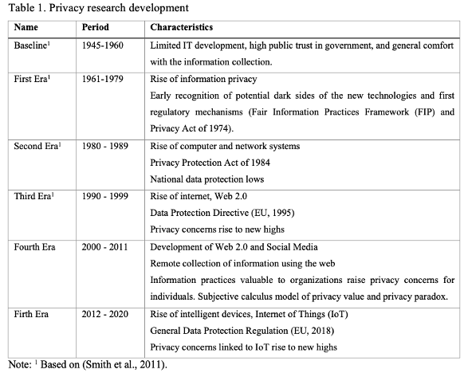
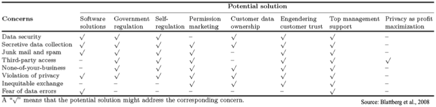
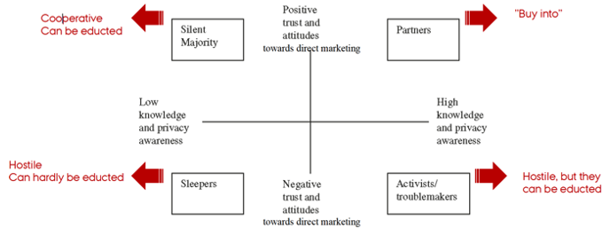

# Privacy

We have different eras of privacy research,

We see that we have 8 different data concerns:

1. Data security: Customers fearing what happens with their data and how might get access to your data, e.g., from hacking.
2. Secretive data collection: That governments and companies are secretaely storing information about you.
3. Junk mail and spam: Some customers fear that entering personal information at webpages leads to all kinds of junk and spam mail.
4. Third-party access: That companies are leaking data third parties.
5. None of your business: This is about peopling feeling ownership of information and companies are not obliged to know, e.g., what books, movies etc. that a customer has been looking at.
6. Feelings of violation: This is a feeling after realizing seeing what information a company is holding. e.g., you accept that google can store your timeline, although when you actually look at this, you start feeling scared.
7. Inequitable exchange: This is basically that customer dont feel that the information they give, is returned in better adds and recommendations.
8. Fear of errors: Customers are afraid that the wrong information is stored on them.

These are solutions to the concerns:

We see that research has found that:

1. 17% are very concerned about websites collecting data and dont want to give any information.
2. 56% of customers are concerned about privacy but also feel it can be legislated through regulations.
3. 27% are only marginally afraid of companies knowing about their customers.

Another study generalize with the following:

Where we see that are four poles and most will find themselved somewhere inbetween.

Despite the research above, one can also find a discrepency between actual oppinions as most people do not read the privacy policies (40%), where they find that 70% of americans worry about privacy policy. Naturally this is different from country to country.

GDPR terms and defaults:

+ Opt-in: meaning that you actively have to accept. This is used more than the opt-out.
+ Opt-out: meaning that you actively have to say no.
+ Internal usage: that is when data is only intended for company to use
+ Third party usage: that is other companies can also use the data, e.g., you download and app, that is working with other software, where they share the information or some of it with external companies.
+ ADM: automated decision making. The more automated decision making pr. individual is, there more cautious do you also have to be.
+ Profiling: that is when a company is collecting information about you, to tailor the experience.
  + Negative effects of profiling:
    a. Making stereotypes
    b. Social segregation
    c. Undermine freedom to choose certain products (if a tailored experience is made from the profiling)
    d. Inaccurate predictions
    e. Denial of services
    f. Discrimination

*Definition of profiling:* any form of *automated processing* of *personal data* consisting of the use of personal data to *evaluate certain personal aspects* relating to a natural person, in particular *to analyses* or *predict aspects* concerning that natural persons performance at work, economic situation, health, personal preferences, interests, reliability, behaviour, location or movements.

Hence we see that profiling often comes with automation. Although automation also comes without profiling. For instance a speeding ticket is automated, atlhough you don't need profiling to judge on such.

**Targeted advertising and GDPR**

We see that online commercials are automated. In most cases it does not have an effect on the individual, although it depends on:

a. The intrusiveness of the profiling process
b. the expectations and wishes of the individuals concerned
c. the way the advert is delivered
d. the particular vulnerabilities of the data subjects targeted.

***What is coming in the future?*** We see that is going to cluster you based on recent browser history to generate ads for these groups instead of individual marketing. The same is applied at Facebook right now.

One should stay aware of data persistance, data spillovers, repurposing nad IoT. There are a lot of unknown consequences.
